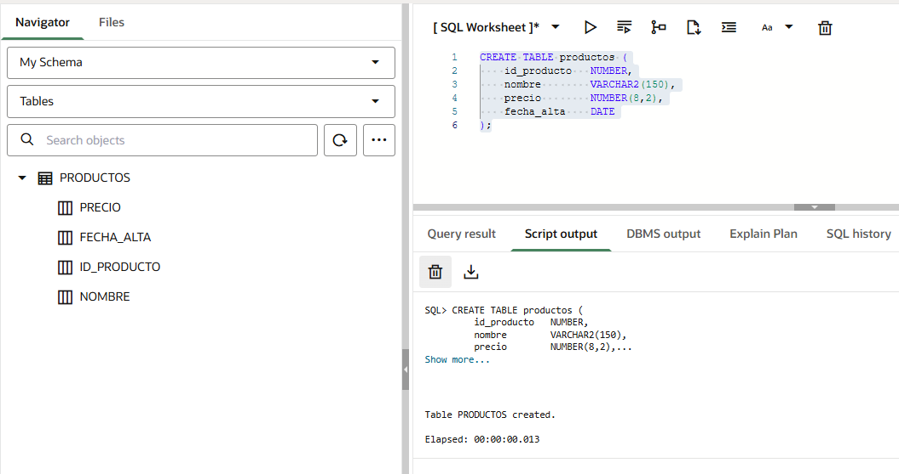

# Clase 03 - Tipos de SQL

# **Sesión 1 -   SQL (DDL)**

### **La diferencia entre leer y construir**

Hasta ahora has usado `SELECT` para **leer** datos que ya existían:

```sql
SELECT *
FROM employees;
```

Esto es como entrar en un almacén y consultar el inventario. No tocas nada, solo lees.

<aside>

El **DDL (Data Definition Language)** es otra cosa: es el lenguaje que te permite **construir el almacén**. Define la estructura donde los datos vivirán más adelante.

</aside>

Los comandos DDL más importantes son:

```sql
CREATE TABLE nombre_tabla (...);   -- Crear una tabla nueva
ALTER TABLE nombre_tabla ...;      -- Modificar una tabla existente
DROP TABLE nombre_tabla;           -- Eliminar una tabla completa
TRUNCATE TABLE nombre_tabla;       -- Vaciar una tabla (mantiene la estructura)
```

> 💡 **Dato clave de Oracle:** Los comandos DDL ejecutan un **COMMIT automático**. Esto significa que sus efectos son **inmediatos e irreversibles**. No puedes deshacer un `CREATE TABLE` ni un `DROP TABLE` con `ROLLBACK`.
> 

<aside>
💡

## El COMMIT automático en DDL — ¿qué significa realmente?

Para entenderlo, primero necesitas saber qué es una **transacción**.

### ¿Qué es una transacción?

Cuando trabajas con datos en Oracle (INSERT, UPDATE, DELETE), los cambios **no se guardan de inmediato**. Quedan en un estado "provisional" — solo tú los ves, nadie más. Tienes dos opciones:

- **`COMMIT`** → confirmas los cambios. Se guardan de forma permanente.
- **`ROLLBACK`** → los descartas. Todo vuelve al estado anterior.

---

### ¿Qué tiene de especial el DDL?

Los comandos DDL (`CREATE TABLE`, `DROP TABLE`, `ALTER TABLE`...) **no te dan esa opción**. En el momento en que los ejecutas, Oracle hace dos cosas automáticamente:

1. Confirma cualquier transacción DML que tuvieras pendiente (hace un COMMIT de lo anterior)
2. Ejecuta el comando DDL y lo confirma también de forma inmediata

---

### Un ejemplo concreto del peligro

```sql
-- Paso 1: insertas dos filas (DML, aún no confirmado)
INSERT INTO productos VALUES (1, 'Teclado', 29.99);
INSERT INTO productos VALUES (2, 'Ratón', 19.99);

-- Paso 2: sin hacer COMMIT, ejecutas un DDL cualquiera
CREATE TABLE almacenes (id_almacen NUMBER PRIMARY KEY);

-- ¿Qué ocurre?
-- Oracle hace COMMIT automático de los dos INSERT anteriores
-- Ya no puedes hacer ROLLBACK para deshacer esas inserciones
-- Además, la tabla almacenes queda creada de forma permanente
```

Si después ejecutas `ROLLBACK`, Oracle te dirá que no hay nada que deshacer — porque el DDL ya lo confirmó todo.

### La regla práctica para no tener sustos

> Antes de ejecutar cualquier comando DDL, decide conscientemente si quieres confirmar o descartar lo que tienes pendiente.
> 

```sql
-- Opción A: quieres guardar lo que llevas → COMMIT antes del DDL
COMMIT;
CREATE TABLE almacenes (...);

-- Opción B: quieres descartar lo que llevas → ROLLBACK antes del DDL
ROLLBACK;
CREATE TABLE almacenes (...);
```

De esta forma tú controlas el momento, y no te lleva una sorpresa el autocommit.

</aside>

En esta sesión trabajaremos principalmente con `CREATE TABLE`.

---

## **¿ Qué es `CREATE TABLE` ?**

`CREATE TABLE` le dice a Oracle: *"crea una nueva tabla con estas columnas y estos tipos de datos"*.

```sql
CREATE TABLE nombre_tabla (
    nombre_columna1  tipo_de_dato  [restricciones],
    nombre_columna2  tipo_de_dato  [restricciones],
    nombre_columna3  tipo_de_dato  [restricciones]
);
```

Ejemplo sencillo con una tabla de productos de una tienda:

```sql
CREATE TABLE productos (
    id_producto   NUMBER,
    nombre        VARCHAR2(150),
    precio        NUMBER(8,2),
    fecha_alta    DATE
);
```



### Donde:

| **Elemento** | **Significado** |
| --- | --- |
| `productos` | Nombre de la tabla que Oracle va a crear |
| `id_producto` | Columna para guardar un identificador numérico |
| `NUMBER` | Tipo de dato: número entero o decimal |
| `nombre` | Columna para guardar texto |
| `VARCHAR2(150)` | Texto variable de hasta 150 caracteres |
| `precio` | Columna para guardar importes con decimales |
| `NUMBER(8,2)` | Número de hasta 8 dígitos, con 2 decimales |
| `fecha_alta` | Columna para guardar una fecha |
| `DATE` | Tipo de dato de fecha y hora en Oracle |

---

## **Tipos de datos básicos en Oracle**

Elegir el tipo de dato correcto para cada columna es una decisión de diseño importante. Un tipo mal elegido puede provocar errores, consumir más espacio del necesario o impedir ciertas operaciones.

Aquí están los cuatro tipos esenciales para empezar:

---

### **`NUMBER` — Para valores numéricos**

Se usa para cualquier tipo de número: identificadores, cantidades, precios, porcentajes, edades, etc.

**Sin precisión** → número entero o con decimales, sin límite fijo:

```sql
id_producto   NUMBER
stock         NUMBER
```

**Con precisión y escala** → `NUMBER(total_dígitos, decimales)`:

```sql
precio        NUMBER(8,2)    -- Hasta 999999.99
descuento     NUMBER(5,2)    -- Hasta 999.99
latitud       NUMBER(9,6)    -- Coordenada geográfica
```

> 💡 `NUMBER(8,2)` significa: como máximo 8 dígitos en total, de los cuales 2 son decimales. El número `12345.67` tiene 7 dígitos → cabe. El número `1234567.89` tiene 9 dígitos → **no cabe** y Oracle devuelve error.
> 

---

### **`VARCHAR2` — Para texto de longitud variable**

Es el tipo de texto más usado en Oracle. Solo ocupa el espacio que realmente necesita el valor almacenado.

```sql
nombre          VARCHAR2(100)
email           VARCHAR2(150)
descripcion     VARCHAR2(500)
codigo_postal   VARCHAR2(10)
```

**¿Cuándo usar `VARCHAR2`?**

<aside>

Siempre que el texto pueda tener longitudes distintas: nombres, correos, descripciones, direcciones, etc.

</aside>

> ⚠️ `VARCHAR2` necesita un tamaño máximo obligatorio. Escribir solo `VARCHAR2` sin el número entre paréntesis dará error en Oracle.
> 

---

### **`CHAR` — Para texto de longitud fija**

A diferencia de `VARCHAR2`, `CHAR` **siempre ocupa el mismo espacio**, independientemente del valor almacenado. Si defines `CHAR(10)` y guardas `'Sí'`, Oracle rellena con espacios hasta llegar a 10 caracteres.

```sql
activo       CHAR(1)    -- 'S' o 'N'
tipo         CHAR(1)    -- 'A', 'B', 'C'
codigo_pais  CHAR(3)    -- 'ESP', 'MEX', 'ARG'
```

**¿Cuándo usar `CHAR`?**

Solo cuando el valor **siempre tiene la misma longitud exacta**: códigos de país, indicadores de estado con valores fijos, etc.

| **Tipo** | **Espacio usado** | **Mejor para** |
| --- | --- | --- |
| `VARCHAR2(50)` | Solo lo que ocupa el texto | Nombres, emails, descripciones |
| `CHAR(3)` | Siempre 3 caracteres | Códigos fijos: `'ESP'`, `'EUR'` |

### **`DATE` — Para fechas y horas**

En Oracle, `DATE` almacena **fecha y hora** (día, mes, año, hora, minutos, segundos). No necesita parámetros adicionales.

```sql
fecha_alta       DATE
fecha_pedido     DATE
fecha_entrega    DATE
```

Oracle tiene varias funciones muy útiles para trabajar con fechas:

```sql
SYSDATE          -- Fecha y hora actuales del sistema
TRUNC(SYSDATE)   -- Solo la fecha actual, sin la parte de hora
```

Ejemplo habitual: que una columna tome la fecha de hoy si no se indica otro valor:

```sql
fecha_alta   DATE   DEFAULT SYSDATE
```

> 💡 Si necesitas almacenar solo el año, puedes usar `NUMBER(4)`. Oracle no tiene un tipo `YEAR` nativo como otros motores.
> 

---

### **Comparativa rápida de tipos**

| **Tipo** | **Ejemplo de uso** | **Ejemplo de valor** |
| --- | --- | --- |
| `NUMBER` | Cantidad, stock, edad | `42`, `1500` |
| `NUMBER(8,2)` | Precio, importe | `29.99`, `1250.00` |
| `VARCHAR2(100)` | Nombre, email, dirección | `'Ana García'` |
| `CHAR(1)` | Estado, indicador | `'S'`, `'N'`, `'A'` |
| `DATE` | Fecha de alta, pedido | `15/03/2024 10:30:00` |

## **Qué es una clave primaria**

### **El problema sin clave primaria**

Imagina una tabla de clientes de una empresa:

| **nombre** | **email** |
| --- | --- |
| Ana García | [ana@empresa.com](mailto:ana@empresa.com) |
| Ana García | [ana.garcia@empresa.com](mailto:ana.garcia@empresa.com) |
| Carlos López | [carlos@empresa.com](mailto:carlos@empresa.com) |

¿Cuál de las dos "Ana García" es la que quieres modificar? Sin un identificador único, es imposible saberlo con certeza.

### **La solución: clave primaria**

<aside>

Una **clave primaria** (`PRIMARY KEY`) es una columna — o combinación de columnas — que **identifica de forma única cada fila** de la tabla.

</aside>

Reglas que Oracle impone automáticamente a una clave primaria:

- **No puede repetirse**: dos filas no pueden tener el mismo valor.
- **No puede estar vacía**: no se permite `NULL`.
- **Cada tabla solo puede tener una clave primaria**.

```sql
CREATE TABLE clientes (
    id_cliente   NUMBER        PRIMARY KEY,
    nombre       VARCHAR2(100) NOT NULL,
    email        VARCHAR2(150)
);
```

Ahora la tabla queda así:

| **id_cliente** | **nombre** | **email** |
| --- | --- | --- |
| 1001 | Ana García | [ana@empresa.com](mailto:ana@empresa.com) |
| 1002 | Ana García | [ana.garcia@empresa.com](mailto:ana.garcia@empresa.com) |
| 1003 | Carlos López | [carlos@empresa.com](mailto:carlos@empresa.com) |

Aunque dos clientes tengan el mismo nombre, `id_cliente` permite distinguirlos sin ambigüedad.

> 💡 **Buena práctica:** usa siempre un identificador numérico como clave primaria (`id_tabla NUMBER PRIMARY KEY`). Evita usar el nombre, el email u otros datos reales como clave primaria, ya que pueden cambiar o repetirse.
> 

---

## **Buenas prácticas para nombres de tablas y columnas**

Oracle acepta nombres en mayúsculas y minúsculas (los convierte a mayúsculas internamente), pero hay reglas que facilitan el trabajo:

**Recomendaciones:**

- Usa nombres en minúsculas con guiones bajos: `nombre_producto`, `fecha_pedido`.
- No uses espacios — usa `_` para separar palabras.
- No uses tildes ni la letra `ñ`.
- No uses palabras reservadas de SQL como nombre de columna (`date`, `number`, `table`).
- Los nombres de tablas en plural: `productos`, `clientes`, `pedidos`.
- Los nombres de columnas en singular y descriptivos: `fecha_alta`, `precio_unitario`.

| **✅ Recomendado** | **❌ Evitar** |
| --- | --- |
| `productos` | `Tabla Productos` |
| `id_producto` | `id producto` |
| `nombre_proveedor` | `NombreProveedor` |
| `fecha_pedido` | `Año` |
| `precio_unitario` | `tabla1` |

---

# **Práctica**

## **Preparación en Oracle Live SQL**

Antes de crear ninguna tabla, realiza estos pasos:

**1. Comprobar que Oracle Live SQL responde:**

```sql
SELECT SYSDATE AS fecha_actual
FROM dual;
```

`DUAL` es una tabla especial de Oracle con una sola fila. Se usa para ejecutar expresiones o funciones que no necesitan consultar una tabla real.

**2. Ver las tablas que ya tienes en tu esquema:**

```sql
--- Genérico
SELECT table_name
FROM user_tables
ORDER BY table_name;
```

```sql
SELECT table_name
FROM all_tables
WHERE owner = 'HR'
ORDER BY table_name;
```


---

## **Ejercicio 1: crear la tabla `productos`**

Vamos a crear la tabla principal de un sistema de gestión de inventario para una empresa distribuidora.

### **Diseño de la tabla**

Antes de escribir SQL, piensa en qué información necesitas guardar de cada producto:

| **Columna** | **¿Qué guarda?** | **Tipo elegido** | **Razón** |
| --- | --- | --- | --- |
| `id_producto` | Identificador único | `NUMBER` | Número entero, clave primaria |
| `nombre` | Nombre del producto | `VARCHAR2(150)` | Texto variable, obligatorio |
| `categoria` | Categoría del producto | `VARCHAR2(80)` | Texto variable, opcional |
| `precio_unitario` | Precio con decimales | `NUMBER(10,2)` | Importe con 2 decimales |
| `stock` | Unidades disponibles | `NUMBER` | Entero sin decimales |
| `fecha_alta` | Cuándo se dio de alta | `DATE` | Fecha, por defecto hoy |
| `activo` | Si está disponible | `CHAR(1)` | Un solo carácter: `'S'` o `'N'` |

### **Código SQL**

```sql
CREATE TABLE productos (
    id_producto      NUMBER        PRIMARY KEY,
    nombre           VARCHAR2(150) NOT NULL,
    categoria        VARCHAR2(80),
    precio_unitario  NUMBER(10,2),
    stock            NUMBER,
    fecha_alta       DATE          DEFAULT SYSDATE,
    activo           CHAR(1)       DEFAULT 'S'
);
```

### **Comprobación inmediata**

```sql
-- ¿Existe la tabla?
SELECT table_name
FROM user_tables
WHERE table_name = 'PRODUCTOS';
```

```sql
-- ¿Qué columnas tiene?
SELECT column_name, data_type, data_length, nullable
FROM user_tab_columns
WHERE table_name = 'PRODUCTOS'
ORDER BY column_id;
```

```sql
-- ¿Qué restricciones tiene? (aquí verás la PRIMARY KEY)
SELECT constraint_name, constraint_type
FROM user_constraints
WHERE table_name = 'PRODUCTOS';
```


- La letra `P` significa **Primary Key**, es decir, clave primaria.

```
SYS_C004777511    P
```

Esto indica que la tabla `PRODUCTOS` tiene una **clave primaria**.

- La letra `C` significa **Check Constraint**. En Oracle, las restricciones `NOT NULL` también suelen aparecer como tipo `C`.

También podría ser un `CHECK`, por ejemplo:

```
precio NUMBERCHECK (precio>0)
```

Por eso, la restricción:

```
SYS_C004777510    C
```

puede ser una restricción de tipo:

```
NOT NULL
```

o una restricción tipo:

```
CHECK
```

### Consulta mejorada para ver qué columna afecta cada restricción

```sql
SELECT 
    uc.constraint_name,
    uc.constraint_type,
    ucc.column_name
FROM user_constraints uc
JOIN user_cons_columns ucc
    ON uc.constraint_name = ucc.constraint_name
WHERE uc.table_name = 'PRODUCTOS'
ORDER BY uc.constraint_type, uc.constraint_name;
```

Veras algo como:


---

## **Ejercicio 2: crear la tabla `proveedores`**

Ahora creamos la tabla de proveedores de esa misma empresa distribuidora.

### **Diseño de la tabla**

| **Columna** | **¿Qué guarda?** | **Tipo elegido** | **Razón** |
| --- | --- | --- | --- |
| `id_proveedor` | Identificador único | `NUMBER` | Entero, clave primaria |
| `razon_social` | Nombre legal de la empresa | `VARCHAR2(200)` | Texto largo, obligatorio |
| `pais` | País de origen | `CHAR(3)` | Código ISO fijo: `'ESP'`, `'DEU'` |
| `email_contacto` | Email del contacto | `VARCHAR2(150)` | Texto variable, único |
| `telefono` | Número de teléfono | `VARCHAR2(20)` | Texto: puede incluir `+`, espacios |
| `fecha_alta` | Cuándo se dio de alta | `DATE` | Fecha, por defecto hoy |
| `activo` | Si está activo | `CHAR(1)` | `'S'` o `'N'` |

> 💡 **¿Por qué `telefono` es `VARCHAR2` y no `NUMBER`?**
> 
> 
> Porque un teléfono puede contener el prefijo internacional (`+34`), espacios o guiones (`+34 91 123-45-67`). Si usaras `NUMBER`, Oracle eliminaría el cero inicial y no aceptaría los caracteres especiales.
> 

### **Código SQL**

```sql
CREATE TABLE proveedores (
    id_proveedor    NUMBER        PRIMARY KEY,
    razon_social    VARCHAR2(200) NOT NULL,
    pais            CHAR(3),
    email_contacto  VARCHAR2(150),
    telefono        VARCHAR2(20),
    fecha_alta      DATE          DEFAULT SYSDATE,
    activo          CHAR(1)       DEFAULT 'S'
);
```


### **Comprobación**

```sql
-- Comprobar ambas tablas a la vez
SELECT table_name
FROM user_tables
WHERE table_name IN ('PRODUCTOS', 'PROVEEDORES')
ORDER BY table_name;
```


```sql
-- Columnas de ambas tablas comparadas
SELECT table_name, column_name, data_type, data_length, nullable
FROM user_tab_columns
WHERE table_name IN ('PRODUCTOS', 'PROVEEDORES')
ORDER BY table_name, column_id;
```


---

## **Ejercicio 3: explorar el diccionario de datos**

<aside>

Oracle tiene un conjunto de vistas especiales llamado **diccionario de datos** que te permite consultar información sobre los objetos de tu esquema. Son tablas que Oracle mantiene automáticamente.

</aside>

Las más útiles para esta sesión:

| **Vista** | **¿Qué muestra?** |
| --- | --- |
| `USER_TABLES` | Las tablas de tu esquema |
| `USER_TAB_COLUMNS` | Las columnas de tus tablas |
| `USER_CONSTRAINTS` | Las restricciones (PRIMARY KEY, etc.) |
| `USER_CONS_COLUMNS` | Qué columna está asociada a cada restricción |

---

---

### **Consultar tablas vacías (solo la estructura)**

Aunque aún no hay datos insertados, puedes hacer `SELECT` sobre las tablas. Oracle devolverá la estructura sin filas:

```sql
SELECT * FROM productos;
SELECT * FROM proveedores;
```

Esto confirma que la tabla existe y que su estructura es válida. El mensaje `no rows selected` es completamente normal en este punto.

---

# **Ejercicios propuestos**

## **Ejercicio 1: tabla `pedidos`**

Crea una tabla `pedidos` para registrar los pedidos realizados a los proveedores. Diseña las columnas tú mismo a partir de estas indicaciones:

| **Columna** | **Indicación** |
| --- | --- |
| `id_pedido` | Identificador único, clave primaria |
| `id_proveedor` | Número entero, referencia al proveedor (por ahora sin restricción de FK) |
| `fecha_pedido` | Fecha, valor por defecto la fecha actual |
| `estado` | Un solo carácter: `'P'` pendiente, `'E'` enviado, `'R'` recibido |
| `total_importe` | Importe total del pedido, con 2 decimales |
| `observaciones` | Texto libre, hasta 500 caracteres, opcional |

Después de crearla, comprueba con `USER_TABLES` y `USER_TAB_COLUMNS`.

---

## **Ejercicio 2: tabla `almacenes`**

Crea una tabla `almacenes` con las siguientes columnas:

| **Columna** | **Tipo sugerido** | **Condición** |
| --- | --- | --- |
| `id_almacen` | `NUMBER` | Clave primaria |
| `nombre_almacen` | `VARCHAR2(100)` | Obligatorio |
| `ciudad` | `VARCHAR2(80)` | Opcional |
| `pais` | `CHAR(3)` | Código ISO, opcional |
| `capacidad_m2` | `NUMBER(8,2)` | Superficie en metros cuadrados |
| `activo` | `CHAR(1)` | Por defecto `'S'` |

## **Ejercicio 3: documentar el modelo**

Completa esta tabla en tu documento de trabajo describiendo cada tabla creada:

| **Tabla** | **¿Qué representa?** | **Clave primaria** | **Columnas obligatorias** |
| --- | --- | --- | --- |
| `productos` |  |  |  |
| `proveedores` |  |  |  |
| `pedidos` |  |  |  |
| `almacenes` |  |  |  |

# **Entregable**

Cada estudiante debe entregar o conservar al finalizar la sesión:

1. Script SQL guardado en Oracle Live SQL con las tablas creadas.
2. Captura o resultado de `USER_TABLES` mostrando `PRODUCTOS` y `PROVEEDORES`.
3. Captura o resultado de `USER_TAB_COLUMNS` con las columnas de ambas tablas.
4. Documento breve (puede ser en el propio script como comentarios) explicando la finalidad de cada tabla y por qué se eligió cada tipo de dato.

# **Práctica 2: Diseño y consulta de una base de datos Oracle**

## **Caso práctico: Distribuidora TecnoStock**

La empresa **TecnoStock** es una distribuidora que vende productos tecnológicos a empresas, academias y pequeños comercios. Actualmente trabaja con hojas de cálculo, pero quiere empezar a organizar su información en una base de datos Oracle.

Tu tarea será diseñar parte de la estructura inicial de la base de datos, crear tablas, elegir tipos de datos adecuados, aplicar restricciones básicas y comprobar la estructura creada mediante consultas al diccionario de datos de Oracle.

La práctica debe realizarse en **Oracle Live SQL / Oracle FreeSQL**.

---

## **Instrucciones generales**

1. Antes de crear tablas, comprueba que tu entorno Oracle funciona correctamente.
2. Usa nombres de tablas en plural y nombres de columnas claros, en minúsculas y con guion bajo.
3. No uses tildes, espacios ni la letra `ñ` en nombres de tablas o columnas.
4. Cada tabla debe tener una clave primaria.
5. Justifica los tipos de datos elegidos para cada columna.
6. Guarda todo tu trabajo en un único script SQL, organizado con comentarios.
7. No borres tablas sin estar seguro, recuerda que los comandos DDL hacen `COMMIT` automático.

---

## **Entregable**

Debes entregar un archivo o script con:

- Las respuestas razonadas a las preguntas de análisis.
- Las sentencias SQL que hayas creado.
- Las consultas de comprobación ejecutadas.
- Capturas o resultados obtenidos en Oracle Live SQL.
- Una breve explicación de cada tabla, cada clave primaria y cada tipo de dato elegido.

---

# **Parte 0. Análisis previo**

Antes de resolver las 20 preguntas SQL, responde por escrito:

## **Pregunta previa**

Investiga y explica con tus palabras qué representa cada una de estas posibles tablas dentro del caso **TecnoStock** y qué tipo de información debería guardar cada campo:

- `productos`
- `proveedores`
- `almacenes`
- `pedidos`
- `clientes`
- `empleados`

Para cada tabla, completa una tabla de análisis como esta:

| **Tabla** | **¿Qué representa?** | **Posibles campos** | **Campo que podría ser clave primaria** | **Observaciones** |
| --- | --- | --- | --- | --- |
| productos |  |  |  |  |
| proveedores |  |  |  |  |
| almacenes |  |  |  |  |
| pedidos |  |  |  |  |
| clientes |  |  |  |  |
| empleados |  |  |  |  |

---

# **Parte 1.**

## **1. Comprobación inicial del entorno**

Ejecuta una consulta que muestre la fecha y hora actual del sistema Oracle. Después, explica para qué sirve la tabla especial `DUAL`.

---

## **2. Exploración de tablas existentes**

Consulta las tablas disponibles en tu esquema actual usando el diccionario de datos de Oracle. Ordena el resultado alfabéticamente por nombre de tabla.

---

## **3. Diseño de la tabla `productos`**

Crea una tabla llamada `productos` para guardar los productos que vende TecnoStock. Debe incluir, como mínimo, los siguientes datos:

- identificador del producto;
- nombre del producto;
- categoría;
- precio unitario;
- stock disponible;
- fecha de alta;
- indicador de producto activo.

Define una clave primaria y usa tipos de datos adecuados para cada columna.

---

## **4. Diseño de la tabla `proveedores`**

Crea una tabla llamada `proveedores` para guardar los datos de las empresas proveedoras. Debe incluir, como mínimo:

- identificador del proveedor;
- razón social;
- país;
- email de contacto;
- teléfono;
- fecha de alta;
- indicador de proveedor activo.

Explica por qué el teléfono no debería guardarse como `NUMBER`.

---

## **5. Diseño de la tabla `almacenes`**

Crea una tabla llamada `almacenes` para registrar los almacenes físicos de TecnoStock. Debe incluir:

- identificador del almacén;
- nombre del almacén;
- ciudad;
- país;
- superficie o capacidad en metros cuadrados;
- indicador de almacén activo.

El nombre del almacén debe ser obligatorio.

---

## **6. Consulta de tablas creadas**

Consulta el diccionario de datos para comprobar que las tablas `productos`, `proveedores` y `almacenes` existen en tu esquema.

---

## **7. Consulta de columnas**

Consulta las columnas de las tablas `productos`, `proveedores` y `almacenes`. El resultado debe mostrar, como mínimo:

- nombre de la tabla;
- nombre de la columna;
- tipo de dato;
- longitud;
- si permite valores nulos.

Ordena el resultado por tabla y por orden de columna.

---

## **8. Identificación de claves primarias**

Consulta las restricciones de las tablas creadas y localiza cuáles corresponden a claves primarias.

Explica qué significa que una restricción sea de tipo `P`.

---

## **9. Campos obligatorios**

Consulta las restricciones generadas en tus tablas e identifica qué campos se han definido como obligatorios.

Explica por qué Oracle puede mostrar algunas restricciones `NOT NULL` como restricciones de tipo `C`.

---

## **10. Consulta simple sobre una tabla vacía**

Ejecuta una consulta `SELECT *` sobre cada una de las tablas creadas.

Explica por qué Oracle puede devolver el mensaje de que no hay filas seleccionadas aunque la tabla exista correctamente.

---

# **Parte 2.**

## **11. Diseño de la tabla `clientes`**

Crea una tabla llamada `clientes` para registrar los clientes de TecnoStock. Debe incluir:

- identificador del cliente;
- nombre o razón social;
- tipo de cliente, usando un campo de un solo carácter;
- email;
- teléfono;
- ciudad;
- país;
- fecha de alta;
- indicador de cliente activo.

Añade las restricciones que consideres necesarias y justifica tus decisiones.

---

## **12. Diseño de la tabla `pedidos`**

Crea una tabla llamada `pedidos` para registrar pedidos realizados por clientes. Debe incluir:

- identificador del pedido;
- identificador del cliente;
- fecha del pedido;
- estado del pedido, usando un solo carácter;
- importe total;
- observaciones.

Por ahora, el campo del cliente debe crearse como `NUMBER`, pero no es obligatorio crear todavía la clave foránea.

---

## **13. Diseño de la tabla `empleados`**

Crea una tabla llamada `empleados` para registrar a las personas que trabajan en TecnoStock. Debe incluir:

- identificador del empleado;
- nombre;
- apellidos;
- email corporativo;
- fecha de contratación;
- salario;
- departamento;
- indicador de empleado activo.

Elige tipos de datos adecuados y explica qué campos deberían ser obligatorios.

---

## **14. Uso razonado de `NUMBER(p,s)`**

Revisa las columnas numéricas que has creado para precios, importes, salarios o superficies.

Indica qué columnas deberían usar `NUMBER` simple y cuáles deberían usar `NUMBER(precision, escala)`. Justifica tu elección en cada caso.

---

## **15. Uso razonado de `CHAR` y `VARCHAR2`**

Revisa todas las columnas de texto de tus tablas.

Indica en qué casos has usado `CHAR` y en qué casos has usado `VARCHAR2`. Explica por qué no sería buena idea usar `CHAR` para campos como nombres, emails o descripciones.

---

## **16. Revisión de nombres de tablas y columnas**

Analiza los nombres que has usado en tus tablas y columnas. Comprueba que cumplen las buenas prácticas vistas en clase:

- sin espacios;
- sin tildes;
- sin `ñ`;
- nombres descriptivos;
- tablas en plural;
- columnas en singular;
- uso de guion bajo cuando sea necesario.

Entrega una breve revisión indicando si corregirías algún nombre y por qué.

---

## **17. Informe del diccionario de datos**

Crea una consulta al diccionario de datos que muestre todas las columnas de todas las tablas creadas para el caso TecnoStock.

El informe debe permitir revisar de forma rápida la estructura completa del modelo.

---

## **18. Informe de restricciones por tabla y columna**

Crea una consulta que combine la información de restricciones y columnas para mostrar:

- nombre de la restricción;
- tipo de restricción;
- nombre de la tabla;
- nombre de la columna afectada.

Usa esta consulta para comprobar que tus claves primarias y campos obligatorios están correctamente definidos.

---

## **19. Análisis del `COMMIT` automático en DDL (opcional)**

Explica con tus palabras qué ocurre en Oracle cuando ejecutas una sentencia `CREATE TABLE`, `ALTER TABLE` o `DROP TABLE`.

Después, plantea un ejemplo escrito —sin necesidad de ejecutarlo— donde se vea por qué puede ser peligroso ejecutar DDL si antes tienes cambios DML pendientes.

---

## **20. Documentación final del modelo TecnoStock**

Elabora una documentación breve del modelo creado. Debe incluir una tabla resumen con:

| **Tabla** | **Finalidad** | **Clave primaria** | **Columnas obligatorias** | **Tipos de datos importantes** | **Observaciones** |
| --- | --- | --- | --- | --- | --- |
| productos |  |  |  |  |  |
| proveedores |  |  |  |  |  |
| almacenes |  |  |  |  |  |
| clientes |  |  |  |  |  |
| pedidos |  |  |  |  |  |
| empleados |  |  |  |  |  |

---

# **Sesión 2 -** Tipos de SQL: DML, DDL, DCL, TCL y DQL

<aside>

 SQL se organiza en **categorías o sublenguajes**, cada uno diseñado para un tipo de tarea específica. Conocerlas te dará una visión clara y ordenada de lo que puedes hacer con una base de datos Oracle.

</aside>

Los cinco tipos principales son:


## DDL: Data Definition Language

### ¿Qué es el DDL?

<aside>
💡

El **DDL** es el lenguaje que usamos para **construir, modificar o eliminar la estructura** de la base de datos. Piensa en él como el arquitecto: no mueve los muebles de una casa, sino que construye las habitaciones donde más tarde irán esos muebles.

</aside>

Con DDL defines cosas como: tablas, columnas, índices, vistas, secuencias, etc.

> 💡 **Dato clave:** Los comandos DDL en Oracle se ejecutan con un **`COMMIT` automático**. Esto significa que sus cambios son **permanentes e inmediatos** — no puedes deshacerlos con un `ROLLBACK`.
> 

---

### Comandos DDL principales

### `CREATE` — Crear objetos

Sirve para crear una nueva tabla, vista, índice, secuencia, etc.

```sql
-- Creamos una tabla para registrar clientes de una empresa
CREATE TABLE clientes (
    id_cliente   NUMBER(10)    PRIMARY KEY,
    nombre       VARCHAR2(100) NOT NULL,
    email        VARCHAR2(150) UNIQUE,
    fecha_alta   DATE          DEFAULT SYSDATE,
    activo       CHAR(1)       DEFAULT 'S'
);
```

Donde:

- `NUMBER(10)` → un número entero de hasta 10 dígitos
- `VARCHAR2(100)` → texto de hasta 100 caracteres
- `PRIMARY KEY` → identifica de forma única cada fila
- `NOT NULL` → ese campo no puede quedarse vacío
- `DEFAULT SYSDATE` → si no se pone fecha, Oracle pone la fecha de hoy automáticamente

---

### `ALTER` — Modificar objetos existentes

<aside>

Cuando la estructura de una tabla necesita cambiar, usamos `ALTER`. No necesitas borrar y recrear la tabla.

</aside>

```sql
-- Añadir una columna nueva
ALTER TABLE clientes ADD telefono VARCHAR2(20);

-- Modificar el tamaño de una columna existente
ALTER TABLE clientes MODIFY nombre VARCHAR2(200);

-- Eliminar una columna que ya no se necesita
ALTER TABLE clientes DROP COLUMN activo;

-- Renombrar una columna
ALTER TABLE clientes RENAME COLUMN email TO correo_electronico;
```

---

### `DROP` — Eliminar objetos

Borra completamente un objeto de la base de datos: la estructura **y** todos sus datos.

```sql
-- Eliminar una tabla completa (¡cuidado, no hay vuelta atrás!)
DROP TABLE clientes;

-- En Oracle, podemos usar PURGE para no enviar al reciclador
DROP TABLE clientes PURGE;
```

> ⚠️ **Advertencia:** `DROP` es irreversible. Antes de ejecutarlo, asegúrate de tener un respaldo o de que realmente quieres eliminar ese objeto.
> 

---

### `TRUNCATE` — Vaciar una tabla

Elimina **todos los datos** de una tabla, pero mantiene la estructura intacta. Es mucho más rápido que borrar fila por fila con `DELETE`.

```sql
-- Vaciar la tabla de clientes (la estructura queda, los datos se van)
TRUNCATE TABLE clientes;
```

> 📌 **Diferencia importante:** `TRUNCATE` pertenece a DDL (no se puede deshacer), mientras que `DELETE` pertenece a DML (sí se puede deshacer con `ROLLBACK`).
> 

<aside>

Desarrolla dos ejemplos para ver esta diferencia

</aside>

---

### `RENAME` — Renombrar un objeto

```sql
-- Renombrar una tabla
RENAME clientes TO clientes_activos;
```

---

### `COMMENT` — Añadir documentación

Oracle permite añadir comentarios descriptivos a tablas y columnas, lo cual es muy útil para documentar el sistema.

```sql
COMMENT ON TABLE clientes IS 'Tabla principal de clientes registrados en el sistema CRM';
COMMENT ON COLUMN clientes.email IS 'Correo electrónico único por cliente, usado para no-tificaciones';
```

---

## DML: Data Manipulation Language

### ¿Qué es el DML?

<aside>
💡

Si el DDL construye las habitaciones, el **DML es quien mueve el mobiliario**: inserta, actualiza, elimina y trabaja con los **datos** que viven dentro de las tablas.

</aside>

> 💡 **Dato clave:** Los comandos DML **no son automáticamente permanentes**. Necesitas confirmarlos con `COMMIT` (lo veremos en TCL). Hasta entonces, puedes deshacerlos con `ROLLBACK`.
> 

---

### Comandos DML principales

### `INSERT` — Insertar datos

Añade una o varias filas nuevas a una tabla.

```sql
-- Insertar un cliente indicando todas las columnas
INSERT INTO clientes (id_cliente, nombre, email, fecha_alta)
VALUES (1001, 'Laura Sánchez', 'laura@empresa.com', TO_DATE('2024-01-15', 'YYYY-MM-DD'));

-- Insertar otro cliente dejando que Oracle ponga la fecha de hoy
INSERT INTO clientes (id_cliente, nombre, email)
VALUES (1002, 'Carlos Méndez', 'carlos@empresa.com');

-- Confirmar los cambios
COMMIT;
```

---

### `UPDATE` — Actualizar datos

Modifica datos existentes en una o más filas.

```sql
-- Actualizar el email de un cliente específico
UPDATE clientes
SET email = 'laura.sanchez@empresa.com'
WHERE id_cliente = 1001;

-- Actualizar varios campos a la vez
UPDATE clientes
SET nombre = 'Carlos Méndez López',
    email  = 'c.mendez@empresa.com'
WHERE id_cliente = 1002;

COMMIT;
```

> ⚠️ **Precaución:** Si omites la cláusula `WHERE`, Oracle actualizará **todas las filas** de la tabla. Siempre verifica tu condición antes de ejecutar.
> 

---

### `DELETE` — Eliminar filas

Borra una o varias filas de una tabla.

```sql
-- Eliminar un cliente específico
DELETE FROM clientes
WHERE id_cliente = 1001;

-- Eliminar todos los clientes que se dieron de alta antes de 2020
DELETE FROM clientes
WHERE fecha_alta < TO_DATE('2020-01-01', 'YYYY-MM-DD');

COMMIT;
```

---

### `MERGE` — Insertar o actualizar en una sola operación

`MERGE` es un comando muy poderoso y propio de Oracle que combina `INSERT` y `UPDATE`: si el registro existe, lo actualiza; si no existe, lo inserta. También se conoce como operación **"upsert"**.

```sql
MERGE INTO clientes c
USING nuevos_clientes nc
ON (c.id_cliente = nc.id_cliente)
WHEN MATCHED THEN
    UPDATE SET c.nombre = nc.nombre,
               c.email  = nc.email
WHEN NOT MATCHED THEN
    INSERT (id_cliente, nombre, email)
    VALUES (nc.id_cliente, nc.nombre, nc.email);

COMMIT;
```

---

## DQL: Data Query Language

### ¿Qué es el DQL?

<aside>
💡

El **DQL** es el lenguaje de **consulta**. Su único y fundamental comando es `SELECT`, que sirve para **leer y recuperar datos** de la base de datos sin modificarlos.

</aside>

Algunos autores incluyen `SELECT` dentro de DML, pero en Oracle — y en la mayoría de frameworks modernos — se trata como una categoría propia por su complejidad y uso frecuente.

---

### El comando `SELECT`

```sql
-- Consulta básica: traer todas las columnas de todos los clientes
SELECT * FROM clientes;

-- Consulta específica: solo nombre y email
SELECT nombre, email FROM clientes;

-- Con filtro WHERE
SELECT nombre, email, fecha_alta
FROM clientes
WHERE fecha_alta >= TO_DATE('2024-01-01', 'YYYY-MM-DD');

-- Con ordenación
SELECT nombre, fecha_alta
FROM clientes
ORDER BY fecha_alta DESC;

-- Con alias para columnas
SELECT
    nombre        AS "Nombre del Cliente",
    email         AS "Correo Electrónico",
    fecha_alta    AS "Fecha de Registro"
FROM clientes
WHERE ROWNUM <= 10;  -- Oracle: limitar resultados a los primeros 10
```

---

### Cláusulas esenciales del SELECT en Oracle


```sql
-- Ejemplo con GROUP BY y HAVING
-- ¿Cuántos clientes se registraron por año?
SELECT
    EXTRACT(YEAR FROM fecha_alta) AS anio,
    COUNT(*)                       AS total_clientes
FROM clientes
GROUP BY EXTRACT(YEAR FROM fecha_alta)
HAVING COUNT(*) > 5
ORDER BY anio;
```

---

## DCL: Data Control Language

### ¿Qué es el DCL?

<aside>
💡

El **DCL** es el lenguaje de **control de acceso**. Gestiona los **permisos y privilegios** de los usuarios sobre los objetos de la base de datos.

En Oracle, la seguridad es un pilar fundamental. No todos los usuarios deben poder ver o modificar todos los datos. Con DCL controlamos exactamente qué puede hacer cada uno.

</aside>

---

### Comandos DCL principales

### `GRANT` — Otorgar permisos

```sql
-- Dar permiso a un usuario para hacer SELECT en la tabla clientes
GRANT SELECT ON clientes TO usuario_ventas;

-- Dar permiso para insertar y actualizar
GRANT INSERT, UPDATE ON clientes TO usuario_ventas;

-- Dar todos los permisos sobre una tabla
GRANT ALL ON clientes TO usuario_admin;

-- Dar permiso para crear tablas en la base de datos
GRANT CREATE TABLE TO usuario_ventas;

-- Dar un rol predefinido de Oracle
GRANT CONNECT, RESOURCE TO usuario_nuevo;
```

---

### `REVOKE` — Revocar permisos

```sql
-- Quitar el permiso de DELETE al usuario
REVOKE DELETE ON clientes FROM usuario_ventas;

-- Quitar todos los permisos sobre la tabla
REVOKE ALL ON clientes FROM usuario_ventas;
```

> 💡 **¿Quién puede usar DCL?** Generalmente el administrador de base de datos (DBA) o el propietario del objeto. Si ejecutas estos comandos sin los privilegios necesarios, Oracle te devolverá un error `ORA-01031: insufficient privileges`.
> 

---


---

## TCL: Transaction Control Language

### ¿Qué es el TCL?

<aside>
💡

El **TCL** es el lenguaje que gestiona las **transacciones**. Una transacción es un conjunto de operaciones DML que deben completarse **todas juntas o ninguna**.

</aside>

Imagina una transferencia bancaria: tienes que descontar dinero de una cuenta **y** añadirlo a otra. Si una operación falla pero la otra se ejecuta, el resultado sería catastrófico. El TCL garantiza que eso no ocurra.

---

### El concepto de transacción (ACID)

Oracle garantiza que las transacciones cumplen las propiedades **ACID**:

| Propiedad | Significado |
| --- | --- |
| **A**tomicidad | Todo o nada: o se completan todas las operaciones o ninguna |
| **C**onsistencia | La base de datos pasa de un estado válido a otro estado válido |
| **I**solamiento | Una transacción no ve los cambios no confirmados de otra |
| **D**urabilidad | Una vez confirmada, la transacción persiste aunque haya un fallo |

---

### Comandos TCL principales

### `COMMIT` — Confirmar cambios

Hace permanentes todos los cambios DML realizados desde el último `COMMIT` o desde el inicio de la sesión.

```sql
-- Insertar un pedido y confirmar
INSERT INTO pedidos (id_pedido, id_cliente, total)
VALUES (5001, 1002, 1250.00);

UPDATE clientes
SET ultimo_pedido = SYSDATE
WHERE id_cliente = 1002;

-- Confirmar ambas operaciones juntas
COMMIT;
```

---

### `ROLLBACK` — Deshacer cambios

Revierte todos los cambios DML que no han sido confirmados con `COMMIT`.

```sql
-- Intentamos hacer una operación pero nos equivocamos
DELETE FROM clientes WHERE fecha_alta < TO_DATE('2023-01-01','YYYY-MM-DD');

-- Nos damos cuenta del error antes de hacer COMMIT
-- Deshacemos todo
ROLLBACK;

-- La tabla vuelve a su estado anterior, como si el DELETE no hubiera ocurrido
```

---

### `SAVEPOINT` — Crear puntos de control

Permite marcar un punto intermedio dentro de una transacción para poder hacer `ROLLBACK` solo hasta ese punto, sin deshacer todo.

```sql
-- Inicio de la transacción
INSERT INTO pedidos VALUES (5002, 1001, 300.00);
SAVEPOINT sp_pedido_insertado;

-- Seguimos con más operaciones
UPDATE inventario SET stock = stock - 5 WHERE id_producto = 100;
SAVEPOINT sp_inventario_actualizado;

-- Algo sale mal en la siguiente operación
DELETE FROM clientes WHERE id_cliente = 1001;  -- ¡Error! No debíamos hacer esto

-- Volvemos solo hasta el punto del inventario, sin perder el pedido ni el inventario
ROLLBACK TO SAVEPOINT sp_inventario_actualizado;

-- Confirmamos lo que sí es correcto
COMMIT;
```

---

### `SET TRANSACTION` — Configurar la transacción

Permite configurar propiedades de la transacción, como el nivel de aislamiento.

```sql
-- Iniciar una transacción de solo lectura
SET TRANSACTION READ ONLY;
```

---


---

## Ejercicio Práctico

Aplica todos los tipos de SQL en un escenario de empresa:

<aside>
💡

**Escenario:** Eres el administrador de la base de datos de una empresa de logística. Debes configurar una tabla de envíos, cargar datos, dar permisos y gestionar transacciones.

</aside>

```sql
-- ─────────────────────────────────
-- 1. DDL: Crear la estructura
-- ─────────────────────────────────
CREATE TABLE envios (
    id_envio       NUMBER(10)    PRIMARY KEY,
    id_cliente     NUMBER(10)    NOT NULL,
    destino        VARCHAR2(200) NOT NULL,
    fecha_envio    DATE          DEFAULT SYSDATE,
    estado         VARCHAR2(20)  DEFAULT 'PENDIENTE',
    peso_kg        NUMBER(6,2),
    coste          NUMBER(10,2)
);

COMMENT ON TABLE envios IS 'Registro de todos los envíos gestionados por la empresa';

-- ─────────────────────────────────
-- 2. DCL: Dar permisos al equipo
-- ─────────────────────────────────
GRANT SELECT, INSERT ON envios TO usuario_operador;
GRANT SELECT ON envios TO usuario_consulta;

-- ─────────────────────────────────
-- 3. DML: Cargar los primeros datos
-- ─────────────────────────────────
INSERT INTO envios (id_envio, id_cliente, destino, peso_kg, coste)
VALUES (1, 1001, 'Madrid, España', 2.5, 15.00);

INSERT INTO envios (id_envio, id_cliente, destino, peso_kg, coste)
VALUES (2, 1002, 'Barcelona, España', 1.2, 10.50);

SAVEPOINT sp_envios_iniciales;

INSERT INTO envios (id_envio, id_cliente, destino, peso_kg, coste)
VALUES (3, 1003, 'Valencia, España', 5.0, 22.00);

-- ─────────────────────────────────
-- 4. DQL: Verificar lo insertado
-- ─────────────────────────────────
SELECT id_envio, destino, estado, coste
FROM envios
ORDER BY id_envio;

-- ─────────────────────────────────
-- 5. DML: Actualizar un estado
-- ─────────────────────────────────
UPDATE envios
SET estado = 'EN_TRANSITO'
WHERE id_envio = 1;

-- ─────────────────────────────────
-- 6. TCL: Confirmar todo
-- ─────────────────────────────────
COMMIT;

-- ─────────────────────────────────
-- 7. DDL: Añadir una columna nueva
-- ─────────────────────────────────
ALTER TABLE envios ADD fecha_entrega DATE;
```

---

---

> 🎓 **Para recordar:** DDL construye, DML manipula, DQL consulta, DCL protege y TCL confirma. Con estos cinco tipos de SQL tienes el control completo de cualquier base de datos Oracle.
>