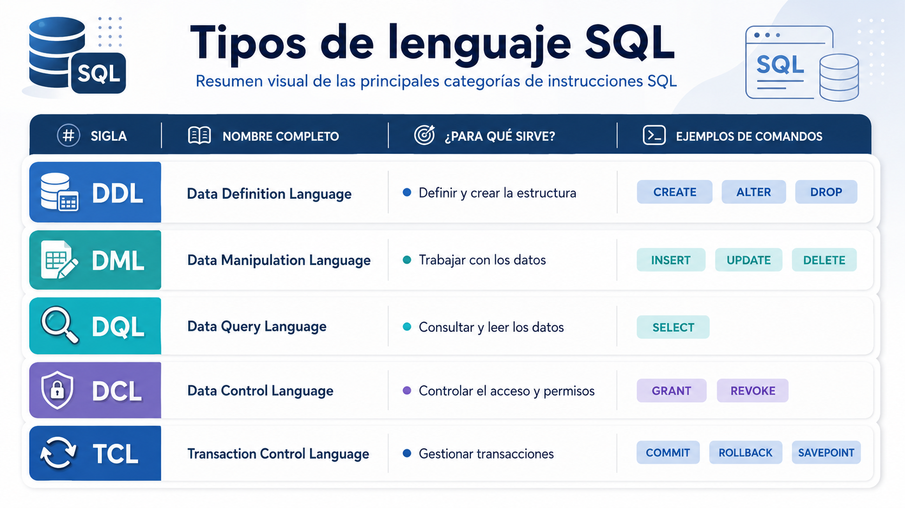

# Clase 04 - Restricciones

---

# **Sesión 1 - Sublenguajes** de SQL: DML, DDL, DCL, TCL y DQL

<aside>

 SQL se organiza en **categorías o sublenguajes**, cada uno diseñado para un tipo de tarea específica. Conocerlas te dará una visión clara y ordenada de lo que puedes hacer con una base de datos Oracle.

</aside>

Los cinco tipos principales son:



## DDL: Data Definition Language

### ¿Qué es el DDL?

<aside>
💡

El **DDL** es el lenguaje que usamos para **construir, modificar o eliminar la estructura** de la base de datos. Piensa en él como el arquitecto: no mueve los muebles de una casa, sino que construye las habitaciones donde más tarde irán esos muebles.

</aside>

Con DDL defines cosas como: tablas, columnas, índices, vistas, secuencias, etc.

> 💡 **Dato clave:** Los comandos DDL en Oracle se ejecutan con un **`COMMIT` automático**. Esto significa que sus cambios son **permanentes e inmediatos** — no puedes deshacerlos con un `ROLLBACK`.
> 

---

### Comandos DDL principales

### `CREATE` — Crear objetos

Sirve para crear una nueva tabla, vista, índice, secuencia, etc.

```sql
-- Creamos una tabla para registrar clientes de una empresa
CREATE TABLE clientes (
    id_cliente   NUMBER(10)    PRIMARY KEY,
    nombre       VARCHAR2(100) NOT NULL,
    email        VARCHAR2(150) UNIQUE,
    fecha_alta   DATE          DEFAULT SYSDATE,
    activo       CHAR(1)       DEFAULT 'S'
);
```

Donde:

- `NUMBER(10)` → un número entero de hasta 10 dígitos
- `VARCHAR2(100)` → texto de hasta 100 caracteres
- `PRIMARY KEY` → identifica de forma única cada fila
- `NOT NULL` → ese campo no puede quedarse vacío
- `DEFAULT SYSDATE` → si no se pone fecha, Oracle pone la fecha de hoy automáticamente

---

### `ALTER` — Modificar objetos existentes

<aside>

Cuando la estructura de una tabla necesita cambiar, usamos `ALTER`. No necesitas borrar y recrear la tabla.

</aside>

```sql
-- Añadir una columna nueva
ALTER TABLE clientes ADD telefono VARCHAR2(20);

-- Modificar el tamaño de una columna existente
ALTER TABLE clientes MODIFY nombre VARCHAR2(200);

-- Eliminar una columna que ya no se necesita
ALTER TABLE clientes DROP COLUMN activo;

-- Renombrar una columna
ALTER TABLE clientes RENAME COLUMN email TO correo_electronico;
```

---

### `DROP` — Eliminar objetos

Borra completamente un objeto de la base de datos: la estructura **y** todos sus datos.

```sql
-- Eliminar una tabla completa. Recuperable via FLASHBACK TABLE clientes TO BEFORE DROP;
DROP TABLE clientes;

-- En Oracle, podemos usar PURGE para no enviar al reciclador
DROP TABLE clientes PURGE;
```

> ⚠️ **Advertencia:** `DROP` es irreversible. Antes de ejecutarlo, asegúrate de tener un respaldo o de que realmente quieres eliminar ese objeto.
> 

---

### `TRUNCATE` — Vaciar una tabla

Elimina **todos los datos** de una tabla, pero mantiene la estructura intacta. Es mucho más rápido que borrar fila por fila con `DELETE`.

```sql
-- Vaciar la tabla de clientes (la estructura queda, los datos se van)
TRUNCATE TABLE clientes;
```

> 📌 **Diferencia importante:** `TRUNCATE` pertenece a DDL (no se puede deshacer), mientras que `DELETE` pertenece a DML (sí se puede deshacer con `ROLLBACK`).
> 

<aside>

Desarrolla dos ejemplos para ver esta diferencia

</aside>

---

### `RENAME` — Renombrar un objeto

```sql
-- Renombrar una tabla
RENAME clientes TO clientes_activos;
```

---

### `COMMENT` — Añadir documentación

Oracle permite añadir comentarios descriptivos a tablas y columnas, lo cual es muy útil para documentar el sistema.

```sql
COMMENT ON TABLE clientes IS 'Tabla principal de clientes registrados en el sistema CRM';
COMMENT ON COLUMN clientes.correo_electronico IS 'Correo electrónico único por cliente, usado para no-tificaciones';
```

---

## DML: Data Manipulation Language

### ¿Qué es el DML?

<aside>
💡

Si el DDL construye las habitaciones, el **DML es quien mueve el mobiliario**: inserta, actualiza, elimina y trabaja con los **datos** que viven dentro de las tablas.

</aside>

> 💡 **Dato clave:** Los comandos DML **no son automáticamente permanentes**. Necesitas confirmarlos con `COMMIT` (lo veremos en `TCL`). Hasta entonces, puedes deshacerlos con `ROLLBACK`.
> 

---

### Comandos DML principales

### `INSERT` — Insertar datos

Añade una o varias filas nuevas a una tabla.

```sql
-- Insertar un cliente indicando todas las columnas
INSERT INTO clientes (id_cliente, nombre, correo_electronico, fecha_alta)
VALUES (1001, 'Laura Sánchez', 'laura@empresa.com', TO_DATE('2024-01-15', 'YYYY-MM-DD'));

-- Insertar otro cliente dejando que Oracle ponga la fecha de hoy
INSERT INTO clientes (id_cliente, nombre, correo_electronico)
VALUES (1002, 'Carlos Méndez', 'carlos@empresa.com');

-- Confirmar los cambios
COMMIT;
```

---

### `UPDATE` — Actualizar datos

Modifica datos existentes en una o más filas.

```sql
-- Actualizar el email de un cliente específico
UPDATE clientes
SET correo_electronico = 'laura.sanchez@empresa.com'
WHERE id_cliente = 1001;

-- Actualizar varios campos a la vez
UPDATE clientes
SET nombre = 'Carlos Méndez López',
    correo_electronico  = 'c.mendez@empresa.com'
WHERE id_cliente = 1002;

COMMIT;
```

> ⚠️ **Precaución:** Si omites la cláusula `WHERE`, Oracle actualizará **todas las filas** de la tabla. Siempre verifica tu condición antes de ejecutar.
> 

---

### `DELETE` — Eliminar filas

Borra una o varias filas de una tabla.

```sql
-- Eliminar un cliente específico
DELETE FROM clientes
WHERE id_cliente = 1001;

-- Eliminar todos los clientes que se dieron de alta antes de 2020
DELETE FROM clientes
WHERE fecha_alta < TO_DATE('2020-01-01', 'YYYY-MM-DD');

COMMIT;
```

---

### `MERGE` — Insertar o actualizar en una sola operación (se explicará despues)

`MERGE` es un comando muy poderoso y propio de Oracle que combina `INSERT` y `UPDATE`: si el registro existe, lo actualiza; si no existe, lo inserta. También se conoce como operación **"upsert"**.

```sql
MERGE INTO clientes c
USING nuevos_clientes nc
ON (c.id_cliente = nc.id_cliente)
WHEN MATCHED THEN
    UPDATE SET c.nombre = nc.nombre,
               c.email  = nc.email
WHEN NOT MATCHED THEN
    INSERT (id_cliente, nombre, email)
    VALUES (nc.id_cliente, nc.nombre, nc.email);

COMMIT;
```

---

## DQL: Data Query Language

### ¿Qué es el DQL?

<aside>
💡

El **DQL** es el lenguaje de **consulta**. Su único y fundamental comando es `SELECT`, que sirve para **leer y recuperar datos** de la base de datos sin modificarlos.

</aside>

---

### El comando `SELECT`

```sql
-- Consulta básica: traer todas las columnas de todos los clientes
SELECT * FROM clientes;

-- Consulta específica: solo nombre y email
SELECT nombre, correo_electronico FROM clientes;

-- Con filtro WHERE
SELECT nombre, correo_electronico, fecha_alta
FROM clientes
WHERE fecha_alta >= TO_DATE('2024-01-01', 'YYYY-MM-DD');

-- Con ordenación
SELECT nombre, fecha_alta
FROM clientes
ORDER BY fecha_alta DESC;

-- Con alias para columnas
SELECT
    nombre        AS "Nombre del Cliente",
    correo_electronico         AS "Correo Electrónico",
    fecha_alta    AS "Fecha de Registro"
FROM clientes
WHERE ROWNUM <= 10;  -- Oracle: limitar resultados a los primeros 10
```

---

### Cláusulas esenciales del SELECT en Oracle


```sql
-- Ejemplo con GROUP BY y HAVING
-- ¿En qué años se registraron más de 5 clientes, y cuántos fueron?
SELECT
    EXTRACT(YEAR FROM fecha_alta) AS anio,
    COUNT(*)                       AS total_clientes
FROM clientes
GROUP BY EXTRACT(YEAR FROM fecha_alta)
HAVING COUNT(*) > 5
ORDER BY anio;
```

### Paso 1 — `FROM clientes`

Oracle va a la tabla `clientes` y trae **todas las filas**. Es el punto de partida.

---

### Paso 2 — `EXTRACT(YEAR FROM fecha_alta)`

De cada fila, extrae **solo el año** del campo `fecha_alta`.

| fecha_alta | → EXTRACT |
| --- | --- |
| 2021-03-15 | → 2021 |
| 2022-07-01 | → 2022 |
| 2021-11-20 | → 2021 |

---

### Paso 3 — `GROUP BY`

```sql
GROUP BY EXTRACT(YEAR FROM fecha_alta)
```

Agrupa todas las filas que tienen **el mismo año**. Ahora ya no hay filas individuales, sino **un grupo por año**.

`Grupo 2021 → [fila1, fila3, fila7, ...]
Grupo 2022 → [fila2, fila5, ...]
Grupo 2023 → [fila4, fila6, ...]`

---

### Paso 4 — `COUNT(*)`

```sql
COUNT(*) AS total_clientes
```

Dentro de cada grupo, **cuenta cuántas filas hay** → cuántos clientes se registraron ese año.

`2021 → 8 clientes
2022 → 3 clientes
2023 → 11 clientes`

---

### Paso 5 — `HAVING COUNT(*) > 5`

Filtra los grupos. **Solo pasan** los años con más de 5 clientes.

> ⚠️ **¿Por qué `HAVING` y no `WHERE`?**
> 
> - `WHERE` filtra **filas individuales** (antes de agrupar)
> - `HAVING` filtra **grupos** (después de agrupar)

`2021 → 8  ✅ pasa
2022 → 3  ❌ eliminado
2023 → 11 ✅ pasa`

---

### Paso 6 — `ORDER BY anio`

```sql
ORDER BY anio
```

Ordena el resultado final **de menor a mayor año**.

---

### Resultado final

| anio | total_clientes |
| --- | --- |
| 2021 | 8 |
| 2023 | 11 |

---

## DCL: Data Control Language

### ¿Qué es el DCL?

<aside>
💡

El **DCL** es el lenguaje de **control de acceso**. Gestiona los **permisos y privilegios** de los usuarios sobre los objetos de la base de datos.

En Oracle, la seguridad es un pilar fundamental. No todos los usuarios deben poder ver o modificar todos los datos. Con DCL controlamos exactamente qué puede hacer cada uno.

</aside>

---

### Comandos DCL principales

### `GRANT` — Otorgar permisos

```sql
-- Dar permiso a un usuario para hacer SELECT en la tabla clientes
GRANT SELECT ON clientes TO usuario_ventas;

-- Dar permiso para insertar y actualizar
GRANT INSERT, UPDATE ON clientes TO usuario_ventas;

-- Dar todos los permisos sobre una tabla
GRANT ALL ON clientes TO usuario_admin;

-- Dar permiso para crear tablas en la base de datos
GRANT CREATE TABLE TO usuario_ventas;

-- Dar un rol predefinido de Oracle
GRANT CONNECT, RESOURCE TO usuario_nuevo;
```

---

### `REVOKE` — Revocar permisos

```sql
-- Quitar el permiso de DELETE al usuario
REVOKE DELETE ON clientes FROM usuario_ventas;

-- Quitar todos los permisos sobre la tabla
REVOKE ALL ON clientes FROM usuario_ventas;
```

> 💡 **¿Quién puede usar DCL?** Generalmente el administrador de base de datos (DBA) o el propietario del objeto. Si ejecutas estos comandos sin los privilegios necesarios, Oracle te devolverá un error `ORA-01031: insufficient privileges`.
> 

---


---

## TCL: Transaction Control Language

### ¿Qué es el TCL?

<aside>
💡

El **TCL** es el lenguaje que gestiona las **transacciones**. Una transacción es un conjunto de operaciones DML que deben completarse **todas juntas o ninguna**.

</aside>

Imagina una transferencia bancaria: tienes que descontar dinero de una cuenta **y** añadirlo a otra. Si una operación falla pero la otra se ejecuta, el resultado sería catastrófico. El TCL garantiza que eso no ocurra.

---

### El concepto de transacción (ACID)

Oracle garantiza que las transacciones cumplen las propiedades **ACID**:

| Propiedad | Significado |
| --- | --- |
| **A**tomicidad | Todo o nada: o se completan todas las operaciones o ninguna |
| **C**onsistencia | La base de datos pasa de un estado válido a otro estado válido |
| **I**solamiento | Una transacción no ve los cambios no confirmados de otra |
| **D**urabilidad | Una vez confirmada, la transacción persiste aunque haya un fallo |

---

### Comandos TCL principales

### `COMMIT` — Confirmar cambios

Hace permanentes todos los cambios DML realizados desde el último `COMMIT` o desde el inicio de la sesión.

```sql
-- Insertar un pedido y confirmar
INSERT INTO pedidos (id_pedido, id_cliente, total)
VALUES (5001, 1002, 1250.00);

UPDATE clientes
SET ultimo_pedido = SYSDATE
WHERE id_cliente = 1002;

-- Confirmar ambas operaciones juntas
COMMIT;
```

---

### `ROLLBACK` — Deshacer cambios

Revierte todos los cambios DML que no han sido confirmados con `COMMIT`.

```sql
-- Intentamos hacer una operación pero nos equivocamos
DELETE FROM clientes WHERE fecha_alta < TO_DATE('2023-01-01','YYYY-MM-DD');

-- Nos damos cuenta del error antes de hacer COMMIT
-- Deshacemos todo
ROLLBACK;

-- La tabla vuelve a su estado anterior, como si el DELETE no hubiera ocurrido
```

---

### `SAVEPOINT` — Crear puntos de control

Permite marcar un punto intermedio dentro de una transacción para poder hacer `ROLLBACK` solo hasta ese punto, sin deshacer todo.

```sql
-- Inicio de la transacción
INSERT INTO pedidos VALUES (5002, 1001, 300.00);
SAVEPOINT sp_pedido_insertado;

-- Seguimos con más operaciones
UPDATE inventario SET stock = stock - 5 WHERE id_producto = 100;
SAVEPOINT sp_inventario_actualizado;

-- Algo sale mal en la siguiente operación
DELETE FROM clientes WHERE id_cliente = 1001;  -- ¡Error! No debíamos hacer esto

-- Volvemos solo hasta el punto del inventario, sin perder el pedido ni el inventario
ROLLBACK TO SAVEPOINT sp_inventario_actualizado;

-- Confirmamos lo que sí es correcto
COMMIT;
```

---

### `SET TRANSACTION` — Configurar la transacción

Permite configurar propiedades de la transacción, como el nivel de aislamiento.

```sql
-- Iniciar una transacción de solo lectura
SET TRANSACTION READ ONLY;
```

---


---

## Ejercicio Práctico

Aplica todos los tipos de SQL en un escenario de empresa:

<aside>
💡

**Escenario:** Eres el administrador de la base de datos de una empresa de logística. Debes configurar una tabla de envíos, cargar datos, dar permisos y gestionar transacciones.

</aside>

```sql
-- ─────────────────────────────────
-- 1. DDL: Crear la estructura
-- ─────────────────────────────────
CREATE TABLE envios (
    id_envio       NUMBER(10)    PRIMARY KEY,
    id_cliente     NUMBER(10)    NOT NULL,
    destino        VARCHAR2(200) NOT NULL,
    fecha_envio    DATE          DEFAULT SYSDATE,
    estado         VARCHAR2(20)  DEFAULT 'PENDIENTE',
    peso_kg        NUMBER(6,2),
    coste          NUMBER(10,2)
);

COMMENT ON TABLE envios IS 'Registro de todos los envíos gestionados por la empresa';

-- ─────────────────────────────────
-- 2. DCL: Dar permisos al equipo
-- ─────────────────────────────────
GRANT SELECT, INSERT ON envios TO usuario_operador;
GRANT SELECT ON envios TO usuario_consulta;

-- ─────────────────────────────────
-- 3. DML: Cargar los primeros datos
-- ─────────────────────────────────
INSERT INTO envios (id_envio, id_cliente, destino, peso_kg, coste)
VALUES (1, 1001, 'Madrid, España', 2.5, 15.00);

INSERT INTO envios (id_envio, id_cliente, destino, peso_kg, coste)
VALUES (2, 1002, 'Barcelona, España', 1.2, 10.50);

SAVEPOINT sp_envios_iniciales;

INSERT INTO envios (id_envio, id_cliente, destino, peso_kg, coste)
VALUES (3, 1003, 'Valencia, España', 5.0, 22.00);

-- ─────────────────────────────────
-- 4. DQL: Verificar lo insertado
-- ─────────────────────────────────
SELECT id_envio, destino, estado, coste
FROM envios
ORDER BY id_envio;

-- ─────────────────────────────────
-- 5. DML: Actualizar un estado
-- ─────────────────────────────────
UPDATE envios
SET estado = 'EN_TRANSITO'
WHERE id_envio = 1;

-- ─────────────────────────────────
-- 6. TCL: Confirmar todo
-- ─────────────────────────────────
COMMIT;

-- ─────────────────────────────────
-- 7. DDL: Añadir una columna nueva
-- ─────────────────────────────────
ALTER TABLE envios ADD fecha_entrega DATE;
```

---

---

> 🎓 **Para recordar:** DDL construye, DML manipula, DQL consulta, DCL protege y TCL confirma. Con estos cinco tipos de SQL tienes el control completo de cualquier base de datos Oracle.
> 

# **Sesión 2 - Restricciones en Oracle**

Ejemplo de problema sin restricciones:

```sql
CREATE TABLE estudiantes_sin_control (
    id_estudiante NUMBER,
    nombre VARCHAR2(100),
    email VARCHAR2(100),
    edad NUMBER
);
```

Esta tabla permite situaciones incorrectas:

- estudiantes sin identificador;
- estudiantes sin nombre;
- identificadores duplicados;
- edades negativas;
- correos duplicados;
- matrículas asociadas a cursos inexistentes.

La solución es usar restricciones.

---

## **1.1. Qué es una restricción**

<aside>

Una restricción es una regla definida sobre una tabla o columna que Oracle comprueba automáticamente cuando se insertan, modifican o eliminan datos.

</aside>

Sirve para proteger la **integridad de los datos**.

Ejemplo conceptual:

```
Un estudiante no puede existir sin nombre.
Un curso no puede tener cero horas.
Una matrícula debe pertenecer a un estudiante existente.
Un correo electrónico no debería repetirse.
```

En Oracle, esas reglas pueden convertirse en restricciones SQL.

---

## **1.2. Restricciones principales en Oracle**

| **Restricción** | **Significado** | **Ejemplo de uso** |
| --- | --- | --- |
| `PRIMARY KEY` | Identifica de forma única cada fila | `id_estudiante` |
| `NOT NULL` | Obliga a que una columna tenga valor | `nombre` obligatorio |
| `UNIQUE` | Evita valores repetidos | `email` único |
| `CHECK` | Comprueba una condición lógica | `horas > 0` |
| `FOREIGN KEY` | Relaciona una tabla hija con una tabla padre | matrícula relacionada con estudiante y curso |
|  |  |  |

---

## **1.3. Restricción `PRIMARY KEY`**

<aside>

La clave primaria identifica de forma única cada registro de una tabla.

</aside>

Características:

- No permite valores repetidos.
- No permite valores nulos.
- Una tabla debería tener una clave primaria.
- Puede estar formada por una o varias columnas.

Ejemplo:

```sql
CREATE TABLE estudiantes (
    id_estudiante NUMBER PRIMARY KEY, -- NUMBER GENERATED BY DEFAULT AS IDENTITY PRIMARY KEY
    nombre VARCHAR2(100) NOT NULL,
    email VARCHAR2(150)
);
```

En versiones modernas de Oracle se puede usar `GENERATED AS IDENTITY`si quiero configurar la clave primaria como autoincremental: 

```sql
CREATE TABLE alumnos (
    id_alumno NUMBER GENERATED BY DEFAULT AS IDENTITY PRIMARY KEY,
    nombre VARCHAR2(100)
);
```

Por lo tanto puedes insertar sin indicar el `id_alumno`:

```sql
INSERT INTO alumnos (nombre)
VALUES ('Ana');

INSERT INTO alumnos (nombre)
VALUES ('Luis');
```

Oracle generará automáticamente los valores.

---

## **1.4. Restricción `NOT NULL`**

Obliga a que una columna tenga un valor.

Ejemplo:

```sql
nombre VARCHAR2(100) NOT NULL
```

Uso recomendado:

- nombres obligatorios;
- fechas necesarias;
- códigos esenciales;
- columnas que no deben quedar vacías.

No debe aplicarse a columnas donde el dato pueda ser desconocido o no aplicable.

---

## **1.5. Restricción `UNIQUE`**

Evita que se repita un valor o combinación de valores.

Ejemplo:

```sql
email VARCHAR2(150) UNIQUE
```

Diferencia frente a `PRIMARY KEY`:

| **Aspecto** | **`PRIMARY KEY`** | **`UNIQUE`** |
| --- | --- | --- |
| Identifica la fila | Sí | No necesariamente |
| Permite nulos | No | Puede permitir nulos, según diseño |
| Cantidad por tabla | Normalmente una | Puede haber varias |

Ejemplo real:

- `id_estudiante`: clave primaria.
- `email`: valor único, pero no es la clave principal de la tabla.

---

## **1.6. Restricción `CHECK`**

Permite validar una condición.

Ejemplos:

```sql
edad NUMBER CHECK (edad >= 16)
```

```sql
horas NUMBER CHECK (horas > 0)
```

```sql
estado VARCHAR2(20) CHECK (estado IN ('ACTIVO', 'INACTIVO'))
```

Uso recomendado:

- controlar rangos numéricos;
- limitar estados permitidos;
- evitar valores incoherentes;
- validar reglas simples de negocio.

### Ejemplo de restricción completa para un email (opcional):

Oracle permite usar `REGEXP_LIKE` en un `CHECK`, para hacer  algo parecido a una validación real. Por ejemplo un correo escrito de forma incorrecta. 

```sql
CREATE TABLE alumnos (
    id_alumno NUMBER GENERATED BY DEFAULT AS IDENTITY PRIMARY KEY,
    nombre VARCHAR2(100) NOT NULL,
    email VARCHAR2(150) NOT NULL,
    CONSTRAINT chk_alumnos_email_formato
        CHECK (
            REGEXP_LIKE(
                email,
                '^[A-Za-z0-9._%+-]+@[A-Za-z0-9.-]+\.[A-Za-z]{2,}$'
            )
        )
);
```

---

## **1.7. Restricción `FOREIGN KEY`**

<aside>

Una clave foránea relaciona una tabla hija con una tabla padre.

</aside>

Ejemplo de un sistema académico:

- Tabla padre: `estudiantes`.
- Tabla padre: `cursos`.
- Tabla hija: `matriculas`.

Una matrícula no debería existir si el estudiante o el curso no existen.

```sql
CONSTRAINT fk_matriculas_estudiantes
FOREIGN KEY (id_estudiante)
REFERENCES estudiantes (id_estudiantes)
```

**Línea por línea**

- Primera línea:

```sql
CONSTRAINT fk_matriculas_estudiantes
```

Aquí se le pone nombre a la restricción. El nombre elegido es: `fk_matriculas_estudiantes`

En este caso significa:

```sql
fk = foreign key
matriculas = tabla hija
estudiantes = tabla padre
```

- Segunda línea:

```sql
FOREIGN KEY (id_estudiante)
```

La tabla hija sería: `matriculas` . Y la columna que depende de otra tabla es: `id_estudiante` , es decir, cada matrícula pertenece a un estudiante.

- Tercera línea:

```sql
REFERENCES estudiantes (id_estudiante)
```

Aquí se indica la **tabla padre** y la columna padre. 

#### Ejemplo de un sistema de soporte técnico:

- Tabla padre: `tecnicos`.
- Tabla padre: `equipos`.
- Tabla hija: `incidencias`.

Una incidencia no debería existir si el técnico asignado o el equipo afectado no existen.

Vamos a crear las tablas padre

```sql
CREATE TABLE tecnicos (
    id_tecnico NUMBER GENERATED BY DEFAULT AS IDENTITY PRIMARY KEY,
    nombre VARCHAR2(100) NOT NULL,
    especialidad VARCHAR2(50) NOT NULL
);
```

```sql
CREATE TABLE equipos (
    id_equipo NUMBER GENERATED BY DEFAULT AS IDENTITY PRIMARY KEY,
    codigo_inventario VARCHAR2(30) NOT NULL UNIQUE,
    tipo_equipo VARCHAR2(50) NOT NULL,
    ubicacion VARCHAR2(100) NOT NULL
);
```

Después se crea la tabla hija:

```sql
CREATE TABLE incidencias (
    id_incidencia NUMBER GENERATED BY DEFAULT AS IDENTITY PRIMARY KEY,
    id_tecnico NUMBER NOT NULL,
    id_equipo NUMBER NOT NULL,
    descripcion VARCHAR2(300) NOT NULL,
    estado VARCHAR2(20) DEFAULT 'ABIERTA' NOT NULL,

    CONSTRAINT chk_incidencias_estado
        CHECK (estado IN ('ABIERTA', 'EN_PROCESO', 'CERRADA')),

    CONSTRAINT fk_incidencias_tecnicos
        FOREIGN KEY (id_tecnico)
        REFERENCES tecnicos (id_tecnico),

    CONSTRAINT fk_incidencias_equipos
        FOREIGN KEY (id_equipo)
        REFERENCES equipos (id_equipo)
);
```

Primera restricción de foreign key:

```sql
CONSTRAINT fk_incidencias_tecnicos
    FOREIGN KEY (id_tecnico)
    REFERENCES tecnicos (id_tecnico)
```

Esta restricción significa:

```
En la tabla incidencias, el valor de id_tecnico
debe existir previamente en la tabla tecnicos.
```

Es decir, no se puede asignar una incidencia a un técnico inexistente.

Segunda restricción de foreign key:

```sql
CONSTRAINT fk_incidencias_equipos
    FOREIGN KEY (id_equipo)
    REFERENCES equipos (id_equipo)
```

Esta restricción significa:

```sql
En la tabla incidencias, el valor de id_equipo
debe existir previamente en la tabla equipos.
```

Es decir, no se puede registrar una incidencia sobre un equipo que no está registrado.

## Inserciones correctas

Primero insertamos técnicos:

```sql
INSERT INTO tecnicos (nombre, especialidad)
VALUES ('Laura Méndez', 'Redes');

INSERT INTO tecnicos (nombre, especialidad)
VALUES ('Carlos Ruiz', 'Hardware');
```

Ahora insertamos equipos:

```sql
INSERT INTO equipos (codigo_inventario, tipo_equipo, ubicacion)
VALUES ('PC-AULA-001', 'Ordenador portátil', 'Aula 3');

INSERT INTO equipos (codigo_inventario, tipo_equipo, ubicacion)
VALUES ('IMP-ADM-002', 'Impresora', 'Administración');
```

Como ya existen técnicos y equipos, ahora sí podemos crear incidencias:

```sql
INSERT INTO incidencias (
    id_tecnico,
    id_equipo,
    descripcion,
    estado
)
VALUES (
    1,
    1,
    'El ordenador no enciende correctamente',
    'ABIERTA'
);
```

```sql
INSERT INTO incidencias (
    id_tecnico,
    id_equipo,
    descripcion,
    estado
)
VALUES (
    2,
    2,
    'La impresora muestra atasco de papel',
    'EN_PROCESO'
);
```

### Inserción incorrecta:

Este ejemplo fallaría:

```sql
INSERT INTO incidencias (
    id_tecnico,
    id_equipo,
    descripcion,
    estado
)
VALUES (
    99,
    1,
    'El equipo no tiene conexión a internet',
    'ABIERTA'
);
```

¿Por qué falla? Porque no existe ningún técnico con `id_tecnico = 99`. Oracle mostraría un error parecido a: 

```sql
ORA-02291: integrity constraint violated - parent key not found
```

Ese error significa:

```sql
Estás intentando insertar en la tabla hija un valor que no existe en la tabla padre.
```

Idea clave :

```sql
La FOREIGN KEY evita registros huérfanos.
```

<aside>
💡

Ejercicio: Crea tres tablas relacionadas de un escenario que tu quieras. Dos padres y una hija y repite los comandos anteriores. 

</aside>

---

## **1.8. Restricciones de columna y restricciones de tabla**

### **Restricción de columna**

Se define junto a la columna.

```sql
id_curso NUMBER PRIMARY KEY
```

```sql
nombre_curso VARCHAR2(100) NOT NULL
```

### **Restricción de tabla**

Se define al final de la tabla. Es más clara cuando se quiere nombrar la restricción o usar varias columnas.

```sql
CONSTRAINT pk_cursos PRIMARY KEY (id_curso)
```

```sql
CONSTRAINT uk_cursos_nombre UNIQUE (nombre_curso)
```

Para proyectos reales conviene nombrar las restricciones, porque así los mensajes de error son más fáciles de interpretar.

---

---

# **2. Práctica**

## **2.1. Preparación del entorno**

Antes de empezar, limpiar tablas anteriores si existen.

> En Oracle, si una tabla está referenciada por una clave foránea, primero se elimina la tabla hija y después las tablas padre.
> 

```sql
DROP TABLE matriculas CASCADE CONSTRAINTS;
DROP TABLE estudiantes CASCADE CONSTRAINTS;
DROP TABLE cursos CASCADE CONSTRAINTS;
```

Si alguna tabla no existe, Oracle mostrará un error similar a:

```
ORA-00942: table or view does not exist
```

En este contexto no es un problema. Significa que la tabla todavía no estaba creada.

---

## **2.2. Crear tabla `estudiantes` con restricciones**

```sql
CREATE TABLE estudiantes (
    id_estudiante NUMBER,
    nombre VARCHAR2(100) NOT NULL,
    email VARCHAR2(150),
    edad NUMBER,
    fecha_alta DATE DEFAULT SYSDATE,
    CONSTRAINT pk_estudiantes PRIMARY KEY (id_estudiante),
    CONSTRAINT uk_estudiantes_email UNIQUE (email),
    CONSTRAINT ck_estudiantes_edad CHECK (edad >= 16)
);
```

### **Explicación**

- `pk_estudiantes`: impide identificadores repetidos o nulos.
- `nombre NOT NULL`: obliga a indicar el nombre.
- `uk_estudiantes_email`: evita correos duplicados.
- `ck_estudiantes_edad`: impide edades menores de 16.
- `fecha_alta DEFAULT SYSDATE`: asigna automáticamente la fecha actual si no se indica otra.

---

## **2.3. Crear tabla `cursos` con restricciones**

```sql
CREATE TABLE cursos (
    id_curso NUMBER,
    nombre_curso VARCHAR2(100) NOT NULL,
    horas NUMBER NOT NULL,
    nivel VARCHAR2(20),
    CONSTRAINT pk_cursos PRIMARY KEY (id_curso),
    CONSTRAINT uk_cursos_nombre UNIQUE (nombre_curso),
    CONSTRAINT ck_cursos_horas CHECK (horas > 0),
    CONSTRAINT ck_cursos_nivel CHECK (nivel IN ('BASICO', 'INTERMEDIO', 'AVANZADO'))
);
```

---

## **2.4. Crear tabla `matriculas` con claves foráneas**

```sql
CREATE TABLE matriculas (
    id_matricula NUMBER,
    id_estudiante NUMBER NOT NULL,
    id_curso NUMBER NOT NULL,
    fecha_matricula DATE DEFAULT SYSDATE,
    estado VARCHAR2(20) DEFAULT 'ACTIVA',
    CONSTRAINT pk_matriculas PRIMARY KEY (id_matricula),
    CONSTRAINT fk_matriculas_estudiantes
        FOREIGN KEY (id_estudiante)
        REFERENCES estudiantes (id_estudiante),
    CONSTRAINT fk_matriculas_cursos
        FOREIGN KEY (id_curso)
        REFERENCES cursos (id_curso),
    CONSTRAINT ck_matriculas_estado
        CHECK (estado IN ('ACTIVA', 'FINALIZADA', 'CANCELADA')),
    CONSTRAINT uk_matriculas_est_cur
        UNIQUE (id_estudiante, id_curso)
);
```

- Una matrícula pertenece a un estudiante existente.
- Una matrícula pertenece a un curso existente.
- El estado solo admite valores controlados.
- Un estudiante no puede matricularse dos veces en el mismo curso.

---

# **2.5. Inserciones válidas**

## **2.6. Insertar estudiantes**

```sql
INSERT INTO estudiantes (id_estudiante, nombre, email, edad)
VALUES (1, 'Ana López', 'ana.lopez@email.com', 22);

INSERT INTO estudiantes (id_estudiante, nombre, email, edad)
VALUES (2, 'Carlos Pérez', 'carlos.perez@email.com', 30);

INSERT INTO estudiantes (id_estudiante, nombre, email, edad)
VALUES (3, 'Lucía Martín', 'lucia.martin@email.com', 19);
```

## **2.7. Insertar cursos**

```sql
INSERT INTO cursos (id_curso, nombre_curso, horas, nivel)
VALUES (10, 'Introducción a Oracle SQL', 30, 'BASICO');

INSERT INTO cursos (id_curso, nombre_curso, horas, nivel)
VALUES (20, 'Oracle SQL Intermedio', 40, 'INTERMEDIO');

INSERT INTO cursos (id_curso, nombre_curso, horas, nivel)
VALUES (30, 'Administración básica Oracle', 35, 'AVANZADO');
```

## **2.8. Insertar matrículas**

```sql
INSERT INTO matriculas (id_matricula, id_estudiante, id_curso, estado)
VALUES (100, 1, 10, 'ACTIVA');

INSERT INTO matriculas (id_matricula, id_estudiante, id_curso, estado)
VALUES (101, 2, 10, 'ACTIVA');

INSERT INTO matriculas (id_matricula, id_estudiante, id_curso, estado)
VALUES (102, 3, 20, 'ACTIVA');
```

## **2.9 Confirmar y consultar**

```sql
COMMIT;
```

```sql
SELECT *
FROM estudiantes;
```

```sql
SELECT *
FROM cursos;
```

```sql
SELECT *
FROM matriculas;
```

---

# **3. Pruebas de errores de restricción**

El objetivo de esta parte no es evitar errores, sino provocarlos de forma controlada para aprender a interpretarlos.

## **3.1. Error por clave primaria duplicada**

```sql
INSERT INTO estudiantes (id_estudiante, nombre, email, edad)
VALUES (1, 'Estudiante Repetido', 'otro@email.com', 25);
```

Error esperado:

```
ORA-00001: unique constraint violated
```

Interpretación: ya existe un estudiante con `id_estudiante = 1`.

---

## **3.2. Error por `NOT NULL`**

```sql
INSERT INTO estudiantes (id_estudiante, nombre, email, edad)
VALUES (4, NULL, 'sin.nombre@email.com', 20);
```

Error esperado:

```
ORA-01400: cannot insert NULL
```

Interpretación: la columna `nombre` es obligatoria.

---

## **3.3. Error por `UNIQUE`**

```sql
INSERT INTO estudiantes (id_estudiante, nombre, email, edad)
VALUES (4, 'Otra Ana', 'ana.lopez@email.com', 24);
```

Error esperado:

```
ORA-00001: unique constraint violated
```

Interpretación: el correo ya existe en la tabla.

---

## **3.4. Error por `CHECK`**

```sql
INSERT INTO cursos (id_curso, nombre_curso, horas, nivel)
VALUES (40, 'Curso con horas incorrectas', 0, 'BASICO');
```

Error esperado:

```
ORA-02290: check constraint violated
```

Interpretación: la restricción exige que las horas sean mayores que cero.

---

## **3.5. Error por valor no permitido en `CHECK`**

```sql
INSERT INTO cursos (id_curso, nombre_curso, horas, nivel)
VALUES (40, 'Curso de prueba', 20, 'EXPERTO');
```

Error esperado:

```
ORA-02290: check constraint violated
```

Interpretación: `EXPERTO` no está dentro de los valores permitidos para `nivel`.

---

## **3.6. Error por clave foránea**

```sql
INSERT INTO matriculas (id_matricula, id_estudiante, id_curso, estado)
VALUES (200, 99, 10, 'ACTIVA');
```

Error esperado:

```
ORA-02291: integrity constraint violated - parent key not found
```

Interpretación: no existe un estudiante con `id_estudiante = 99`.

---

## **3.7. Error al borrar un registro padre referenciado**

```sql
DELETE FROM estudiantes
WHERE id_estudiante = 1;
```

Error esperado:

```
ORA-02292: integrity constraint violated - child record found
```

Interpretación: el estudiante no puede borrarse porque tiene matrículas asociadas.

---

# **4. Consultar restricciones en el diccionario de datos**

## **4.1. Ver restricciones del usuario**

```sql
SELECT constraint_name, constraint_type, table_name, status
FROM user_constraints
WHERE table_name IN ('ESTUDIANTES', 'CURSOS', 'MATRICULAS')
ORDER BY table_name, constraint_name;
```

## **4.2. Interpretar `constraint_type`**

| **Tipo** | **Significado** |
| --- | --- |
| `P` | Primary key |
| `R` | Referential integrity / foreign key |
| `U` | Unique |
| `C` | Check o not null |

## **4.3. Ver columnas asociadas a restricciones**

```sql
SELECT constraint_name, table_name, column_name, position
FROM user_cons_columns
WHERE table_name IN ('ESTUDIANTES', 'CURSOS', 'MATRICULAS')
ORDER BY table_name, constraint_name, position;
```

## **4.4. Ver reglas `CHECK`**

```sql
SELECT constraint_name, table_name, search_condition
FROM user_constraints
WHERE table_name IN ('ESTUDIANTES', 'CURSOS', 'MATRICULAS')
  AND constraint_type = 'C';
```

> En algunos entornos, la columna `SEARCH_CONDITION` puede mostrarse como tipo largo y no visualizarse cómodamente. Si ocurre, basta con revisar `constraint_name`, `constraint_type`, `table_name` y `status`.
> 

---

# **5. Ejercicio**

Diseñar una pequeña base de datos para una **tienda online**. 

## **Caso práctico**

Una tienda necesita registrar sus clientes, productos y pedidos. La base de datos debe impedir datos incompletos, duplicados o incoherentes.

## **Requisitos**

Crear la tabla `clientes` con:

- `id_cliente` como clave primaria.
- `nombre` obligatorio.
- `email` obligatorio y único.
- Una restricción `CHECK` básica para validar que el email contenga `@`. Puedes utilizar `CHECK (email LIKE '%@%')`
- `telefono` opcional.
- `estado` con valores permitidos: `ACTIVO` o `INACTIVO`.

Crear la tabla `productos` con:

- `id_producto` como clave primaria.
- `nombre_producto` obligatorio.
- `precio` obligatorio y mayor que 0.
- `stock` obligatorio y mayor o igual que 0.
- `sku` único.
    
    <aside>
    💡
    
    sku es habitualmente código interno de producto. Son las siglas de S**tock Keeping Unit**, que se puede traducir como **unidad de mantenimiento de inventario** o **código interno de producto**.
    
    En una tienda o almacén, el `sku` es un código único que identifica un producto concreto. 
    
    Por ejemplo:
    
    ```sql
    SKU: CAM-NEG-M
    Producto: Camiseta negra talla M
    ```
    
    ```sql
    SKU: ZAP-BLA-42
    Producto: Zapatillas blancas talla 42
    ```
    
    ```sql
    SKU: TECL-LOG-K120
    Producto: Teclado Logitech K120
    ```
    
    En una tabla `productos` el campo `sku` sirve para diferenciar productos de forma clara:
    
    </aside>
    

Crear la tabla `pedidos` con:

- `id_pedido` como clave primaria.
- `id_cliente` como clave foránea hacia `clientes`.
- `fecha_pedido` con valor por defecto `SYSDATE`.
- `estado` con valores permitidos: `PENDIENTE`, `PAGADO`, `ENVIADO` o `CANCELADO`.

Crear la tabla `detalle_pedido` con:

- `id_detalle` como clave primaria.
- `id_pedido` como clave foránea hacia `pedidos`.
- `id_producto` como clave foránea hacia `productos`.
- `cantidad` obligatoria y mayor que 0.
- `precio_unitario` obligatorio y mayor que 0.
- Una restricción `UNIQUE` para evitar que el mismo producto se repita dos veces dentro del mismo pedido.

## **Entrega**

Se debe entregar:

1. Script de creación de tablas.
2. Script de inserciones válidas.
3. Cuatro pruebas de inserciones inválidas, por ejemplo:
    - email sin `@`; (opcional)
        
        ```sql
        -- puedes utilizar:
        CHECK (email LIKE '%@%')
        ```
        
    - producto con precio negativo;
    - pedido asociado a un cliente inexistente;
    - detalle de pedido con cantidad igual a 0.
4. Captura o copia del resultado de `USER_CONSTRAINTS`.
5. Explicación breve de qué regla protege cada restricción.