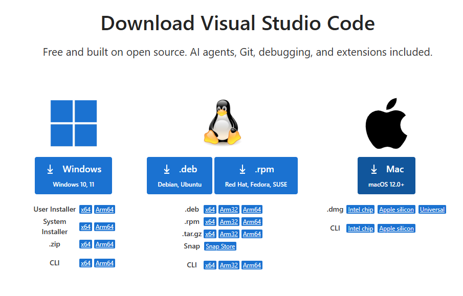

# Clase 05 - Práctica con Oracle SQL Database

# **Sistema de gestión para una veterinaria**

## **Entorno de trabajo**

Esta práctica se debe hacer en **Oracle SQL Developer 24.3.1.347**.

- **Conexión:** `practicas`.
- **Host:** `localhost`.
- **Puerto:** `1521`.
- **Usuario de trabajo:** `academia`.
- **Contraseña:** la indicada en la clase 2.

> Importante: durante la práctica trabajarás principalmente con el usuario `academia`. No debes crear otro usuario para esta práctica. Todo el trabajo se realizará con el usuario `academia`
> 

---

# **1. Contexto empresarial**

La empresa **VetCare S.L.** es una clínica veterinaria que está comenzando a digitalizar su información. Hasta ahora llevaba el control de clientes, mascotas y consultas veterinarias en hojas de cálculo, pero necesita migrar esos datos a una base de datos Oracle.

La clínica desea registrar:

- Los **clientes** que llevan sus mascotas a la veterinaria.
- Las **mascotas** atendidas por la clínica.
- Las **consultas veterinarias** realizadas a cada mascota.

Para esta primera versión del sistema se pide construir un modelo sencillo con **tres tablas**:

1. `clientes`: tabla padre.
2. `mascotas`: tabla padre.
3. `consultas`: tabla hija.

La tabla `consultas` será la tabla hija porque dependerá tanto de un cliente como de una mascota.

---

# **2. Objetivos**

Al finalizar esta práctica deberás ser capaz de:

- Trabajar correctamente dentro del esquema del usuario `academia`.
- Conectarte correctamente desde Oracle SQL Developer.
- Crear tablas usando SQL DDL.
- Definir restricciones `PRIMARY KEY`, `UNIQUE`, `CHECK` y `FOREIGN KEY`.
- Insertar datos consistentes entre tablas relacionadas.
- Modificar estructuras con `ALTER TABLE`.
- Actualizar y borrar registros.
- Consultar datos con `SELECT`, `WHERE`, `ORDER BY`, funciones de grupo, `GROUP BY` y `HAVING`.
- Usar `COMMIT`, `ROLLBACK` y `SAVEPOINT`.
- Comprender qué es una transacción en Oracle.
- Documentar el trabajo realizado mediante script SQL y capturas de pantalla.

---

# **3. Entregables**

Debes entregar:

1. Un archivo SQL llamado:

```
practica_veterinaria_apellido_nombre.sql
```

1. Un documento en PDF o Word (instalar libreoffice u openoffice en la maquina virtual) llamado:

```
evidencias_veterinaria_apellido_nombre.pdf
```

Ese documento debe incluir capturas de pantalla de:

- La conexión `practicas` funcionando en SQL Developer.
- La creación correcta de las tablas.
- La inserción de datos.
- Algunos `SELECT` ejecutados.
- Al menos un ejemplo de `COMMIT`.
- Al menos un ejemplo de `ROLLBACK`.
- Al menos un ejemplo de `SAVEPOINT`.
- La consulta final a las tablas creadas.

---

---

# **4. Esquema de trabajo con el usuario `academia`**

## **Nota importante sobre Oracle**

En Oracle, normalmente no se crea una “database” nueva para cada práctica como puede hacerse en otros motores. En Oracle, lo habitual es trabajar con **usuarios/esquemas**.

Un **usuario** puede tener sus propios objetos: tablas, vistas, secuencias, procedimientos, etc. A ese conjunto de objetos pertenecientes a un usuario se le llama **esquema**.

Por tanto, para esta práctica:

- Trabajarás siempre con el usuario `academia`.
- No debes crear otro usuario.
- Todos los objetos creados, como tablas y restricciones, pertenecerán al esquema `academia`.

## **Preguntas / tareas**

1. Explica con tus palabras la diferencia entre **usuario** y **esquema** en Oracle.
2. Comprueba con qué usuario estás conectado. Busca el comando de SQL.
3. Consulta las tablas existentes en tu esquema antes de comenzar la práctica.

---

# **5. Diseño inicial del modelo de datos**

La veterinaria necesita estas tres tablas:

## **Tabla padre 1: `clientes`**

Debe almacenar información básica del cliente responsable de una o varias mascotas.

Columnas sugeridas:

- `id_cliente`
- `nombre`
- `apellidos`
- `dni`
- `telefono`
- `email`
- `fecha_alta`
- `estado`

Restricciones esperadas:

- Clave primaria sobre `id_cliente`, usando columna autoincremental con `GENERATED AS IDENTITY`.
- `dni` único.
- `email` único.
- `estado` solo debe permitir valores como `ACTIVO` o `INACTIVO`.

## **Tabla padre 2: `mascotas`**

Debe almacenar información básica de las mascotas atendidas.

Columnas sugeridas:

- `id_mascota`
- `nombre`
- `especie`
- `raza`
- `sexo`
- `fecha_nacimiento`
- `peso_kg`
- `estado`

Restricciones esperadas:

- Clave primaria sobre `id_mascota`, usando columna autoincremental con `GENERATED AS IDENTITY`.
- `especie` debe estar controlada mediante una restricción `CHECK`.
- `sexo` debe permitir solo valores concretos.
- `peso_kg` debe ser mayor que cero.
- `estado` debe permitir valores como `ACTIVA`, `EN_TRATAMIENTO` o `FALLECIDA`.

## **Tabla hija: `consultas`**

Debe almacenar las visitas o consultas veterinarias realizadas.

Columnas sugeridas:

- `id_consulta`
- `id_cliente`
- `id_mascota`
- `fecha_consulta`
- `motivo`
- `diagnostico`
- `tratamiento`
- `importe`
- `estado_pago`

Restricciones esperadas:

- Clave primaria sobre `id_consulta`, usando columna autoincremental con `GENERATED AS IDENTITY`.
- Clave foránea hacia `clientes` mediante `id_cliente`.
- Clave foránea hacia `mascotas` mediante `id_mascota`.
- `importe` debe ser mayor o igual que cero.
- `estado_pago` debe permitir valores como `PENDIENTE`, `PAGADO` o `ANULADO`.

---

# **6. Crear las tablas**

## **Nota sobre claves primarias autoincrementales**

En esta práctica las claves primarias deben ser autoincrementales. Para ello, en Oracle debes declarar las columnas identificadoras con `GENERATED AS IDENTITY`.

Ejemplo de sintaxis orientativa:

```sql
id_cliente NUMBER GENERATED BY DEFAULT AS IDENTITY PRIMARY KEY
```

Con esta sintaxis Oracle puede generar automáticamente el valor de la clave primaria cuando insertas un registro y no indicas el identificador.

## **Tareas**

1. Crea la tabla `clientes` con sus columnas y restricciones.
2. Crea la tabla `mascotas` con sus columnas y restricciones.
3. Crea la tabla `consultas` con sus columnas y restricciones.
4. Comprueba que las tres tablas se han creado correctamente consultando el diccionario de datos.
5. Comprueba las restricciones creadas sobre cada tabla.
6. Realiza una captura de pantalla donde se vean las tres tablas en el panel de SQL Developer.

> Recuerda: no debes copiar una solución externa. Debes construir tu propio script usando los comandos vistos en clase.
> 

---

# **7. Datos proporcionados para insertar**

A continuación se proporciona un conjunto de datos iniciales para que puedas cargar la base de datos. Estos datos son consistentes entre las tablas.

Debes insertarlos en el orden correcto para respetar las claves foráneas.

Como las claves primarias son autoincrementales, los `INSERT` no incluyen las columnas `id_cliente`, `id_mascota` ni `id_consulta`. Oracle generará esos valores automáticamente.

> Importante: para que las claves foráneas de `consultas` coincidan con los datos proporcionados, las tablas deben estar vacías antes de cargar estos datos y las columnas `IDENTITY` deben comenzar en 1.
> 

## **7.1. Datos para `clientes`**

```sql
INSERT INTO clientes (nombre, apellidos, dni, telefono, email, fecha_alta, estado)
VALUES ('Laura', 'Sánchez Pérez', '10000001A', '600111001', 'laura.sanchez@email.com', DATE '2024-01-10', 'ACTIVO');

INSERT INTO clientes (nombre, apellidos, dni, telefono, email, fecha_alta, estado)
VALUES ('Miguel', 'Torres Ruiz', '10000002B', '600111002', 'miguel.torres@email.com', DATE '2024-01-15', 'ACTIVO');

INSERT INTO clientes (nombre, apellidos, dni, telefono, email, fecha_alta, estado)
VALUES ('Carmen', 'López García', '10000003C', '600111003', 'carmen.lopez@email.com', DATE '2024-02-01', 'ACTIVO');

INSERT INTO clientes (nombre, apellidos, dni, telefono, email, fecha_alta, estado)
VALUES ('Andrés', 'Martín Gómez', '10000004D', '600111004', 'andres.martin@email.com', DATE '2024-02-08', 'ACTIVO');

INSERT INTO clientes (nombre, apellidos, dni, telefono, email, fecha_alta, estado)
VALUES ('Paula', 'Hernández Díaz', '10000005E', '600111005', 'paula.hernandez@email.com', DATE '2024-02-20', 'INACTIVO');

INSERT INTO clientes (nombre, apellidos, dni, telefono, email, fecha_alta, estado)
VALUES ('Sergio', 'Navarro Molina', '10000006F', '600111006', 'sergio.navarro@email.com', DATE '2024-03-05', 'ACTIVO');
```

## **7.2. Datos para `mascotas`**

```sql
INSERT INTO mascotas (nombre, especie, raza, sexo, fecha_nacimiento, peso_kg, estado)
VALUES ('Luna', 'PERRO', 'Labrador', 'H', DATE '2020-05-12', 24.50, 'ACTIVA');

INSERT INTO mascotas (nombre, especie, raza, sexo, fecha_nacimiento, peso_kg, estado)
VALUES ('Milo', 'GATO', 'Europeo común', 'M', DATE '2021-09-03', 5.20, 'ACTIVA');

INSERT INTO mascotas (nombre, especie, raza, sexo, fecha_nacimiento, peso_kg, estado)
VALUES ('Rocky', 'PERRO', 'Bulldog francés', 'M', DATE '2019-11-20', 12.30, 'EN_TRATAMIENTO');

INSERT INTO mascotas (nombre, especie, raza, sexo, fecha_nacimiento, peso_kg, estado)
VALUES ('Nina', 'GATO', 'Siamés', 'H', DATE '2022-01-18', 4.10, 'ACTIVA');

INSERT INTO mascotas (nombre, especie, raza, sexo, fecha_nacimiento, peso_kg, estado)
VALUES ('Thor', 'PERRO', 'Pastor alemán', 'M', DATE '2018-07-30', 31.80, 'ACTIVA');

INSERT INTO mascotas (nombre, especie, raza, sexo, fecha_nacimiento, peso_kg, estado)
VALUES ('Kira', 'CONEJO', 'Belier', 'H', DATE '2023-03-14', 2.30, 'ACTIVA');
```

## **7.3. Datos para `consultas`**

```sql
INSERT INTO consultas (id_cliente, id_mascota, fecha_consulta, motivo, diagnostico, tratamiento, importe, estado_pago)
VALUES (1, 1, DATE '2024-04-01', 'Vacunación anual', 'Mascota sana', 'Vacuna polivalente', 45.00, 'PAGADO');

INSERT INTO consultas (id_cliente, id_mascota, fecha_consulta, motivo, diagnostico, tratamiento, importe, estado_pago)
VALUES (2, 2, DATE '2024-04-03', 'Revisión general', 'Ligera pérdida de peso', 'Control alimentario', 35.00, 'PAGADO');

INSERT INTO consultas (id_cliente, id_mascota, fecha_consulta, motivo, diagnostico, tratamiento, importe, estado_pago)
VALUES (3, 3, DATE '2024-04-05', 'Dificultad respiratoria', 'Bronquitis leve', 'Antibiótico y reposo', 80.00, 'PENDIENTE');

INSERT INTO consultas (id_cliente, id_mascota, fecha_consulta, motivo, diagnostico, tratamiento, importe, estado_pago)
VALUES (4, 4, DATE '2024-04-08', 'Limpieza dental', 'Sarro moderado', 'Limpieza y control', 95.00, 'PAGADO');

INSERT INTO consultas (id_cliente, id_mascota, fecha_consulta, motivo, diagnostico, tratamiento, importe, estado_pago)
VALUES (6, 5, DATE '2024-04-12', 'Cojera pata trasera', 'Inflamación muscular', 'Antiinflamatorio', 70.00, 'PENDIENTE');

INSERT INTO consultas (id_cliente, id_mascota, fecha_consulta, motivo, diagnostico, tratamiento, importe, estado_pago)
VALUES (1, 1, DATE '2024-05-02', 'Control postvacuna', 'Sin incidencias', 'Observación', 20.00, 'PAGADO');

INSERT INTO consultas (id_cliente, id_mascota, fecha_consulta, motivo, diagnostico, tratamiento, importe, estado_pago)
VALUES (2, 2, DATE '2024-05-06', 'Vómitos', 'Gastritis leve', 'Dieta blanda', 55.00, 'PAGADO');

INSERT INTO consultas (id_cliente, id_mascota, fecha_consulta, motivo, diagnostico, tratamiento, importe, estado_pago)
VALUES (3, 3, DATE '2024-05-10', 'Revisión respiratoria', 'Mejoría parcial', 'Continuar tratamiento', 40.00, 'PENDIENTE');

INSERT INTO consultas (id_cliente, id_mascota, fecha_consulta, motivo, diagnostico, tratamiento, importe, estado_pago)
VALUES (4, 4, DATE '2024-05-15', 'Revisión dental', 'Buena evolución', 'Cepillado recomendado', 30.00, 'PAGADO');

INSERT INTO consultas (id_cliente, id_mascota, fecha_consulta, motivo, diagnostico, tratamiento, importe, estado_pago)
VALUES (6, 6, DATE '2024-05-20', 'Primera revisión', 'Mascota sana', 'Desparasitación', 38.00, 'PAGADO');

INSERT INTO consultas (id_cliente, id_mascota, fecha_consulta, motivo, diagnostico, tratamiento, importe, estado_pago)
VALUES (6, 5, DATE '2024-06-01', 'Control de cojera', 'Recuperación favorable', 'Ejercicio moderado', 42.00, 'PAGADO');

INSERT INTO consultas (id_cliente, id_mascota, fecha_consulta, motivo, diagnostico, tratamiento, importe, estado_pago)
VALUES (1, 1, DATE '2024-06-04', 'Dermatitis', 'Alergia cutánea', 'Champú medicado', 65.00, 'PENDIENTE');

INSERT INTO consultas (id_cliente, id_mascota, fecha_consulta, motivo, diagnostico, tratamiento, importe, estado_pago)
VALUES (2, 2, DATE '2024-06-07', 'Vacunación', 'Mascota sana', 'Vacuna triple felina', 50.00, 'PAGADO');

INSERT INTO consultas (id_cliente, id_mascota, fecha_consulta, motivo, diagnostico, tratamiento, importe, estado_pago)
VALUES (3, 3, DATE '2024-06-10', 'Consulta urgente', 'Recaída respiratoria', 'Nebulización', 90.00, 'PENDIENTE');

INSERT INTO consultas (id_cliente, id_mascota, fecha_consulta, motivo, diagnostico, tratamiento, importe, estado_pago)
VALUES (4, 4, DATE '2024-06-12', 'Control de peso', 'Peso estable', 'Mantener dieta', 25.00, 'PAGADO');

INSERT INTO consultas (id_cliente, id_mascota, fecha_consulta, motivo, diagnostico, tratamiento, importe, estado_pago)
VALUES (6, 6, DATE '2024-06-15', 'Revisión digestiva', 'Sin alteraciones', 'Control rutinario', 32.00, 'PAGADO');

INSERT INTO consultas (id_cliente, id_mascota, fecha_consulta, motivo, diagnostico, tratamiento, importe, estado_pago)
VALUES (1, 1, DATE '2024-07-01', 'Control dermatitis', 'Mejoría clara', 'Continuar champú', 28.00, 'PAGADO');

INSERT INTO consultas (id_cliente, id_mascota, fecha_consulta, motivo, diagnostico, tratamiento, importe, estado_pago)
VALUES (2, 2, DATE '2024-07-04', 'Revisión general', 'Mascota sana', 'Sin tratamiento', 30.00, 'PAGADO');

INSERT INTO consultas (id_cliente, id_mascota, fecha_consulta, motivo, diagnostico, tratamiento, importe, estado_pago)
VALUES (3, 3, DATE '2024-07-07', 'Control respiratorio', 'Estable', 'Medicación preventiva', 45.00, 'PENDIENTE');

INSERT INTO consultas (id_cliente, id_mascota, fecha_consulta, motivo, diagnostico, tratamiento, importe, estado_pago)
VALUES (6, 5, DATE '2024-07-12', 'Revisión final cojera', 'Alta médica', 'Sin tratamiento', 35.00, 'PAGADO');
```

## **Tareas**

1. Inserta los datos proporcionados en las tablas correspondientes.
2. Ejecuta un `COMMIT` después de insertar todos los datos iniciales.
3. Comprueba cuántos registros tiene cada tabla.
4. Realiza una captura de pantalla del resultado de las consultas de comprobación.

---

# **8. Pruebas de restricciones**

## **Tareas**

1. Intenta insertar un cliente con un `dni` repetido.
2. Intenta insertar un cliente con un `email` repetido.
3. Intenta insertar una mascota con un `peso_kg` negativo.
4. Intenta insertar una mascota con una especie no permitida por la restricción `CHECK`.
5. Intenta insertar una consulta usando un `id_cliente` que no exista.
6. Intenta insertar una consulta usando un `id_mascota` que no exista.
7. Anota en tu documento de evidencias qué error devuelve Oracle en cada caso.
8. Explica qué restricción se ha activado en cada error.

---

# **9. Actualización de datos con `UPDATE`**

## **Tareas**

1. Actualiza el teléfono de un cliente.
2. Cambia el estado de un cliente de `INACTIVO` a `ACTIVO`.
3. Actualiza el peso de una mascota después de una revisión veterinaria.
4. Cambia el estado de una consulta de `PENDIENTE` a `PAGADO`.
5. Incrementa el importe de algunas consultas según un criterio que definas.
6. Comprueba los cambios con consultas `SELECT`.
7. Ejecuta un `COMMIT` después de validar los cambios.

---

# **10. Modificación de estructura con `ALTER TABLE`**

## **Tareas**

1. Agrega una columna nueva a `clientes` llamada `direccion`.
2. Agrega una columna nueva a `mascotas` llamada `color`.
3. Agrega una columna nueva a `consultas` llamada `observaciones`.
4. Modifica el tamaño de una columna de tipo texto en una de las tablas.
5. Cambia el nombre de una columna usando `RENAME COLUMN`.
6. Elimina una columna que hayas creado previamente para practicar.
7. Consulta la estructura de las tablas después de cada modificación.
8. Realiza capturas de pantalla donde se evidencien algunos cambios estructurales.

---

# **11. Borrado de registros con `DELETE`**

## **Tareas**

1. Inserta un cliente de prueba y después bórralo.
2. Inserta una mascota de prueba y después bórrala.
3. Inserta una consulta de prueba y después bórrala.
4. Intenta borrar un cliente que tenga consultas asociadas.
5. Explica qué sucede si intentas borrar un registro padre que tiene registros hijos.
6. Ejecuta un `ROLLBACK` en una de las operaciones de borrado antes de confirmar.
7. Ejecuta un `COMMIT` solo cuando estés seguro de que el borrado es correcto.

---

# **12. Consultas básicas con `SELECT`**

## **Tareas**

1. Muestra todos los clientes registrados.
2. Muestra todas las mascotas registradas.
3. Muestra todas las consultas veterinarias.
4. Muestra solo el nombre, especie y peso de las mascotas.
5. Muestra el nombre, apellidos y teléfono de los clientes activos.
6. Muestra las consultas ordenadas por fecha de consulta descendente.
7. Muestra las consultas cuyo importe sea mayor que un valor definido por ti.
8. Muestra las mascotas que sean de una especie concreta.
9. Muestra las consultas que estén pendientes de pago.
10. Muestra las consultas realizadas en un rango de fechas.

---

# **13. Consultas con filtros, funciones de grupo, `GROUP BY` y `HAVING`**

## **Tareas**

1. Cuenta cuántos clientes hay en total.
2. Cuenta cuántas mascotas hay por especie.
3. Calcula el importe total facturado por la veterinaria.
4. Calcula el importe total pendiente de pago.
5. Calcula el importe medio de las consultas.
6. Muestra el importe máximo y mínimo de las consultas.
7. Agrupa las consultas por `estado_pago`.
8. Agrupa las mascotas por especie y muestra solo las especies que tengan más de una mascota.
9. Agrupa las consultas por mascota y muestra solo las mascotas que tengan más de dos consultas.
10. Agrupa las consultas por cliente y muestra solo los clientes cuyo importe total acumulado supere una cantidad definida por ti.

---

# **14. Transacciones en Oracle**

## **Definición**

Una **transacción** es un conjunto de operaciones SQL que Oracle trata como una unidad lógica de trabajo. Una transacción puede incluir varios `INSERT`, `UPDATE` o `DELETE`.

La transacción termina cuando ocurre una de estas acciones:

- Se confirma con `COMMIT`.
- Se deshace con `ROLLBACK`.
- Se confirma implícitamente por algunas sentencias DDL, como `CREATE TABLE`, `ALTER TABLE` o `DROP TABLE`.

En una transacción, Oracle permite decidir si los cambios realizados deben guardarse definitivamente o si deben cancelarse antes de confirmarlos.

## **Sintaxis orientativa de una transacción**

```sql
-- 1. Comprobar el estado inicial
SELECT *
FROM clientes
WHERE dni = '20000001Z';

-- 2. Realizar una operación DML
INSERT INTO clientes (nombre, apellidos, dni, telefono, email, fecha_alta, estado)
VALUES ('Cliente', 'Transaccion Prueba', '20000001Z', '699111222', 'transaccion.prueba@email.com', SYSDATE, 'ACTIVO');

-- 3. Comprobar el cambio antes de confirmar
SELECT *
FROM clientes
WHERE dni = '20000001Z';

-- 4A. Guardar definitivamente los cambios
COMMIT;

-- 4B. O cancelar los cambios si todavía no se han confirmado
ROLLBACK;
```

En una misma transacción puedes ejecutar varias operaciones antes del `COMMIT` o del `ROLLBACK`. Por ejemplo, insertar un cliente, insertar una mascota y registrar una consulta.

## **Tareas**

1. Realiza una transacción donde insertes un nuevo cliente y confirmes con `COMMIT`.
2. Realiza una transacción donde insertes una nueva mascota y canceles con `ROLLBACK`.
3. Realiza una transacción donde actualices una consulta pendiente a pagada y confirmes con `COMMIT`.
4. Realiza una transacción donde borres una consulta y luego recuperes el cambio con `ROLLBACK`.
5. Comprueba antes y después de cada transacción qué datos han cambiado.
6. Documenta con capturas de pantalla una transacción confirmada y una transacción cancelada.

---

# **15. Uso de `SAVEPOINT`**

## **Tareas**

1. Inicia una transacción insertando un nuevo cliente de prueba.
2. Crea un `SAVEPOINT` después de insertar el cliente.
3. Inserta una mascota asociada al caso de prueba.
4. Crea otro `SAVEPOINT` después de insertar la mascota.
5. Inserta una consulta asociada al caso de prueba.
6. Vuelve al segundo `SAVEPOINT` y comprueba qué datos se mantienen.
7. Vuelve al primer `SAVEPOINT` y comprueba qué datos se mantienen.
8. Finaliza la transacción con `COMMIT` o `ROLLBACK`.
9. Explica en tu documento para qué sirve un `SAVEPOINT`.

---

# **16. Consultas de comprobación del diccionario de datos**

## **Tareas**

1. Consulta las tablas creadas por tu usuario.
2. Consulta las restricciones de la tabla `clientes`.
3. Consulta las restricciones de la tabla `mascotas`.
4. Consulta las restricciones de la tabla `consultas`.
5. Consulta las columnas de cada tabla.
6. Consulta qué restricciones son de tipo `P`, `R`, `U` y `C`.
7. Explica qué significa cada tipo de restricción consultada.

---

# **17. Recomendaciones finales**

- Guarda tu script frecuentemente.
- Ejecuta los bloques poco a poco, no todo el archivo de una sola vez al principio.
- Comprueba cada operación con un `SELECT`.
- Antes de hacer un `COMMIT`, asegúrate de que los datos son correctos.
- Usa comentarios en tu script para separar cada apartado.

---

# Instalación de la extensión  **Oracle SQL Developer para VSCode (En la máquina virtual)**

1. [Instalar VSCode](https://code.visualstudio.com/download):
2. Pulsa en Windows:
    
    
    

1. Pulsa sobre el archivo que se ha descargado con el  botón derecho del mouse y pulsa en Ejecutar como administrador:
    
    
    
2. Sigue las instrucciones.
3. Una vez instalado VSCode, ábrelo y pulsa sobre el botón de extensiones:
    
    
    
4. Escribe: Oracle SQL Developer y selecciona el primero:
    
    
    
5. Pulsa en Install:
    
    
    
6. Pulsar en Trust Publisher & Install
    
    
    
7. Espera a que se instale. Pulsa en Accept
    
    
    
8. Ve al icono lateral de **SQL Developer**. Es el icono de base de datos que aparece en la barra izquierda.
    
    
    
9. En el panel **CONNECTIONS**, pulsa el botón: `Create Connection` :
    
    
    
10. Rellena los datos de conexión así:
    
    ```sql
    Connection Name: Practicas
    Username: academia
    Password: contraseña de academia
    Connection Type: Basic
    Hostname: localhost
    Port: 1521
    Type: Service Name
    Service Name: FREEPDB1
    Role: Default
    ```
    
    
    
11. Pulsa en Test. Debe aparecer esto:
    
    
    
12. Pulsar en Save:
    
    
    
13. Después abre una hoja SQL :
    
    
    
14. Escribe:
    
    ```sql
    SELECT USER
    FROM dual;
    ```
    
    
    
15. Ejecuta escribiendo presionado CTRL + ENTER o en el icono ▶️ de color verde:
    
    
    
16. Veras el resultado de la salida en la parte inferior:
    
    