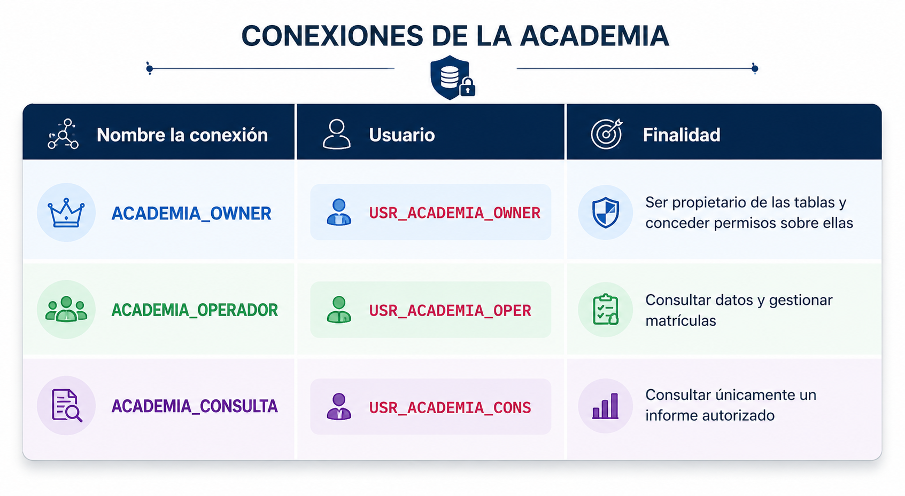

# Clase 08 - Usuarios, esquemas, privilegios y roles

---

> Las sentencias DDL como `CREATE USER`, `CREATE ROLE`, `GRANT`, `REVOKE`, `CREATE TABLE` y `DROP` producen confirmaciones implícitas en Oracle; no se deshacen con `ROLLBACK`.
> 

# Sesión 1

## 1. **Escenario práctico**

<aside>

Una academia necesita separar responsabilidades dentro de su base de datos. Se crearán 3 conexiones en Oracle SQL Developer.

</aside>



> Todos deben conectarse al mismo servicio de la `FREEPDB1`.
> 

También se crearán dos roles:

- `ROL_ACADEMIA_OPERACION`.
- `ROL_ACADEMIA_CONSULTA`.

La distribución de acceso será la siguiente:


## **2. ¿Qué es un usuario en Oracle?**


Por ejemplo:


---

## **3. ¿Qué es un esquema?**


Ejemplo:


## **3.1. Usuario y esquema no son exactamente lo mismo**

<aside>

Aunque comparten el mismo nombre, representan conceptos diferentes:

</aside>

| **Concepto** | **Significado** |
| --- | --- |
| Usuario | Cuenta que puede autenticarse y recibir permisos |
| Esquema | Espacio lógico que agrupa los objetos propiedad del usuario |


## **3.2. Ver el Usuario actual y esquema actual**

Ejecutar desde cualquier conexión:

```sql
SELECT USER AS usuario_conectado,
       SYS_CONTEXT('USERENV', 'CURRENT_SCHEMA') AS esquema_actual
FROM dual;
```


<aside>

### **¿Qué hace esta consulta?**

Esta consulta muestra dos datos importantes de la sesión actual:

- **qué usuario está conectado**;
- **qué esquema está usando Oracle como esquema actual**.

Normalmente ambos valores coinciden.

- `USER` es una función de Oracle que devuelve el **nombre del usuario conectado actualmente**.
- `AS usuario_conectado` pone un alias a la columna para que el resultado salga con un nombre más claro.
- `SYS_CONTEXT` es una función de Oracle que permite obtener información del contexto de la sesión.
- `'USERENV'` indica que queremos información del entorno del usuario.
- `'CURRENT_SCHEMA'` pide específicamente el **esquema actual**.
- `DUAL` es una tabla especial de Oracle que se usa para hacer consultas sencillas cuando no necesitas leer datos de una tabla real.
</aside>

Oracle permite cambiar el esquema de resolución de nombres:

```sql
ALTER SESSION SET CURRENT_SCHEMA = USR_ACADEMIA_OWNER;
```

<aside>

## **¿Qué significa este comando?**

Este comando le dice a Oracle:

> “Durante esta sesión, cuando escriba nombres de objetos sin prefijo, intenta buscarlos primero en el esquema `USR_ACADEMIA_OWNER`.”
> 
- `ALTER SESSION` Significa que vas a modificar alguna característica de la **sesión actual**. No cambia la base de datos completa, solo afecta a la sesión abierta por ese usuario.
- `SET CURRENT_SCHEMA = USR_ACADEMIA_OWNER`  Esto cambia el esquema actual a `USR_ACADEMIA_OWNER`. A partir de ese momento, Oracle intentará resolver nombres de objetos como si ese fuera el esquema principal.
</aside>

<aside>

## **¿Qué es “resolver nombres de objetos”?**

Supongamos que existe esta tabla:

```
USR_ACADEMIA_OWNER.ADM_ALUMNOS
```

Si estás conectado como `USR_ACADEMIA_OPER`, normalmente tendrías que escribir:

```
SELECT*
FROM USR_ACADEMIA_OWNER.ADM_ALUMNOS;
```

Pero si primero ejecutas:

```
ALTER SESSION SET CURRENT_SCHEMA = USR_ACADEMIA_OWNER;
```

entonces podrías escribir:

```
SELECT *
FROM ADM_ALUMNOS;
```

y Oracle entenderá que realmente te refieres a:

```
USR_ACADEMIA_OWNER.ADM_ALUMNOS
```

---

### ¿ Que hace entonces el comando?

- cambia el esquema actual de la sesión;
- permite escribir nombres de objetos sin poner el prefijo del propietario;
- facilita trabajar con objetos de otro esquema cuando ya tienes permisos.
</aside>

## 3.3 Ejemplo

<aside>

Para explicar la diferencia entre **usuario conectado** y **esquema actual**, utilizaremos una empresa que gestiona clientes, productos y pedidos.

El sistema tendrá tres usuarios:

</aside>

| Usuario | Función |
| --- | --- |
| `USR_VENTAS_OWNER` | Propietario de las tablas del sistema de ventas |
| `USR_VENTAS_OPER` | Registra y consulta pedidos |
| `USR_VENTAS_CONS` | Solo consulta información autorizada |

Los tres usuarios se crearán dentro de la misma base de datos conectándose al servicio:

```
FREEPDB1
```

- **Crear el usuario propietario del sistema de ventas**
    
    Conectado como `SYSTEM o SYS`, ejecuta:
    
    ```sql
    CREATE USER usr_ventas_owner
    IDENTIFIED BY "Ventas#2026_Owner"
    DEFAULT TABLESPACE users
    TEMPORARY TABLESPACE temp
    QUOTA 50M ON users;
    ```
    
    ```sql
    CREATE USER usr_ventas_owner
    ```
    
    Crea una cuenta de base de datos llamada:  `USR_VENTAS_OWNER`
    
    Oracle también deja disponible un esquema con ese mismo nombre. Inicialmente, el esquema está vacío.
    
    ### `IDENTIFIED BY`
    
    ```sql
    IDENTIFIED BY "Ventas#2026_Owner"
    ```
    
    Establece la contraseña del usuario. Las comillas dobles permiten utilizar caracteres especiales y respetan exactamente las mayúsculas y minúsculas indicadas.
    
    ### `DEFAULT TABLESPACE users`
    
    ```sql
    DEFAULT TABLESPACE users
    ```
    
    Indica que los objetos permanentes del usuario se almacenarán por defecto en el tablespace `USERS`.
    
    <aside>
    
    Un **tablespace** es una unidad lógica de almacenamiento dentro de Oracle Database.
    
    > El tablespace es el espacio que Oracle reserva y organiza para guardar los objetos de la base de datos.
    > 
    
    Esos objetos pueden ser:
    
    - tablas;
    - índices;
    - segmentos;
    - datos de usuarios;
    - información temporal.
    
    La tabla pertenece al esquema, pero se almacena en el tablespace.
    
    ### Qué es un datafile
    
    El tablespace es una estructura lógica. Para guardar realmente la información en disco, Oracle utiliza uno o varios archivos físicos llamados **datafiles**.
    
    La relación es:
    
    ```
    Base de datos
    └── Tablespace USERS
        └── Datafile físico
            └── Datos de tablas e índices
    ```
    
    Por ejemplo, conceptualmente:
    
    ```
    Tablespace: USERS
    Datafile: users01.dbf
    ```
    
    El nombre y la ubicación real pueden variar según la instalación.
    
    </aside>
    
    ### `TEMPORARY TABLESPACE temp`
    
    ```sql
    TEMPORARY TABLESPACE temp
    ```
    
    Indica el tablespace temporal que Oracle utilizará para ciertas operaciones, como ordenaciones y consultas que necesitan espacio de trabajo temporal.
    
    ### `QUOTA 50M ON users`
    
    ```sql
    QUOTA 50M ON users
    ```
    
    Autoriza al usuario a utilizar hasta 50 MB en el tablespace `USERS`. Esta cuota es necesaria porque `USR_VENTAS_OWNER` será propietario de tablas y otros objetos.
    
- **Conceder privilegios al propietario**
    
    Crear el usuario no significa que pueda conectarse o crear tablas automáticamente. Por eso, como `SYSTEM`, ejecuta:
    
    ```sql
    GRANT CREATE SESSION,
          CREATE TABLE,
          CREATE VIEW,
          CREATE SEQUENCE
    TO usr_ventas_owner;
    ```
    
    ## **Privilegios concedidos**
    
    | Privilegio | Utilidad |
    | --- | --- |
    | `CREATE SESSION` | Permite conectarse a Oracle |
    | `CREATE TABLE` | Permite crear tablas en su esquema |
    | `CREATE VIEW` | Permite crear vistas |
    | `CREATE SEQUENCE` | Permite crear secuencias |
    
    <aside>
    
    ## ¿Qué es una secuencia?
    
    Una secuencia es un objeto de Oracle que genera números automáticamente.
    
    Se utiliza normalmente para crear identificadores consecutivos, por ejemplo:
    
    ```
    1, 2, 3, 4, 5...
    ```
    
    Esto resulta útil para columnas como:
    
    - `id_cliente`
    - `id_producto`
    - `id_pedido`
    - `id_factura`
    </aside>
    
- **Crear el usuario operador**
    
    El operador registrará y consultará ventas, pero no será propietario de las tablas.
    
    Como `SYSTEM` o `SYS` ejecuta:
    
    ```sql
    CREATE USER usr_ventas_oper
    IDENTIFIED BY "Ventas#2026_Oper";
    ```
    
    Ahora concédele permiso para conectarse:
    
    ```sql
    GRANT CREATE SESSION
    TO usr_ventas_oper;
    ```
    
    Este usuario tendrá también un esquema llamado:
    
    ```
    USR_VENTAS_OPER
    ```
    
    Sin embargo, su esquema estará vacío, porque no le hemos concedido `CREATE TABLE`.
    
- **Crear el usuario de consulta**
    
    Este usuario solo consultará información autorizada.
    
    Como `SYSTEM o SYS`, ejecuta:
    
    ```sql
    CREATE USER usr_ventas_cons
    IDENTIFIED BY "Ventas#2026_Cons";
    ```
    
    Concédele permiso para conectarse:
    
    ```sql
    GRANT CREATE SESSION
    TO usr_ventas_cons;
    ```
    
    También tendrá un esquema vacío llamado:
    
    ```
    USR_VENTAS_CONS
    ```
    

---

### **Resumen de los usuarios creados**


---

### **Crear las conexiones en SQL Developer**

### **Conexión del propietario**

```
Nombre de conexión: VENTAS_OWNER
Usuario: USR_VENTAS_OWNER
Contraseña: Ventas#2026_Owner
Host: localhost
Puerto: 1521
Nombre del servicio: FREEPDB1
Rol: Predeterminado
```

### **Conexión del operador**

```
Nombre de conexión: VENTAS_OPERADOR
Usuario: USR_VENTAS_OPER
Contraseña: Ventas#2026_Oper
Host: localhost
Puerto: 1521
Nombre del servicio: FREEPDB1
Rol: Predeterminado
```

### **Conexión de consulta**

```
Nombre de conexión: VENTAS_CONSULTA
Usuario: USR_VENTAS_CONS
Contraseña: Ventas#2026_Cons
Host: localhost
Puerto: 1521
Nombre del servicio: FREEPDB1
Rol: Predeterminado
```

Las tres conexiones apuntan a la misma base de datos:

```
localhost:1521/FREEPDB1
```

> Lo que cambia es el usuario, la contraseña y los privilegios disponibles.
> 

---

### **Crear una tabla en el esquema propietario**

Abre la conexión `VENTAS_OWNER`. Comprueba primero el usuario conectado y el esquema actual:

```sql
SELECT USER AS usuario_conectado,
       SYS_CONTEXT('USERENV', 'CURRENT_SCHEMA') AS esquema_actual
FROM dual;
```

Resultado esperado:

| USUARIO_CONECTADO | ESQUEMA_ACTUAL |
| --- | --- |
| USR_VENTAS_OWNER | USR_VENTAS_OWNER |

Ahora crea una tabla:

```sql
CREATE TABLE ven_productos (
    id_producto NUMBER,
    nombre      VARCHAR2(100) NOT NULL,
    precio      NUMBER(10,2) NOT NULL,
    stock       NUMBER DEFAULT 0 NOT NULL,

    CONSTRAINT pk_ven_productos
        PRIMARY KEY (id_producto),

    CONSTRAINT ck_ven_productos_precio
        CHECK (precio >= 0),

    CONSTRAINT ck_ven_productos_stock
        CHECK (stock >= 0)
);
```

Aunque hemos escrito:

```sql
CREATE TABLE ven_productos
```

el nombre completo del objeto es:

```
USR_VENTAS_OWNER.VEN_PRODUCTOS
```

Se compone de:

```
USR_VENTAS_OWNER = propietario o esquema
VEN_PRODUCTOS    = nombre de la tabla
```

---

### **Insertar datos de prueba**

Como `USR_VENTAS_OWNER`:

```sql
INSERT INTO ven_productos (
    id_producto,
    nombre,
    precio,
    stock
)
VALUES (
    1,
    'Teclado inalámbrico',
    39.90,
    20
);
```

```sql
INSERT INTO ven_productos (
    id_producto,
    nombre,
    precio,
    stock
)
VALUES (
    2,
    'Ratón óptico',
    18.50,
    35
);
```

```sql
COMMIT;
```

Consulta los registros:

```sql
SELECT *
FROM ven_productos;
```

El propietario puede escribir solo:

```sql
VEN_PRODUCTOS
```

porque esa tabla se encuentra dentro de su esquema actual.

---

### **Conceder permiso al operador**

El propietario de una tabla puede conceder privilegios sobre ella. Desde la conexión `VENTAS_OWNER`, ejecuta:

```sql
GRANT SELECT, INSERT, UPDATE
ON ven_productos
TO usr_ventas_oper;
```

Esto permite al operador:

- consultar productos;
- insertar productos;
- modificar productos.

No le permite eliminar registros porque no se le ha concedido `DELETE`.

---

### **Conceder permiso al usuario de consulta**

Como `USR_VENTAS_OWNER`, ejecuta:

```sql
GRANT SELECT
ON ven_productos
TO usr_ventas_cons;
```

Este usuario solo podrá consultar la tabla.

---

### **Consultar desde el usuario operador**

Abre la conexión `VENTAS_OPERADOR`.

Ejecuta:

```sql
SELECT USER AS usuario_conectado,
       SYS_CONTEXT('USERENV', 'CURRENT_SCHEMA') AS esquema_actual
FROM dual;
```

Resultado esperado:

| USUARIO_CONECTADO | ESQUEMA_ACTUAL |
| --- | --- |
| USR_VENTAS_OPER | USR_VENTAS_OPER |

El usuario conectado y el esquema actual coinciden. Sin embargo, la tabla `VEN_PRODUCTOS` no pertenece a ese esquema. Pertenece a:

```
USR_VENTAS_OWNER
```

Por tanto, el operador debe utilizar el nombre completo:

```sql
SELECT *
FROM usr_ventas_owner.ven_productos;
```

## **¿Qué significa el nombre completo?**

```
USR_VENTAS_OWNER.VEN_PRODUCTOS
```

- `USR_VENTAS_OWNER` es el propietario o esquema.
- `VEN_PRODUCTOS` es el objeto que queremos consultar.

---

### **Cambiar el esquema actual del operador**

Para evitar escribir el prefijo en todas las consultas, el operador puede ejecutar:

```sql
ALTER SESSION
SET CURRENT_SCHEMA = USR_VENTAS_OWNER;
```

## `ALTER SESSION`

```sql
ALTER SESSION
```

Indica que se modificará una característica de la sesión actual. El cambio solo afecta a esa sesión. No cambia la configuración general de la base de datos.

---

### `SET CURRENT_SCHEMA`

```sql
SET CURRENT_SCHEMA = USR_VENTAS_OWNER
```

Indica que Oracle debe utilizar `USR_VENTAS_OWNER` como esquema de referencia al resolver nombres de objetos sin prefijo. Después del cambio, el operador puede ejecutar:

```sql
SELECT *
FROM ven_productos;
```

Oracle interpreta ese nombre como:

```sql
SELECT *
FROM usr_ventas_owner.ven_productos;
```

---

### **Comprobar el cambio**

Después de ejecutar `ALTER SESSION`, consulta otra vez:

```sql
SELECT USER AS usuario_conectado,
       SYS_CONTEXT('USERENV', 'CURRENT_SCHEMA') AS esquema_actual
FROM dual;
```

Resultado esperado:

| USUARIO_CONECTADO | ESQUEMA_ACTUAL |
| --- | --- |
| USR_VENTAS_OPER | USR_VENTAS_OWNER |

Ahora los valores son diferentes.

Esto significa:

```
Usuario conectado: USR_VENTAS_OPER
Esquema utilizado como referencia: USR_VENTAS_OWNER
```

---

### **El usuario no ha cambiado**

Aunque el esquema actual sea `USR_VENTAS_OWNER`, el usuario sigue siendo:

```
USR_VENTAS_OPER
```

El comando:

```sql
ALTER SESSION
SET CURRENT_SCHEMA = USR_VENTAS_OWNER;
```

no hace que el operador se convierta en el propietario. Tampoco conoce ni utiliza la contraseña de `USR_VENTAS_OWNER`.

La sesión sigue perteneciendo a:

```
USR_VENTAS_OPER
```

### **El cambio de esquema no concede permisos**

Supongamos que el propietario crea otra tabla:

```sql
CREATE TABLE ven_facturas (
    id_factura    NUMBER PRIMARY KEY,
    importe_total NUMBER(10,2) NOT NULL
);
```

No se concede ningún privilegio sobre ella al operador.

Desde `USR_VENTAS_OPER`, aunque se haya ejecutado:

```sql
ALTER SESSION
SET CURRENT_SCHEMA = USR_VENTAS_OWNER;
```

esta consulta no funcionará:

```sql
SELECT *
FROM ven_facturas;
```

Oracle devolverá un error porque `USR_VENTAS_OPER` no tiene permiso sobre esa tabla.

Por tanto:

> Cambiar el esquema actual facilita la escritura de los nombres, pero no concede acceso a los objetos.
> 

---

## **3.4 Ejemplo de una operación permitida**

El operador tiene `INSERT` sobre `VEN_PRODUCTOS`.

Por tanto, después de cambiar el esquema actual puede ejecutar:

```sql
INSERT INTO ven_productos (
    id_producto,
    nombre,
    precio,
    stock
)
VALUES (
    3,
    'Monitor de 24 pulgadas',
    179.90,
    12
);
```

```sql
COMMIT;
```

Esta operación funciona porque el propietario concedió:

```sql
GRANT SELECT, INSERT, UPDATE
ON ven_productos
TO usr_ventas_oper;
```

---

## **3.5 Ejemplo de una operación prohibida**

El operador no tiene privilegio `DELETE`.

Por tanto, esta sentencia debe fallar:

```sql
DELETE FROM ven_productos
WHERE id_producto = 3;
```

El error esperado será similar a:

```
ORA-01031: privilegios insuficientes
```

El cambio de esquema actual no evita este error.

### **Restaurar el esquema original**

El operador puede volver a utilizar su propio esquema como esquema actual:

```sql
ALTER SESSION
SET CURRENT_SCHEMA = USR_VENTAS_OPER;
```

Comprueba el resultado:

```sql
SELECT USER AS usuario_conectado,
       SYS_CONTEXT('USERENV', 'CURRENT_SCHEMA') AS esquema_actual
FROM dual;
```

Resultado:

| USUARIO_CONECTADO | ESQUEMA_ACTUAL |
| --- | --- |
| USR_VENTAS_OPER | USR_VENTAS_OPER |

---

### **Comparación final**


---

### **Idea clave**

```
USER
```

responde a la pregunta:

> ¿Quién ha iniciado sesión?
> 

```
CURRENT_SCHEMA
```

responde a la pregunta:

> ¿En qué esquema buscará Oracle primero los objetos escritos sin prefijo?
> 

Por ejemplo:

```
USER           = USR_VENTAS_OPER
CURRENT_SCHEMA = USR_VENTAS_OWNER
```

significa:

> El operador sigue siendo el usuario conectado, pero Oracle utiliza el esquema del propietario como referencia para encontrar las tablas.
> 

<aside>

El propietario crea los objetos y concede los permisos. Los otros usuarios acceden a esos objetos según los privilegios que hayan recibido.

</aside>

## **4. Autenticación y autorización**

### **4.1. Autenticación**


### **4.2. Autorización**


## **5. Usuarios locales y arquitectura multitenant**


## **5.1. Comprobar el contenedor actual**

Con la conexión administrativa, ejecutar:

```sql
SELECT SYS_CONTEXT('USERENV', 'CON_NAME') AS contenedor_actual
FROM dual;
```


También puede utilizarse:

```sql
SHOW CON_NAME
```


## **5.2. Error por crear el usuario en el contenedor incorrecto**

Si se intenta crear un usuario local estando conectado al contenedor raíz, puede aparecer:

```
ORA-65096: invalid common user or role name
```

La solución para esta práctica es crear una conexión administrativa cuyo servicio apunte directamente a la PDB.

<aside>

Actividad: Investiga como crear una conexión al contenedor raíz, es decir crear un FREEPDB2 y otro FREEPDB3. 

</aside>

---

## **6. Privilegios de sistema**

Un privilegio de sistema autoriza a realizar una operación en la base de datos.

Ejemplos:

| **Privilegio** | **Permite** |
| --- | --- |
| `CREATE SESSION` | Iniciar una sesión en Oracle |
| `CREATE TABLE` | Crear tablas en el propio esquema |
| `CREATE VIEW` | Crear vistas en el propio esquema |
| `CREATE SEQUENCE` | Crear secuencias en el propio esquema |
| `CREATE PROCEDURE` | Crear procedimientos y funciones en el propio esquema |
| `CREATE ROLE` | Crear roles |
| `CREATE USER` | Crear usuarios |

<aside>

Los privilegios administrativos como `CREATE USER` y `CREATE ROLE` no se suelen conceder cuentas normales. 

</aside>

## **6.1. Principio de mínimo privilegio**


---

## **7. Tablespace predeterminado, temporal y cuota**

<aside>

Cuando un usuario crea objetos, esos objetos necesitan espacio de almacenamiento.

</aside>

### **7.1. Tablespace predeterminado**

Es el tablespace donde se crearán los objetos del usuario si no se indica otro.

En muchos laboratorios se utiliza:

```
USERS
```

### **7.2. Tablespace temporal**

Se utiliza para operaciones temporales, como ordenaciones de gran tamaño.

Normalmente se utiliza:

```
TEMP
```

### **7.3. Cuota**

La cuota limita cuánto espacio puede utilizar el usuario en un tablespace.

Ejemplo:

```sql
QUOTA 20M ON users
```

<aside>

Investiga mas detalles sobre Quota. 

- Tipos de Quota
- Como subir cuota,  como bajar cuota
- Como asignar “infinita cuota”.
- Buenas practicas adminstrativas respecto a las cuotas.
</aside>

Aunque un usuario tenga `CREATE TABLE`, no podrá almacenar la tabla si no dispone de cuota en el tablespace correspondiente.

El error habitual es:

```
ORA-01950: no privileges on tablespace 'USERS'
```

### **7.4. Comprobar los tablespaces predeterminados de la base de datos**

Con la conexión administrativa:

```sql
SELECT property_name,
       property_value
FROM database_properties
WHERE property_name IN (
    'DEFAULT_PERMANENT_TABLESPACE',
    'DEFAULT_TEMP_TABLESPACE'
)
ORDER BY property_name;
```


<aside>

Investiga todos los tablespaces que tiene Oracle y para que se utilizan

</aside>

# **8. Práctica**

### **8.1. Paso 1 — Abrir la conexión administrativa**

Abrir en Oracle SQL Developer la conexión:

```
ADMIN_PDB
```

Comprobar el usuario y el contenedor:

```sql
SELECT USER AS usuario_actual,
       SYS_CONTEXT('USERENV', 'CON_NAME') AS contenedor_actual
FROM dual;
```

Resultado orientativo:

```
USUARIO_ACTUAL    CONTENEDOR_ACTUAL
----------------  -----------------
SYSTEM            FREEPDB1
```

### **8.2. Paso 2 — Limpieza previa opcional**

> Ejecutar este bloque únicamente si la práctica ya se realizó antes y se desea comenzar desde cero. Seleccionar todo el bloque y pulsar **F5**, porque contiene unidades PL/SQL terminadas con `/`.
> 

```sql
BEGIN
    EXECUTE IMMEDIATE 'DROP USER usr_academia_cons CASCADE';
EXCEPTION
    WHEN OTHERS THEN
        IF SQLCODE != -1918 THEN
            RAISE;
        END IF;
END;
/

BEGIN
    EXECUTE IMMEDIATE 'DROP USER usr_academia_oper CASCADE';
EXCEPTION
    WHEN OTHERS THEN
        IF SQLCODE != -1918 THEN
            RAISE;
        END IF;
END;
/

BEGIN
    EXECUTE IMMEDIATE 'DROP USER usr_academia_owner CASCADE';
EXCEPTION
    WHEN OTHERS THEN
        IF SQLCODE != -1918 THEN
            RAISE;
        END IF;
END;
/

BEGIN
    EXECUTE IMMEDIATE 'DROP ROLE rol_academia_consulta';
EXCEPTION
    WHEN OTHERS THEN
        IF SQLCODE != -1919 THEN
            RAISE;
        END IF;
END;
/

BEGIN
    EXECUTE IMMEDIATE 'DROP ROLE rol_academia_operacion';
EXCEPTION
    WHEN OTHERS THEN
        IF SQLCODE != -1919 THEN
            RAISE;
        END IF;
END;
/
```

### **8.3. Paso 3 — Crear las cuentas**

Ejecutar como administrador:

```sql
CREATE USER usr_academia_owner
IDENTIFIED BY "Curso#2026_Owner"
DEFAULT TABLESPACE users
TEMPORARY TABLESPACE temp
QUOTA 20M ON users
ACCOUNT UNLOCK;
```

```sql
CREATE USER usr_academia_oper
IDENTIFIED BY "Curso#2026_Oper"
DEFAULT TABLESPACE users
TEMPORARY TABLESPACE temp
QUOTA 0 ON users
ACCOUNT UNLOCK;
```

```sql
CREATE USER usr_academia_cons
IDENTIFIED BY "Curso#2026_Cons"
DEFAULT TABLESPACE users
TEMPORARY TABLESPACE temp
QUOTA 0 ON users
ACCOUNT UNLOCK;
```

> Las comillas dobles delimitan la contraseña en la sentencia SQL. No forman parte de la contraseña que se escribe en el campo de conexión.
> 

### **8.4. Paso 4 — Conceder privilegios mínimos**

Al propietario se le permite iniciar sesión y crear los objetos necesarios para el escenario:

```sql
GRANT CREATE SESSION,
      CREATE TABLE,
      CREATE VIEW,
      CREATE SEQUENCE
TO usr_academia_owner;
```

A los otros dos usuarios solo se les permite iniciar sesión:

```sql
GRANT CREATE SESSION TO usr_academia_oper;
```

```sql
GRANT CREATE SESSION TO usr_academia_cons;
```

### **8.5. Paso 5 — Comprobar las cuentas creadas**

Como administrador:

```sql
SELECT username,
       account_status,
       default_tablespace,
       temporary_tablespace,
       created
FROM dba_users
WHERE username IN (
    'USR_ACADEMIA_OWNER',
    'USR_ACADEMIA_OPER',
    'USR_ACADEMIA_CONS'
)
ORDER BY username;
```

Resultado esperado:

- las tres cuentas existen;
- su estado es `OPEN`;
- el tablespace predeterminado es `USERS`;
- el tablespace temporal es `TEMP`.

### **8.6. Paso 6 — Comprobar las cuotas**

```sql
SELECT username,
       tablespace_name,
       bytes,
       max_bytes
FROM dba_ts_quotas
WHERE username IN (
    'USR_ACADEMIA_OWNER',
    'USR_ACADEMIA_OPER',
    'USR_ACADEMIA_CONS'
)
ORDER BY username, tablespace_name;
```

El propietario dispone de cuota. Los otros usuarios no necesitan espacio porque no crearán objetos.

### **8.7. Paso 7 — Comprobar los privilegios de sistema**

```sql
SELECT grantee,
       privilege,
       admin_option
FROM dba_sys_privs
WHERE grantee IN (
    'USR_ACADEMIA_OWNER',
    'USR_ACADEMIA_OPER',
    'USR_ACADEMIA_CONS'
)
ORDER BY grantee, privilege;
```

### **8.8. Paso 8 — Crear las conexiones en SQL Developer 24.3.1**

En el panel **Conexiones**:

1. Pulsar el botón **Nueva conexión** o hacer clic derecho sobre `Conexiones` y elegir **Nueva conexión de base de datos**.
2. Seleccionar `Oracle` como tipo de base de datos.
3. Elegir autenticación predeterminada y tipo de conexión `Básica`.
4. Mantener el campo **Rol** en `Predeterminado` para `SYSTEM` y para las cuentas del laboratorio. No seleccionar `SYSDBA`.
5. Introducir el mismo host, puerto y **nombre del servicio** que utiliza `ADMIN_PDB`.
6. Pulsar **Probar**. Solo guardar la conexión cuando la prueba finalice correctamente.
7. En un equipo compartido, no guardar la contraseña.

Crear tres conexiones nuevas con el mismo host, puerto y servicio de la conexión administrativa.

### **Conexión del propietario**

```
Nombre: ACADEMIA_OWNER
Usuario: USR_ACADEMIA_OWNER
Contraseña: Curso#2026_Owner
```

### **Conexión del operador**

```
Nombre: ACADEMIA_OPERADOR
Usuario: USR_ACADEMIA_OPER
Contraseña: Curso#2026_Oper
```

### **Conexión de consulta**

```
Nombre: ACADEMIA_CONSULTA
Usuario: USR_ACADEMIA_CONS
Contraseña: Curso#2026_Cons
```

Pulsar **Probar** antes de guardar cada conexión. Después, abrir una **Hoja de trabajo SQL** distinta para cada conexión mediante clic derecho sobre la conexión → **Abrir Hoja de trabajo SQL**.

### **8.9. Paso 9 — Verificar cada sesión**

Ejecutar desde cada conexión:

```sql
SELECT USER AS usuario_actual,
       SYS_CONTEXT('USERENV', 'CURRENT_SCHEMA') AS esquema_actual,
       SYS_CONTEXT('USERENV', 'CON_NAME') AS contenedor_actual
FROM dual;
```

Cada conexión debe mostrar su propio usuario y el mismo nombre de PDB.

### **8.10. Paso 10 — Probar el privilegio `CREATE TABLE`**

Conectarse como `USR_ACADEMIA_OPER` e intentar:

```sql
CREATE TABLE prueba_operador (
    id NUMBER PRIMARY KEY
);
```

La operación debe fallar porque el operador no tiene `CREATE TABLE`.

Conectarse como `USR_ACADEMIA_OWNER` e intentar:

```sql
CREATE TABLE prueba_propietario (
    id NUMBER PRIMARY KEY
);
```

La operación debe funcionar.

Eliminar la tabla de prueba:

```sql
DROP TABLE prueba_propietario PURGE;
```

Esta comparación demuestra que dos usuarios conectados al mismo servicio pueden tener capacidades diferentes.

---

### **9. Gestión básica del ciclo de vida de una cuenta**

Estas operaciones se ejecutan con la conexión administrativa.

### **9.1. Bloquear una cuenta**

```sql
ALTER USER usr_academia_cons ACCOUNT LOCK;
```

Mientras esté bloqueada, la cuenta no podrá iniciar nuevas sesiones.

Al intentar conectarse puede aparecer:

```
ORA-28000: the account is locked
```

### **9.2. Desbloquear una cuenta**

```sql
ALTER USER usr_academia_cons ACCOUNT UNLOCK;
```

### **9.3. Cambiar una contraseña**

```sql
ALTER USER usr_academia_cons
IDENTIFIED BY "Curso#2026_ConsNueva";
```

Después del cambio se debe actualizar la contraseña guardada en SQL Developer.

Para continuar la práctica con la contraseña inicial:

```sql
ALTER USER usr_academia_cons
IDENTIFIED BY "Curso#2026_Cons";
```

### **9.4. Modificar una cuota**

```sql
ALTER USER usr_academia_owner
QUOTA 30M ON users;
```

### **9.5. Eliminar una cuenta**

```sql
DROP USER usuario_demo;
```

Si el usuario tiene objetos, Oracle exige:

```sql
DROP USER usuario_demo CASCADE;
```

`CASCADE` elimina la cuenta y todos los objetos de su esquema. Por ello debe utilizarse con cuidado.

---

## **10. Consultas de autoinspección para un usuario**

Cada usuario puede revisar parte de sus propios permisos sin acceder a las vistas `DBA_`.

### **10.1. Privilegios de sistema recibidos directamente**

```sql
SELECT privilege
FROM user_sys_privs
ORDER BY privilege;
```

### **10.2. Privilegios efectivos de la sesión**

```sql
SELECT privilege
FROM session_privs
ORDER BY privilege;
```

### **10.3. Roles asignados al usuario**

```sql
SELECT granted_role,
       admin_option,
       default_role
FROM user_role_privs
ORDER BY granted_role;
```

---

## **11. Preguntas**

1. ¿Por qué `CREATE USER` no es suficiente para conectarse?
2. ¿Qué diferencia existe entre usuario y esquema?
3. ¿Para qué sirve una cuota de tablespace?
4. ¿Por qué el operador no debe recibir `CREATE TABLE`?
5. ¿Qué problema de seguridad tendría conceder el rol `DBA` a todos los estudiantes?
6. ¿Qué debe comprobarse antes de crear usuarios en una arquitectura multitenant?

---

# **Sesión 2 — Roles y privilegios sobre objetos**

---

## **1. Privilegios sobre objetos**

<aside>

Un privilegio sobre objeto permite realizar una acción sobre un objeto concreto.

</aside>

Ejemplos sobre una tabla:

| **Privilegio** | **Operación autorizada** |
| --- | --- |
| `SELECT` | Consultar filas |
| `INSERT` | Insertar filas |
| `UPDATE` | Modificar filas |
| `DELETE` | Eliminar filas |
| `REFERENCES` | Crear una clave foránea que apunte a la tabla |

Ejemplo:

```sql
GRANT SELECT ON usr_academia_owner.adm_alumnos
TO usr_academia_cons;
```

Este permiso no permite consultar todas las tablas de Oracle. Solo permite consultar el objeto indicado.

### **1.1. El propietario puede conceder permisos sobre sus objetos**

El usuario propietario de una tabla puede conceder privilegios sobre ella.

Por ejemplo, `USR_ACADEMIA_OWNER` puede ejecutar:

```sql
GRANT SELECT ON adm_alumnos TO otro_usuario;
```

No necesita escribir su propio esquema delante del nombre, porque la tabla se encuentra en su esquema actual.

### **1.2. Acceso desde otro esquema**

Un usuario que accede a una tabla ajena debe utilizar el nombre completo:

```sql
SELECT *
FROM usr_academia_owner.adm_alumnos;
```

Sin el prefijo del esquema, Oracle buscaría una tabla llamada `ADM_ALUMNOS` dentro del esquema del usuario conectado.

---

## **2. ¿Qué es un rol?**


### **2.1. Ventajas de los roles**

- reducen comandos repetidos;
- facilitan altas y bajas de personal;
- permiten diseñar permisos por función laboral;
- simplifican auditorías y revisiones;
- disminuyen errores de administración;
- apoyan el principio de mínimo privilegio.

### **2.2. Permiso directo frente a permiso mediante rol**

#### **Permiso directo**

```sql
GRANT SELECT ON tabla_x TO usuario_a;
```

#### **Permiso mediante rol**

```sql
GRANT SELECT ON tabla_x TO rol_lectura;
GRANT rol_lectura TO usuario_a;
```

Para grupos de usuarios con funciones similares, el rol suele ser más fácil de mantener.

<aside>

Investiga todos los roles y privilegios que tiene Oracle

</aside>

---

## **3. Preparar los objetos del escenario**

Los siguientes comandos se ejecutan con la conexión:

```
ACADEMIA_OWNER
```

### **3.1. Crear la tabla de alumnos**

```sql
CREATE TABLE adm_alumnos (
    id_alumno NUMBER,
    nombre VARCHAR2(100) NOT NULL,
    email VARCHAR2(120) NOT NULL,
    ciudad VARCHAR2(60) NOT NULL,
    activo CHAR(1) DEFAULT 'S' NOT NULL,

    CONSTRAINT pk_adm_alumnos
        PRIMARY KEY (id_alumno),

    CONSTRAINT uk_adm_alumnos_email
        UNIQUE (email),

    CONSTRAINT ck_adm_alumnos_activo
        CHECK (activo IN ('S', 'N'))
);
```

### **3.2. Crear la tabla de cursos**

```sql
CREATE TABLE adm_cursos (
    id_curso NUMBER,
    nombre_curso VARCHAR2(100) NOT NULL,
    horas NUMBER(4) NOT NULL,
    precio NUMBER(10,2) NOT NULL,
    activo CHAR(1) DEFAULT 'S' NOT NULL,

    CONSTRAINT pk_adm_cursos
        PRIMARY KEY (id_curso),

    CONSTRAINT uk_adm_cursos_nombre
        UNIQUE (nombre_curso),

    CONSTRAINT ck_adm_cursos_horas
        CHECK (horas > 0),

    CONSTRAINT ck_adm_cursos_precio
        CHECK (precio >= 0),

    CONSTRAINT ck_adm_cursos_activo
        CHECK (activo IN ('S', 'N'))
);
```

### **3.3. Crear la tabla de matrículas**

```sql
CREATE TABLE adm_matriculas (
    id_matricula NUMBER,
    id_alumno NUMBER NOT NULL,
    id_curso NUMBER NOT NULL,
    fecha_matricula DATE DEFAULT SYSDATE NOT NULL,
    estado VARCHAR2(20) DEFAULT 'PENDIENTE' NOT NULL,

    CONSTRAINT pk_adm_matriculas
        PRIMARY KEY (id_matricula),

    CONSTRAINT fk_adm_matriculas_alumno
        FOREIGN KEY (id_alumno)
        REFERENCES adm_alumnos (id_alumno),

    CONSTRAINT fk_adm_matriculas_curso
        FOREIGN KEY (id_curso)
        REFERENCES adm_cursos (id_curso),

    CONSTRAINT uk_adm_matriculas_alumno_curso
        UNIQUE (id_alumno, id_curso),

    CONSTRAINT ck_adm_matriculas_estado
        CHECK (estado IN (
            'PENDIENTE',
            'CONFIRMADA',
            'CANCELADA'
        ))
);
```

### **3.4. Crear una secuencia para matrículas**

```sql
CREATE SEQUENCE seq_adm_matriculas
START WITH 100
INCREMENT BY 1
NOCACHE;
```

<aside>

Una secuencia es un objeto de Oracle que genera números automáticamente. En este caso se utilizará para asignar identificadores a las matrículas.

- `CREATE SEQUENCE` Crea una secuencia llamada: `SEQ_ADM_MATRICULAS` . Oracle la guardará como un objeto dentro del esquema del usuario que ejecute el comando.
- `START WITH 100` Indica que el primer número generado será: 100. Después se generarán: 101, 102, 103, 104…Se empieza en `100` simplemente por una decisión de diseño. También podría comenzar en `1`.
- `INCREMENT BY 1`  Indica que cada nuevo valor aumentará en una unidad.
- `NOCACHE`Indica que Oracle no reservará previamente un grupo de números en memoria. 
Importante: `NOCACHE` no garantiza que no existan saltos en la numeración.
</aside>

### **3.5. Insertar alumnos**

```sql
INSERT INTO adm_alumnos
    (id_alumno, nombre, email, ciudad, activo)
VALUES
    (1, 'Ana Torres', 'ana.torres@academia.test', 'Madrid', 'S');

INSERT INTO adm_alumnos
    (id_alumno, nombre, email, ciudad, activo)
VALUES
    (2, 'Luis Martín', 'luis.martin@academia.test', 'Valencia', 'S');

INSERT INTO adm_alumnos
    (id_alumno, nombre, email, ciudad, activo)
VALUES
    (3, 'Marta Ruiz', 'marta.ruiz@academia.test', 'Sevilla', 'S');

INSERT INTO adm_alumnos
    (id_alumno, nombre, email, ciudad, activo)
VALUES
    (4, 'Diego López', 'diego.lopez@academia.test', 'Bilbao', 'S');

INSERT INTO adm_alumnos
    (id_alumno, nombre, email, ciudad, activo)
VALUES
    (5, 'Lucía Gómez', 'lucia.gomez@academia.test', 'Málaga', 'N');
```

### **3.6. Insertar cursos**

```sql
INSERT INTO adm_cursos
    (id_curso, nombre_curso, horas, precio, activo)
VALUES
    (10, 'Oracle SQL Inicial', 40, 450, 'S');

INSERT INTO adm_cursos
    (id_curso, nombre_curso, horas, precio, activo)
VALUES
    (20, 'PL/SQL para Principiantes', 30, 390, 'S');

INSERT INTO adm_cursos
    (id_curso, nombre_curso, horas, precio, activo)
VALUES
    (30, 'Administración Oracle Básica', 36, 520, 'S');

INSERT INTO adm_cursos
    (id_curso, nombre_curso, horas, precio, activo)
VALUES
    (40, 'Modelado de Datos', 24, 280, 'S');
```

### **3.7. Insertar matrículas iniciales**

```sql
INSERT INTO adm_matriculas
    (id_matricula, id_alumno, id_curso, fecha_matricula, estado)
VALUES
    (1, 1, 10, DATE '2026-06-01', 'CONFIRMADA');

INSERT INTO adm_matriculas
    (id_matricula, id_alumno, id_curso, fecha_matricula, estado)
VALUES
    (2, 2, 10, DATE '2026-06-02', 'CONFIRMADA');

INSERT INTO adm_matriculas
    (id_matricula, id_alumno, id_curso, fecha_matricula, estado)
VALUES
    (3, 3, 20, DATE '2026-06-03', 'PENDIENTE');

INSERT INTO adm_matriculas
    (id_matricula, id_alumno, id_curso, fecha_matricula, estado)
VALUES
    (4, 4, 30, DATE '2026-06-04', 'CONFIRMADA');

COMMIT;
```

En estos inserts no se está usando: START WITH 100 INCREMENT BY 1. En tal caso el insert podra escribirse asi:

```sql
INSERT INTO adm_matriculas
    (id_matricula, id_alumno, id_curso, fecha_matricula, estado)
VALUES
    (seq_adm_matriculas.NEXTVAL,
     1,
     10,
     DATE '2026-06-01',
     'CONFIRMADA');
     
INSERT INTO adm_matriculas
    (id_matricula, id_alumno, id_curso, fecha_matricula, estado)
VALUES
    (seq_adm_matriculas.NEXTVAL,
     2,
     10,
     DATE '2026-06-02',
     'CONFIRMADA');
 
 INSERT INTO adm_matriculas
    (id_matricula, id_alumno, id_curso, fecha_matricula, estado)
VALUES
    (seq_adm_matriculas.NEXTVAL,
     3,
     20,
     DATE '2026-06-03',
     'PENDIENTE');
  INSERT INTO adm_matriculas
    (id_matricula, id_alumno, id_curso, fecha_matricula, estado)
VALUES
    (seq_adm_matriculas.NEXTVAL,
     4,
     30,
     DATE '2026-06-04',
     'CONFIRMADA');

COMMIT;
```

### **3.8. Crear una vista de consulta controlada**

```sql
CREATE VIEW vw_adm_resumen_matriculas AS
SELECT m.id_matricula,
       a.nombre AS alumno,
       a.ciudad,
       c.nombre_curso,
       c.horas,
       m.fecha_matricula,
       m.estado
FROM adm_matriculas m
INNER JOIN adm_alumnos a
    ON a.id_alumno = m.id_alumno
INNER JOIN adm_cursos c
    ON c.id_curso = m.id_curso;
```

> ¿Cómo podemos crear una vista que nos muestre, de forma clara y en una sola consulta, quién se ha matriculado, en qué curso, cuándo lo hizo y cuál es el estado de la matrícula?
> 

<aside>

La vista permite ofrecer un informe sin conceder necesariamente acceso directo a todas las tablas base.

</aside>

### **3.9. Verificar los objetos**


Resumen de conceptos

---


# **4. Práctica**

## **4.1. Paso 1 — Crear los roles**

Volver a la conexión administrativa `ADMIN_PDB`.

```sql
CREATE ROLE rol_academia_consulta;
```

```sql
CREATE ROLE rol_academia_operacion;
```

Comprobar que existen:

```sql
SELECT role
FROM dba_roles
WHERE role IN (
    'ROL_ACADEMIA_CONSULTA',
    'ROL_ACADEMIA_OPERACION'
)
ORDER BY role;
```

## **4.2. Paso 2 — Conceder privilegios sobre objetos a los roles**

Volver a la conexión `ACADEMIA_OWNER`.

### **Rol de consulta**

Solo podrá consultar la vista autorizada:

```sql
GRANT SELECT ON vw_adm_resumen_matriculas
TO rol_academia_consulta;
```

### **Rol de operación**

Podrá consultar las tablas necesarias:

```sql
GRANT SELECT ON adm_alumnos
TO rol_academia_operacion;
```

```sql
GRANT SELECT ON adm_cursos
TO rol_academia_operacion;
```

```sql
GRANT SELECT, INSERT, UPDATE ON adm_matriculas
TO rol_academia_operacion;
```

Podrá utilizar la secuencia para generar identificadores:

```sql
GRANT SELECT ON seq_adm_matriculas
TO rol_academia_operacion;
```

También podrá consultar la vista de resumen:

```sql
GRANT SELECT ON vw_adm_resumen_matriculas
TO rol_academia_operacion;
```

No se concede `DELETE` al rol de operación.

## **4.3. Paso 3 — Asignar los roles a los usuarios**

Volver a `ADMIN_PDB`.

```sql
GRANT rol_academia_consulta
TO usr_academia_cons;
```

```sql
GRANT rol_academia_operacion
TO usr_academia_oper;
```

## **4.4. Paso 4 — Comprobar la asignación administrativa**

```sql
SELECT grantee,
       granted_role,
       admin_option,
       default_role
FROM dba_role_privs
WHERE grantee IN (
    'USR_ACADEMIA_OPER',
    'USR_ACADEMIA_CONS'
)
ORDER BY grantee, granted_role;
```

## **4.5. Paso 5 — Comprobar privilegios concedidos a los roles**

```sql
SELECT grantee,
       owner,
       table_name,
       privilege,
       grantable
FROM dba_tab_privs
WHERE grantee IN (
    'ROL_ACADEMIA_CONSULTA',
    'ROL_ACADEMIA_OPERACION'
)
ORDER BY grantee, owner, table_name, privilege;
```

---

# **5. Pruebas con el usuario de consulta**

Abrir la conexión:

```
ACADEMIA_CONSULTA
```

## **5.1. Comprobar el rol de la sesión**

```sql
SELECT role
FROM session_roles
ORDER BY role;
```

Debe aparecer:

```
ROL_ACADEMIA_CONSULTA
```

## **5.2. Consultar la vista autorizada**

```sql
SELECT id_matricula,
       alumno,
       ciudad,
       nombre_curso,
       estado
FROM usr_academia_owner.vw_adm_resumen_matriculas
ORDER BY id_matricula;
```

La consulta debe funcionar.

## **5.3. Intentar consultar una tabla base**

```sql
SELECT *
FROM usr_academia_owner.adm_alumnos;
```

La operación debe fallar porque el rol de consulta no tiene permiso directo sobre la tabla. Esto demuestra que una vista puede utilizarse como capa de acceso controlado.

## **5.4. Intentar insertar una matrícula**

```sql
INSERT INTO usr_academia_owner.adm_matriculas
    (id_matricula, id_alumno, id_curso, fecha_matricula, estado)
VALUES
    (90, 1, 20, SYSDATE, 'PENDIENTE');
```

La operación debe fallar porque el usuario solo tiene permisos de lectura sobre la vista.

---

# **6. Pruebas con el usuario operador**

Abrir la conexión:

```
ACADEMIA_OPERADOR
```

## **6.1. Comprobar el rol activo**

```sql
SELECT role
FROM session_roles
ORDER BY role;
```

Debe aparecer:

```
ROL_ACADEMIA_OPERACION
```

## **6.2. Consultar las tablas autorizadas**

```sql
SELECT id_alumno,
       nombre,
       email,
       activo
FROM usr_academia_owner.adm_alumnos
ORDER BY id_alumno;
```

```sql
SELECT id_curso,
       nombre_curso,
       horas,
       precio
FROM usr_academia_owner.adm_cursos
ORDER BY id_curso;
```

## **6.3. Insertar una matrícula utilizando la secuencia**

```sql
INSERT INTO usr_academia_owner.adm_matriculas (
    id_matricula,
    id_alumno,
    id_curso,
    fecha_matricula,
    estado
)
VALUES (
    usr_academia_owner.seq_adm_matriculas.NEXTVAL,
    1,
    20,
    SYSDATE,
    'PENDIENTE'
);
```

```sql
COMMIT;
```

## **6.4. Consultar la matrícula insertada**

```sql
SELECT id_matricula,
       id_alumno,
       id_curso,
       fecha_matricula,
       estado
FROM usr_academia_owner.adm_matriculas
ORDER BY id_matricula;
```

## **6.5. Modificar la matrícula**

```sql
UPDATE usr_academia_owner.adm_matriculas
SET estado = 'CONFIRMADA'
WHERE id_alumno = 1
  AND id_curso = 20;
```

```sql
COMMIT;
```

## **6.6. Intentar eliminar la matrícula**

```sql
DELETE FROM usr_academia_owner.adm_matriculas
WHERE id_alumno = 1
  AND id_curso = 20;
```

La operación debe fallar porque el rol no dispone de `DELETE`. La decisión de no conceder `DELETE` reduce el riesgo de borrados accidentales.

---

# **7. Concesión directa temporal y revocación**

<aside>

Esta actividad permite comparar un privilegio directo con uno recibido por rol.

</aside>

## **7.1. Conceder temporalmente `DELETE`**

Conectarse como `ACADEMIA_OWNER`:

```sql
GRANT DELETE ON adm_matriculas
TO usr_academia_oper;
```

## **7.2. Comprobar el permiso directo**

Conectarse como `ACADEMIA_OPERADOR`:

```sql
SELECT owner,
       table_name,
       privilege,
       grantor
FROM user_tab_privs_recd
ORDER BY owner, table_name, privilege;
```

El privilegio `DELETE` aparece concedido directamente al usuario.

## **7.3. Probar la eliminación dentro de una transacción**

```sql
SAVEPOINT antes_delete;
```

```sql
DELETE FROM usr_academia_owner.adm_matriculas
WHERE id_alumno = 1
  AND id_curso = 20;
```

Comprobar el resultado:

```sql
SELECT *
FROM usr_academia_owner.adm_matriculas
WHERE id_alumno = 1
  AND id_curso = 20;
```

Recuperar la fila:

```sql
ROLLBACK TO antes_delete;
```

Finalizar la transacción:

```sql
COMMIT;
```

## **7.4. Retirar el permiso directo**

Como `ACADEMIA_OWNER`:

```sql
REVOKE DELETE ON adm_matriculas
FROM usr_academia_oper;
```

El operador conserva los permisos recibidos mediante su rol, pero pierde el permiso directo de borrado.

---

# **8. Revocar y volver a conceder un rol**

## **8.1. Retirar el rol de operación**

Como administrador:

```sql
REVOKE rol_academia_operacion
FROM usr_academia_oper;
```

El usuario ya no debe poder acceder a los objetos mediante ese rol en una sesión nueva.

> Para comprobar el efecto con claridad, cerrar y volver a abrir la conexión del operador.
> 

## **8.2. Comprobar la pérdida de acceso**

Como operador:

```sql
SELECT *
FROM usr_academia_owner.vw_adm_resumen_matriculas;
```

La consulta debe fallar.

## **8.3. Volver a conceder el rol**

Como administrador:

```sql
GRANT rol_academia_operacion
TO usr_academia_oper;
```

Cerrar y volver a abrir la conexión. La consulta debe funcionar de nuevo.

---

# **9. Roles predeterminados y activación en la sesión**

<aside>

Un usuario puede tener varios roles asignados. Los roles marcados como predeterminados se activan normalmente al iniciar sesión.

</aside>

Consultar:

```sql
SELECT granted_role,
       default_role
FROM user_role_privs
ORDER BY granted_role;
```

Consultar los roles activos de la sesión:

```sql
SELECT role
FROM session_roles
ORDER BY role;
```

Un administrador puede definir qué roles se activan de forma predeterminada:

```sql
ALTER USER usr_academia_oper
DEFAULT ROLE rol_academia_operacion;
```

En esta práctica cada usuario utiliza un único rol funcional.

---

# **10. La opción `WITH ADMIN OPTION`**

<aside>

Cuando se concede un rol con `WITH ADMIN OPTION`, el usuario puede conceder ese rol a otros usuarios o roles.

</aside>

Ejemplo:

```sql
GRANT rol_academia_consulta
TO usuario_responsable
WITH ADMIN OPTION;
```

Consultar esta información:

```sql
SELECT grantee,
       granted_role,
       admin_option
FROM dba_role_privs
WHERE grantee = 'USR_ACADEMIA_OPER';
```

El valor esperado de `ADMIN_OPTION` es:

```
NO
```

---

# **11. La opción `WITH GRANT OPTION`**

<aside>

Cuando se concede un privilegio sobre un objeto con `WITH GRANT OPTION`, el usuario receptor puede volver a conceder ese privilegio directamente a otros usuarios.

</aside>

Ejemplo:

```sql
GRANT SELECT ON adm_alumnos
TO usuario_responsable
WITH GRANT OPTION;
```

No es habitual usarlo, porque aumenta la capacidad de redistribuir accesos y dificulta su control.

Diferencia principal:

| **Opción** | **Se aplica a** | **Permite** |
| --- | --- | --- |
| `WITH ADMIN OPTION` | Roles y privilegios de sistema | Volver a conceder el rol o privilegio correspondiente |
| `WITH GRANT OPTION` | Privilegios sobre objetos | Volver a conceder el acceso al objeto |

---

# **12. Consultas administrativas de verificación**

Estas consultas se ejecutan como administrador.

## **12.1. Listar cuentas del laboratorio**

```sql
SELECT username,
       account_status,
       default_tablespace,
       temporary_tablespace
FROM dba_users
WHERE username LIKE 'USR_ACADEMIA_%'
ORDER BY username;
```

## **12.2. Listar privilegios de sistema**

```sql
SELECT grantee,
       privilege,
       admin_option
FROM dba_sys_privs
WHERE grantee LIKE 'USR_ACADEMIA_%'
ORDER BY grantee, privilege;
```

## **12.3. Listar roles concedidos**

```sql
SELECT grantee,
       granted_role,
       admin_option,
       default_role
FROM dba_role_privs
WHERE grantee LIKE 'USR_ACADEMIA_%'
ORDER BY grantee, granted_role;
```

## **12.4. Listar privilegios sobre objetos**

```sql
SELECT grantee,
       owner,
       table_name,
       privilege,
       grantable
FROM dba_tab_privs
WHERE owner = 'USR_ACADEMIA_OWNER'
ORDER BY grantee, table_name, privilege;
```

## **12.5. Listar cuotas**

```sql
SELECT username,
       tablespace_name,
       ROUND(bytes / 1024 / 1024, 2) AS mb_utilizados,
       CASE
           WHEN max_bytes = -1 THEN 'ILIMITADA'
           ELSE TO_CHAR(ROUND(max_bytes / 1024 / 1024, 2))
       END AS cuota_mb
FROM dba_ts_quotas
WHERE username LIKE 'USR_ACADEMIA_%'
ORDER BY username, tablespace_name;
```

## **12.6. Informe unificado básico**

```sql
SELECT u.username,
       u.account_status,
       u.default_tablespace,
       rp.granted_role
FROM dba_users u
LEFT JOIN dba_role_privs rp
    ON rp.grantee = u.username
WHERE u.username LIKE 'USR_ACADEMIA_%'
ORDER BY u.username, rp.granted_role;
```

---

# **13. Errores frecuentes y su interpretación**

### **13.1. `ORA-65096: invalid common user or role name`**

**Causa probable:** se intenta crear un usuario local desde `CDB$ROOT`.

**Comprobación:**

```sql
SELECT SYS_CONTEXT('USERENV', 'CON_NAME')
FROM dual;
```

**Solución:** conectarse al servicio de la PDB.

---

### **13.2. `ORA-01045: user lacks CREATE SESSION privilege`**

**Causa:** la cuenta existe, pero no puede iniciar sesión.

**Solución administrativa:**

```sql
GRANT CREATE SESSION TO nombre_usuario;
```

---

### **13.3. `ORA-01950: no privileges on tablespace 'USERS'`**

**Causa:** el usuario tiene permiso para crear la tabla, pero no dispone de cuota.

**Solución:**

```sql
ALTER USER nombre_usuario
QUOTA 20M ON users;
```

---

### **13.4. `ORA-01031: insufficient privileges`**

**Causa:** el usuario intenta ejecutar una operación para la que no está autorizado.

**Solución:** identificar el permiso mínimo necesario. No conceder `DBA` como solución rápida.

---

### **13.5. `ORA-00942: table or view does not exist`**

Puede significar:

- el objeto no existe;
- se ha escrito mal el nombre;
- falta el prefijo del esquema;
- el usuario no dispone de permiso para acceder al objeto.

Ejemplo correcto desde otro usuario:

```sql
SELECT *
FROM usr_academia_owner.adm_alumnos;
```

---

### **13.6. `ORA-01918: user does not exist`**

**Causa:** el nombre del usuario no coincide con una cuenta existente en el contenedor actual.

**Solución:** consultar:

```sql
SELECT username
FROM dba_users
ORDER BY username;
```

---

### **13.7. `ORA-01919: role does not exist`**

**Causa:** el rol no existe en la PDB actual o el nombre es incorrecto.

**Solución:**

```sql
SELECT role
FROM dba_roles
ORDER BY role;
```

---

### **13.8. `ORA-28000: the account is locked`**

**Causa:** la cuenta está bloqueada.

**Solución administrativa:**

```sql
ALTER USER nombre_usuario ACCOUNT UNLOCK;
```

---

### **13.9. El usuario puede conectarse, pero no puede crear objetos**

Revisar dos elementos diferentes:

1. privilegio de sistema:

```sql
SELECT privilege
FROM dba_sys_privs
WHERE grantee = 'NOMBRE_USUARIO';
```

1. cuota de tablespace:

```sql
SELECT username,
       tablespace_name,
       max_bytes
FROM dba_ts_quotas
WHERE username = 'NOMBRE_USUARIO';
```

Tener `CREATE TABLE` no sustituye a la cuota, y tener cuota no sustituye a `CREATE TABLE`.

---

### **13.10. `ORA-01940: cannot drop a user that is currently connected`**

**Causa:** se intenta eliminar una cuenta que todavía mantiene una sesión abierta en SQL Developer.

**Solución para el laboratorio:**

1. Guardar o confirmar el trabajo necesario.
2. Desconectar `ACADEMIA_OWNER`, `ACADEMIA_OPERADOR` y `ACADEMIA_CONSULTA` desde el panel **Conexiones**.
3. Cerrar sus Hojas de trabajo SQL o cambiar esas hojas a otra conexión.
4. Volver a ejecutar `DROP USER ... CASCADE` desde `ADMIN_PDB`.

No se recomienda terminar sesiones de otros usuarios mediante comandos administrativos durante una práctica inicial salvo indicación expresa del formador.

# **14. Buenas prácticas**

1. Crear cuentas personales o funcionales claramente identificadas.
2. Evitar trabajar diariamente como `SYS` o `SYSTEM`.
3. Conceder `CREATE SESSION` solo a cuentas que deban conectarse.
4. Asignar cuotas limitadas a usuarios que creen objetos.
5. Conceder privilegios de objeto sobre recursos concretos.
6. Utilizar roles para agrupar permisos por función laboral.
7. Evitar los privilegios `ANY` en cuentas normales.
8. No conceder el rol `DBA` para resolver errores de permisos.
9. Bloquear cuentas temporalmente en lugar de eliminarlas sin análisis.
10. Revisar periódicamente usuarios, roles y privilegios.
11. Retirar permisos que ya no sean necesarios.
12. Probar los accesos utilizando la cuenta real del usuario, no solo la cuenta administrativa.
13. Separar el propietario de los objetos de las cuentas que utilizan la aplicación.
14. Utilizar vistas cuando se necesite exponer solo una parte controlada de la información.
15. Documentar quién autorizó cada rol y por qué se necesita.

---

# **15. Ejercicios propuestos**

> Realizar los ejercicios en Oracle SQL Developer. No utilizar el usuario `SYS` para el trabajo habitual.
> 

## **Nivel básico**

1. Consultar el usuario, el esquema actual y el contenedor de la conexión administrativa.
2. Crear un usuario llamado `USR_BIBLIOTECA_OWNER` con contraseña segura.
3. Asignar a ese usuario el tablespace `USERS`, el temporal `TEMP` y una cuota de 15 MB.
4. Concederle `CREATE SESSION` y `CREATE TABLE`.
5. Crear una conexión nueva en SQL Developer para ese usuario.
6. Crear una tabla `LIB_LIBROS` dentro de su esquema.
7. Consultar `USER_TABLES` desde la cuenta del propietario.
8. Crear un usuario `USR_BIBLIOTECA_CONS` con permiso únicamente para conectarse.
9. Conceder directamente `SELECT` sobre `LIB_LIBROS` al usuario de consulta.
10. Comprobar el acceso utilizando el nombre completo del objeto.

## **Nivel intermedio**

1. Crear el rol `ROL_BIBLIOTECA_LECTURA`.
2. Retirar el permiso directo concedido en el ejercicio 9.
3. Conceder `SELECT` sobre `LIB_LIBROS` al rol.
4. Asignar el rol al usuario de consulta.
5. Comprobar que el usuario conserva el acceso mediante el rol.
6. Crear una tabla `LIB_PRESTAMOS` dentro del esquema propietario.
7. Crear el rol `ROL_BIBLIOTECA_OPERACION`.
8. Conceder al rol `SELECT`, `INSERT` y `UPDATE` sobre `LIB_PRESTAMOS`, pero no `DELETE`.
9. Crear un usuario operador y asignarle el rol de operación.
10. Probar desde el operador qué sentencias funcionan y cuáles fallan.

## **Preguntas de análisis**

1. ¿Por qué es preferible asignar un rol a veinte usuarios en lugar de repetir veinte veces los mismos `GRANT`?
2. ¿Qué diferencia existe entre `CREATE TABLE` y `INSERT` sobre una tabla de otro usuario?
3. ¿Por qué un usuario con `CREATE TABLE` puede recibir `ORA-01950`?
4. ¿Qué riesgo supone utilizar `WITH ADMIN OPTION` sin necesidad?
5. ¿Qué ventaja aporta una vista para un usuario que solo debe consultar determinados campos?

---

# **16. Reto**

## **Caso: control de acceso para una clínica**

Una clínica necesita los siguientes perfiles:

- un propietario de datos;
- personal de recepción;
- personal de consulta estadística.

Se debe diseñar y ejecutar un script que incluya:

1. Un usuario propietario con cuota limitada.
2. Un usuario de recepción sin permiso para crear tablas.
3. Un usuario de consulta sin permiso para modificar datos.
4. Una tabla de pacientes.
5. Una tabla de citas.
6. Una vista que oculte datos sensibles y muestre solo:
    - identificador de cita;
    - fecha;
    - especialidad;
    - estado.
7. Un rol para recepción con permisos para:
    - consultar pacientes;
    - consultar citas;
    - insertar citas;
    - modificar el estado de una cita.
8. Un rol de consulta con permiso únicamente sobre la vista.
9. La asignación correcta de los roles.
10. Pruebas realizadas desde cada conexión.
11. Una consulta administrativa que muestre los roles concedidos.
12. Una breve explicación de cómo se aplicó el principio de mínimo privilegio.

## **Entregable**

Un archivo `.sql` creado desde Oracle SQL Developer que contenga:

- creación de usuarios;
- creación de roles;
- creación de objetos;
- concesión y retirada de permisos;
- consultas de comprobación;
- comentarios que indiquen con qué conexión debe ejecutarse cada bloque.

---

---

# **17. Script de limpieza del laboratorio (opcional)**

Antes de comenzar, desconectar en SQL Developer las conexiones `ACADEMIA_OWNER`, `ACADEMIA_OPERADOR` y `ACADEMIA_CONSULTA`. Si alguna permanece conectada, Oracle puede devolver `ORA-01940`.

Conectarse como administrador a la PDB:

```sql
DROP USER usr_academia_cons CASCADE;
```

```sql
DROP USER usr_academia_oper CASCADE;
```

```sql
DROP USER usr_academia_owner CASCADE;
```

```sql
DROP ROLE rol_academia_consulta;
```

```sql
DROP ROLE rol_academia_operacion;
```

Comprobar que ya no existen:

```sql
SELECT username
FROM dba_users
WHERE username LIKE 'USR_ACADEMIA_%';
```

```sql
SELECT role
FROM dba_roles
WHERE role LIKE 'ROL_ACADEMIA_%';
```

Ambas consultas deben devolver cero filas.

---