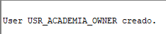

# Clase 09 - Introd a PL/SQL

---

# Sesión 1 - Vistas y tablas temporales

## Escenario:

<aside>
💡

Una academia necesita gestionar:

- alumnos;
- cursos;
- matrículas.

Además, necesita:

1. mostrar informes sin dar acceso directo a todas las tablas;
2. acelerar un resumen que se consulta muchas veces;
3. almacenar datos intermedios durante procesos de cálculo.

Para resolver estas necesidades se utilizarán:

- **vistas**;
- **vistas materializadas**;
- **tablas temporales**.
</aside>

## Preparación del entorno

### Conexiones recomendadas

En Oracle SQL Developer se utilizarán dos conexiones:

| Nombre de la conexión | Usuario | Servicio | Finalidad |
| --- | --- | --- | --- |
| `ADMIN_FREEPDB1` | `SYSTEM` | `FREEPDB1` | Crear usuario y conceder privilegios |
| `ACADEMIA_OWNER` | `USR_ACADEMIA_OWNER` | `FREEPDB1` | Crear tablas, vistas y tablas temporales |

---

## 1. Crear el usuario propietario

Este bloque debe ejecutarse como `SYS` conectado a `FREEPDB1`.

> Si el usuario ya existe, no vuelvas a ejecutar `CREATE USER`.
> 

```sql
CREATE USER usr_academia_owner
IDENTIFIED BY "Curso#2026_Owner"
DEFAULT TABLESPACE users
TEMPORARY TABLESPACE temp
QUOTA 100M ON users;
```



Conceder los privilegios necesarios:

```sql
GRANT CREATE SESSION,
      CREATE TABLE,
      CREATE VIEW,
      CREATE MATERIALIZED VIEW
TO usr_academia_owner;
```


> Dependiendo de la configuración de Oracle, algunos privilegios pueden estar ya concedidos o requerir un usuario con privilegios administrativos.
> 

---

## 2. Crear la conexión del propietario

Configura en SQL Developer:

```
Nombre de conexión: ACADEMIA_OWNER
Usuario: USR_ACADEMIA_OWNER
Contraseña: Curso#2026_Owner
Host: localhost
Puerto: 1521
Nombre del servicio: FREEPDB1
Rol: Predeterminado
```

Pulsa **Probar** y después **Conectar**.

Comprueba la sesión:

```sql
SELECT USER AS usuario_conectado,
       SYS_CONTEXT('USERENV', 'CURRENT_SCHEMA') AS esquema_actual,
       SYS_CONTEXT('USERENV', 'CON_NAME') AS contenedor
FROM dual;
```

Resultado esperado:

```
USUARIO_CONECTADO   ESQUEMA_ACTUAL       CONTENEDOR
------------------  -------------------  -----------
USR_ACADEMIA_OWNER  USR_ACADEMIA_OWNER   FREEPDB1
```

---

## 3. Crear las tablas base

Ejecuta los siguientes comandos desde la conexión `ACADEMIA_OWNER`.

### 3.1. Tabla de alumnos

```sql
CREATE TABLE adm_alumnos (
    id_alumno     NUMBER,
    nombre        VARCHAR2(100) NOT NULL,
    email         VARCHAR2(120) NOT NULL,
    ciudad        VARCHAR2(80) NOT NULL,
    fecha_alta    DATE DEFAULT SYSDATE NOT NULL,
    activo        CHAR(1) DEFAULT 'S' NOT NULL,

    CONSTRAINT pk_adm_alumnos
        PRIMARY KEY (id_alumno),

    CONSTRAINT uk_adm_alumnos_email
        UNIQUE (email),

    CONSTRAINT ck_adm_alumnos_activo
        CHECK (activo IN ('S', 'N'))
);
```

### 3.2. Tabla de cursos

```sql
CREATE TABLE adm_cursos (
    id_curso       NUMBER,
    nombre_curso   VARCHAR2(120) NOT NULL,
    horas          NUMBER(4) NOT NULL,
    precio         NUMBER(10,2) NOT NULL,
    plazas         NUMBER(4) NOT NULL,
    activo         CHAR(1) DEFAULT 'S' NOT NULL,

    CONSTRAINT pk_adm_cursos
        PRIMARY KEY (id_curso),

    CONSTRAINT uk_adm_cursos_nombre
        UNIQUE (nombre_curso),

    CONSTRAINT ck_adm_cursos_horas
        CHECK (horas > 0),

    CONSTRAINT ck_adm_cursos_precio
        CHECK (precio >= 0),

    CONSTRAINT ck_adm_cursos_plazas
        CHECK (plazas > 0),

    CONSTRAINT ck_adm_cursos_activo
        CHECK (activo IN ('S', 'N'))
);
```

### 3.3. Tabla de matrículas

```sql
CREATE TABLE adm_matriculas (
    id_matricula    NUMBER,
    id_alumno       NUMBER NOT NULL,
    id_curso        NUMBER NOT NULL,
    fecha_matricula DATE DEFAULT SYSDATE NOT NULL,
    estado          VARCHAR2(20) DEFAULT 'PENDIENTE' NOT NULL,
    importe_pagado  NUMBER(10,2) DEFAULT 0 NOT NULL,

    CONSTRAINT pk_adm_matriculas
        PRIMARY KEY (id_matricula),

    CONSTRAINT fk_adm_matriculas_alumno
        FOREIGN KEY (id_alumno)
        REFERENCES adm_alumnos (id_alumno),

    CONSTRAINT fk_adm_matriculas_curso
        FOREIGN KEY (id_curso)
        REFERENCES adm_cursos (id_curso),

    CONSTRAINT ck_adm_matriculas_estado
        CHECK (estado IN ('PENDIENTE', 'CONFIRMADA', 'CANCELADA')),

    CONSTRAINT ck_adm_matriculas_importe
        CHECK (importe_pagado >= 0),

    CONSTRAINT uk_adm_matricula_alumno_curso
        UNIQUE (id_alumno, id_curso)
);
```

---

## 4. Insertar datos de prueba

### 4.1. Insertar alumnos

```sql
INSERT INTO adm_alumnos
    (id_alumno, nombre, email, ciudad, fecha_alta, activo)
VALUES
    (1, 'Ana López', 'ana.lopez@email.com', 'Madrid', DATE '2026-05-10', 'S');

INSERT INTO adm_alumnos
    (id_alumno, nombre, email, ciudad, fecha_alta, activo)
VALUES
    (2, 'Luis Martín', 'luis.martin@email.com', 'Madrid', DATE '2026-05-12', 'S');

INSERT INTO adm_alumnos
    (id_alumno, nombre, email, ciudad, fecha_alta, activo)
VALUES
    (3, 'Marta Ruiz', 'marta.ruiz@email.com', 'Sevilla', DATE '2026-05-15', 'S');

INSERT INTO adm_alumnos
    (id_alumno, nombre, email, ciudad, fecha_alta, activo)
VALUES
    (4, 'Carlos Pérez', 'carlos.perez@email.com', 'Valencia', DATE '2026-05-18', 'S');

INSERT INTO adm_alumnos
    (id_alumno, nombre, email, ciudad, fecha_alta, activo)
VALUES
    (5, 'Laura Gómez', 'laura.gomez@email.com', 'Madrid', DATE '2026-05-20', 'N');

INSERT INTO adm_alumnos
    (id_alumno, nombre, email, ciudad, fecha_alta, activo)
VALUES
    (6, 'Pedro Sánchez', 'pedro.sanchez@email.com', 'Bilbao', DATE '2026-05-22', 'S');

INSERT INTO adm_alumnos
    (id_alumno, nombre, email, ciudad, fecha_alta, activo)
VALUES
    (7, 'Elena Torres', 'elena.torres@email.com', 'Sevilla', DATE '2026-05-25', 'S');

INSERT INTO adm_alumnos
    (id_alumno, nombre, email, ciudad, fecha_alta, activo)
VALUES
    (8, 'Diego Romero', 'diego.romero@email.com', 'Madrid', DATE '2026-05-28', 'S');
```

### 4.2. Insertar cursos

```sql
INSERT INTO adm_cursos
    (id_curso, nombre_curso, horas, precio, plazas, activo)
VALUES
    (10, 'Oracle SQL Básico', 30, 350, 20, 'S');

INSERT INTO adm_cursos
    (id_curso, nombre_curso, horas, precio, plazas, activo)
VALUES
    (20, 'Oracle SQL Avanzado', 45, 520, 15, 'S');

INSERT INTO adm_cursos
    (id_curso, nombre_curso, horas, precio, plazas, activo)
VALUES
    (30, 'Introducción a PL/SQL', 40, 480, 18, 'S');

INSERT INTO adm_cursos
    (id_curso, nombre_curso, horas, precio, plazas, activo)
VALUES
    (40, 'Administración Oracle', 60, 750, 12, 'S');

INSERT INTO adm_cursos
    (id_curso, nombre_curso, horas, precio, plazas, activo)
VALUES
    (50, 'Oracle Reports', 25, 300, 10, 'N');
```

### 4.3. Insertar matrículas

```sql
INSERT INTO adm_matriculas
    (id_matricula, id_alumno, id_curso, fecha_matricula, estado, importe_pagado)
VALUES
    (100, 1, 10, DATE '2026-06-01', 'CONFIRMADA', 350);

INSERT INTO adm_matriculas
    (id_matricula, id_alumno, id_curso, fecha_matricula, estado, importe_pagado)
VALUES
    (101, 2, 10, DATE '2026-06-02', 'CONFIRMADA', 350);

INSERT INTO adm_matriculas
    (id_matricula, id_alumno, id_curso, fecha_matricula, estado, importe_pagado)
VALUES
    (102, 3, 20, DATE '2026-06-03', 'PENDIENTE', 200);

INSERT INTO adm_matriculas
    (id_matricula, id_alumno, id_curso, fecha_matricula, estado, importe_pagado)
VALUES
    (103, 4, 30, DATE '2026-06-04', 'CONFIRMADA', 480);

INSERT INTO adm_matriculas
    (id_matricula, id_alumno, id_curso, fecha_matricula, estado, importe_pagado)
VALUES
    (104, 5, 10, DATE '2026-06-05', 'CANCELADA', 0);

INSERT INTO adm_matriculas
    (id_matricula, id_alumno, id_curso, fecha_matricula, estado, importe_pagado)
VALUES
    (105, 6, 40, DATE '2026-06-06', 'PENDIENTE', 300);

INSERT INTO adm_matriculas
    (id_matricula, id_alumno, id_curso, fecha_matricula, estado, importe_pagado)
VALUES
    (106, 7, 20, DATE '2026-06-07', 'CONFIRMADA', 520);

INSERT INTO adm_matriculas
    (id_matricula, id_alumno, id_curso, fecha_matricula, estado, importe_pagado)
VALUES
    (107, 8, 30, DATE '2026-06-08', 'PENDIENTE', 150);

INSERT INTO adm_matriculas
    (id_matricula, id_alumno, id_curso, fecha_matricula, estado, importe_pagado)
VALUES
    (108, 1, 20, DATE '2026-06-09', 'CONFIRMADA', 520);

INSERT INTO adm_matriculas
    (id_matricula, id_alumno, id_curso, fecha_matricula, estado, importe_pagado)
VALUES
    (109, 2, 30, DATE '2026-06-10', 'PENDIENTE', 240);

COMMIT;
```

### 4.4. Comprobar los datos

```sql
SELECT *
FROM adm_alumnos
ORDER BY id_alumno;
```

```sql
SELECT *
FROM adm_cursos
ORDER BY id_curso;
```

```sql
SELECT *
FROM adm_matriculas
ORDER BY id_matricula;
```

---

## 5. ¿Qué es una vista?

Una **vista** es un objeto de Oracle basado en una consulta `SELECT`.

La vista guarda la definición de la consulta, pero normalmente no almacena una copia independiente de las filas.

```
Tabla = almacena datos.
Vista = muestra datos obtenidos mediante una consulta.
```

Cuando cambian las tablas base, la vista muestra los cambios en la siguiente consulta.


---

## 6. Diferencias entre tabla y vista


---

## 7. Crear una vista simple

Una vista simple suele basarse en una sola tabla y no incluye agrupaciones.

```sql
CREATE OR REPLACE VIEW vw_adm_alumnos_activos AS
SELECT id_alumno,
       nombre,
       email,
       ciudad
FROM adm_alumnos
WHERE activo = 'S';
```

Consultar la vista:

```sql
SELECT *
FROM vw_adm_alumnos_activos
ORDER BY id_alumno;
```

## Cuándo se utiliza

- mostrar solo determinados registros;
- ocultar columnas innecesarias;
- simplificar una consulta frecuente;
- dar una interfaz estable a una aplicación.

---

# 8. Crear una vista con filtro

```sql
CREATE OR REPLACE VIEW vw_adm_alumnos_madrid AS
SELECT id_alumno,
       nombre,
       email,
       ciudad
FROM adm_alumnos
WHERE ciudad = 'Madrid';
```

Consultar:

```sql
SELECT *
FROM vw_adm_alumnos_madrid;
```

---

# 9. Crear una vista compleja

Una vista compleja puede utilizar:

- varias tablas;
- `JOIN`;
- funciones;
- agrupaciones;
- cálculos;
- subconsultas.

```sql
CREATE OR REPLACE VIEW vw_adm_resumen_matriculas AS
SELECT m.id_matricula,
       a.nombre AS alumno,
       a.ciudad,
       c.nombre_curso,
       c.horas,
       m.fecha_matricula,
       m.estado,
       m.importe_pagado
FROM adm_matriculas m
INNER JOIN adm_alumnos a
    ON a.id_alumno = m.id_alumno
INNER JOIN adm_cursos c
    ON c.id_curso = m.id_curso;
```

Consultar:

```sql
SELECT *
FROM vw_adm_resumen_matriculas
ORDER BY id_matricula;
```

## Cuándo se utiliza

- evitar repetir varios `JOIN`;
- preparar informes reutilizables;
- presentar datos de varias tablas como si fueran una sola;
- ocultar la estructura interna del sistema.

---

# 10. Vista de solo lectura

La cláusula `WITH READ ONLY` permite consultar una vista, pero impide modificar datos a través de ella.

```sql
CREATE OR REPLACE VIEW vw_adm_alumnos_consulta AS
SELECT id_alumno,
       nombre,
       ciudad
FROM adm_alumnos
WITH READ ONLY;
```

Esta consulta funciona:

```sql
SELECT *
FROM vw_adm_alumnos_consulta;
```

Esta operación debe fallar:

```sql
UPDATE vw_adm_alumnos_consulta
SET ciudad = 'Barcelona'
WHERE id_alumno = 1;
```

## Cuándo se utiliza

- informes;
- usuarios que solo deben consultar;
- evitar modificaciones accidentales;
- exponer información de forma controlada.

---

# 11. Vista con `WITH CHECK OPTION`

Esta opción impide que una operación realizada mediante la vista haga que una fila deje de cumplir la condición de la vista.

```sql
CREATE OR REPLACE VIEW vw_adm_alumnos_madrid_control AS
SELECT id_alumno,
       nombre,
       email,
       ciudad
FROM adm_alumnos
WHERE ciudad = 'Madrid'
WITH CHECK OPTION;
```

Este cambio puede funcionar:

```sql
UPDATE vw_adm_alumnos_madrid_control
SET nombre = 'Ana López García'
WHERE id_alumno = 1;
```

Este cambio debe fallar:

```sql
UPDATE vw_adm_alumnos_madrid_control
SET ciudad = 'Barcelona'
WHERE id_alumno = 1;
```

La fila dejaría de pertenecer a la vista porque ya no cumpliría:

```sql
WHERE ciudad = 'Madrid'
```

Después de la prueba, recupera el nombre original:

```sql
UPDATE adm_alumnos
SET nombre = 'Ana López'
WHERE id_alumno = 1;

COMMIT;
```

---

# 12. Vista agregada

```sql
CREATE OR REPLACE VIEW vw_adm_matriculas_por_curso AS
SELECT c.id_curso,
       c.nombre_curso,
       COUNT(m.id_matricula) AS total_matriculas,
       SUM(CASE
               WHEN m.estado = 'CONFIRMADA' THEN 1
               ELSE 0
           END) AS confirmadas,
       SUM(CASE
               WHEN m.estado = 'PENDIENTE' THEN 1
               ELSE 0
           END) AS pendientes,
       SUM(NVL(m.importe_pagado, 0)) AS total_pagado
FROM adm_cursos c
LEFT JOIN adm_matriculas m
    ON m.id_curso = c.id_curso
GROUP BY c.id_curso,
         c.nombre_curso;
```

Consultar:

```sql
SELECT *
FROM vw_adm_matriculas_por_curso
ORDER BY id_curso;
```

Esta vista normalmente no es modificable directamente porque contiene:

- `GROUP BY`;
- `COUNT`;
- `SUM`.

---

# 13. Conceder permisos sobre una vista

Supongamos que existe el usuario:

```
USR_ACADEMIA_CONS
```

El propietario puede concederle acceso únicamente a la vista:

```sql
GRANT SELECT
ON vw_adm_resumen_matriculas
TO usr_academia_cons;
```

El usuario de consulta utilizaría:

```sql
SELECT *
FROM usr_academia_owner.vw_adm_resumen_matriculas;
```

Esto permite mostrar un informe sin conceder acceso directo a todas las tablas base.

---

# 14. Ver las vistas del usuario

```sql
SELECT view_name
FROM user_views
ORDER BY view_name;
```

Consultar los objetos de tipo vista:

```sql
SELECT object_name,
       object_type,
       status
FROM user_objects
WHERE object_type = 'VIEW'
ORDER BY object_name;
```

En SQL Developer:

1. abre la conexión;
2. despliega **Vistas**;
3. pulsa con el botón derecho;
4. selecciona **Actualizar**.

---

# 15. ¿Qué es una vista materializada?

---


# 16. Crear una vista materializada

```sql
CREATE MATERIALIZED VIEW mv_adm_resumen_cursos
BUILD IMMEDIATE
REFRESH COMPLETE
ON DEMAND
AS
SELECT c.id_curso,
       c.nombre_curso,
       COUNT(m.id_matricula) AS total_matriculas,
       SUM(NVL(m.importe_pagado, 0)) AS total_recaudado
FROM adm_cursos c
LEFT JOIN adm_matriculas m
    ON m.id_curso = c.id_curso
GROUP BY c.id_curso,
         c.nombre_curso;
```

### Donde:

- `BUILD IMMEDIATE` : Crea la vista materializada y carga sus datos inmediatamente.
- `REFRESH COMPLETE` : Cuando se refresque, Oracle volverá a ejecutar toda la consulta.
- `ON DEMAND` : El refresco se realizará cuando se solicite manualmente o mediante una tarea programada.

Consultar:

```sql
SELECT *
FROM mv_adm_resumen_cursos
ORDER BY id_curso;
```

---

# 17. Comprobar que la vista materializada puede quedar desactualizada

Inserta una matrícula nueva:

```sql
INSERT INTO adm_matriculas
    (id_matricula, id_alumno, id_curso, fecha_matricula, estado, importe_pagado)
VALUES
    (110, 3, 30, DATE '2026-06-15', 'CONFIRMADA', 480);

COMMIT;
```

Consulta la tabla base:

```sql
SELECT id_curso,
       COUNT(*) AS total_actual
FROM adm_matriculas
GROUP BY id_curso
ORDER BY id_curso;
```

Consulta la vista materializada:

```sql
SELECT *
FROM mv_adm_resumen_cursos
ORDER BY id_curso;
```

Es posible que todavía muestre el resumen anterior.

---

# 18. Refrescar una vista materializada

```sql
BEGIN
    DBMS_MVIEW.REFRESH(
        list   => 'MV_ADM_RESUMEN_CURSOS',
        method => 'C'
    );
END;
/
```

Después consulta de nuevo:

```sql
SELECT *
FROM mv_adm_resumen_cursos
ORDER BY id_curso;
```

Ahora debe mostrar los datos actualizados.

---

# 19. Cuándo utilizar una vista materializada


---

# 20. Ver vistas materializadas

```sql
SELECT mview_name,
       refresh_mode,
       refresh_method,
       staleness
FROM user_mviews
ORDER BY mview_name;
```

También:

```sql
SELECT object_name,
       object_type,
       status
FROM user_objects
WHERE object_type = 'MATERIALIZED VIEW'
ORDER BY object_name;
```

En SQL Developer puede aparecer el nodo:

```
Vistas materializadas
```

Si no aparece el objeto, pulsa **Actualizar**.

# 21. ¿Qué es una tabla temporal?


---

# 22. Tabla normal frente a tabla temporal


---

# 23. Tabla temporal global

Se crea con:

```sql
CREATE GLOBAL TEMPORARY TABLE
```


---

# 24. Tabla temporal global por transacción

Los datos desaparecen cuando finaliza la transacción.

```sql
CREATE GLOBAL TEMPORARY TABLE tmp_adm_transaccion (
    id_matricula NUMBER,
    id_alumno    NUMBER,
    estado       VARCHAR2(20)
)
ON COMMIT DELETE ROWS;
```

Insertar datos:

```sql
INSERT INTO tmp_adm_transaccion
    (id_matricula, id_alumno, estado)
VALUES
    (900, 1, 'PENDIENTE');

INSERT INTO tmp_adm_transaccion
    (id_matricula, id_alumno, estado)
VALUES
    (901, 2, 'CONFIRMADA');
```

Consultar antes de `COMMIT`:

```sql
SELECT *
FROM tmp_adm_transaccion;
```

Confirmar:

```sql
COMMIT;
```

Consultar después:

```sql
SELECT *
FROM tmp_adm_transaccion;
```

Resultado esperado:

```
Sin filas
```

## Cuándo se utiliza

- cálculos que solo tienen sentido dentro de una transacción;
- pasos intermedios antes de confirmar cambios;
- datos que deben desaparecer al ejecutar `COMMIT`.

---

# 25. Tabla temporal global por sesión

Los datos permanecen después de `COMMIT`, pero desaparecen al cerrar la sesión.

```sql
CREATE GLOBAL TEMPORARY TABLE tmp_adm_sesion (
    id_curso         NUMBER,
    nombre_curso     VARCHAR2(120),
    total_matriculas NUMBER
)
ON COMMIT PRESERVE ROWS;
```

Cargar datos:

```sql
INSERT INTO tmp_adm_sesion
    (id_curso, nombre_curso, total_matriculas)
SELECT c.id_curso,
       c.nombre_curso,
       COUNT(m.id_matricula)
FROM adm_cursos c
LEFT JOIN adm_matriculas m
    ON m.id_curso = c.id_curso
GROUP BY c.id_curso,
         c.nombre_curso;
```

Confirmar:

```sql
COMMIT;
```

Consultar:

```sql
SELECT *
FROM tmp_adm_sesion
ORDER BY id_curso;
```

Los registros siguen disponibles en esa sesión.

## Cuándo se utiliza

- procesos de varias etapas;
- cálculos que duran toda la sesión;
- preparación de informes;
- transformaciones antes de guardar resultados definitivos.

---

# 26. Comprobar el aislamiento entre sesiones

Abre dos hojas SQL con sesiones distintas.

## Sesión 1

```sql
INSERT INTO tmp_adm_sesion
    (id_curso, nombre_curso, total_matriculas)
VALUES
    (999, 'Curso temporal de la sesión 1', 5);

COMMIT;

SELECT *
FROM tmp_adm_sesion
WHERE id_curso = 999;
```

La sesión 1 verá la fila.

## Sesión 2

```sql
SELECT *
FROM tmp_adm_sesion
WHERE id_curso = 999;
```

La sesión 2 no debería verla.

```
Definición de la tabla = compartida.
Datos temporales = privados para cada sesión.
```

---

# 27. Tabla temporal privada

Una tabla temporal privada se crea con:

```sql
CREATE PRIVATE TEMPORARY TABLE
```

Características:

- la definición también es temporal;
- solo existe dentro de la sesión que la crea;
- se elimina automáticamente;
- normalmente su nombre debe comenzar por `ORA$PTT_`.

---

# 28. Tabla temporal privada por transacción

```sql
CREATE PRIVATE TEMPORARY TABLE ora$ptt_adm_transaccion (
    id NUMBER,
    descripcion VARCHAR2(100)
)
ON COMMIT DROP DEFINITION;
```

Insertar:

```sql
INSERT INTO ora$ptt_adm_transaccion
VALUES (1, 'Dato provisional');
```

Consultar:

```sql
SELECT *
FROM ora$ptt_adm_transaccion;
```

Ejecutar:

```sql
COMMIT;
```

Después del `COMMIT`, la tabla deja de existir.

Esta consulta debe fallar:

```sql
SELECT *
FROM ora$ptt_adm_transaccion;
```

## Cuándo se utiliza

- pruebas puntuales;
- procesos temporales de una sola transacción;
- cálculos que no deben dejar objetos permanentes.

---

# 29. Tabla temporal privada por sesión

```sql
CREATE PRIVATE TEMPORARY TABLE ora$ptt_adm_sesion (
    id_alumno        NUMBER,
    total_matriculas NUMBER
)
ON COMMIT PRESERVE DEFINITION;
```

Insertar datos:

```sql
INSERT INTO ora$ptt_adm_sesion
    (id_alumno, total_matriculas)
SELECT a.id_alumno,
       COUNT(m.id_matricula)
FROM adm_alumnos a
LEFT JOIN adm_matriculas m
    ON m.id_alumno = a.id_alumno
GROUP BY a.id_alumno;
```

Confirmar:

```sql
COMMIT;
```

Consultar:

```sql
SELECT *
FROM ora$ptt_adm_sesion
ORDER BY id_alumno;
```

La tabla permanecerá durante la sesión y desaparecerá cuando se cierre.

---

# 30. Tipos de tablas temporales


---

# 31. Consultar tablas temporales globales

```sql
SELECT table_name,
       temporary,
       duration
FROM user_tables
WHERE temporary = 'Y'
ORDER BY table_name;
```

Valores posibles:

```
SYS$TRANSACTION = datos durante la transacción.
SYS$SESSION     = datos durante la sesión.
```

---

# 32. Diferencias entre vista, vista materializada y tabla temporal


---

# 33. ¿Cuándo utilizar cada objeto?

## 33.1. Utilizar una vista cuando


---

## 33.2. Utilizar una vista materializada cuando


---

## 33.3. Utilizar una tabla temporal cuando


---

# 34. Comparación mediante un mismo caso

Necesidad: calcular el número de matrículas por curso.

## Con una vista

```sql
CREATE OR REPLACE VIEW vw_adm_total_curso AS
SELECT c.id_curso,
       c.nombre_curso,
       COUNT(m.id_matricula) AS total_matriculas
FROM adm_cursos c
LEFT JOIN adm_matriculas m
    ON m.id_curso = c.id_curso
GROUP BY c.id_curso,
         c.nombre_curso;
```

Uso:

```
Se necesita información actualizada en cada consulta.
```

## Con una vista materializada

```sql
CREATE MATERIALIZED VIEW mv_adm_total_curso
BUILD IMMEDIATE
REFRESH COMPLETE
ON DEMAND
AS
SELECT c.id_curso,
       c.nombre_curso,
       COUNT(m.id_matricula) AS total_matriculas
FROM adm_cursos c
LEFT JOIN adm_matriculas m
    ON m.id_curso = c.id_curso
GROUP BY c.id_curso,
         c.nombre_curso;
```

Uso:

```
La consulta es pesada y puede actualizarse periódicamente.
```

## Con una tabla temporal

```sql
CREATE GLOBAL TEMPORARY TABLE tmp_adm_total_curso (
    id_curso         NUMBER,
    nombre_curso     VARCHAR2(120),
    total_matriculas NUMBER
)
ON COMMIT PRESERVE ROWS;
```

```sql
INSERT INTO tmp_adm_total_curso
SELECT c.id_curso,
       c.nombre_curso,
       COUNT(m.id_matricula)
FROM adm_cursos c
LEFT JOIN adm_matriculas m
    ON m.id_curso = c.id_curso
GROUP BY c.id_curso,
         c.nombre_curso;
```

Uso:

```
El resultado solo se necesita durante el proceso actual.
```

---

# 35. Guía rápida para elegir


---

# 36. Analogía


---

# 37. Verificar todos los objetos creados

```sql
SELECT object_name,
       object_type,
       status
FROM user_objects
WHERE object_name LIKE 'ADM_%'
   OR object_name LIKE 'VW_ADM_%'
   OR object_name LIKE 'MV_ADM_%'
   OR object_name LIKE 'TMP_ADM_%'
ORDER BY object_type,
         object_name;
```

> Las tablas temporales privadas pueden no aparecer porque solo existen durante la sesión correspondiente.
> 

---

# 41. Ejercicios propuestos

## Ejercicio 1

Crea una vista llamada `VW_ADM_CURSOS_LARGOS` que muestre los cursos con más de 30 horas.

## Ejercicio 2

Crea una vista de solo lectura llamada `VW_ADM_ALUMNOS_PUBLICOS` que muestre únicamente:

- identificador;
- nombre;
- ciudad.

## Ejercicio 3

Crea una vista que muestre solo matrículas confirmadas.

## Ejercicio 4

Crea una vista compleja que muestre:

- alumno;
- curso;
- estado;
- importe pagado.

## Ejercicio 5

Crea una vista con `WITH CHECK OPTION` que muestre únicamente alumnos de Sevilla. Intenta cambiar uno a Madrid mediante la vista.

## Ejercicio 6

Crea una vista agregada que muestre el total recaudado por curso.

## Ejercicio 7

Crea una vista materializada con el número de alumnos por ciudad.

## Ejercicio 8

Inserta un alumno nuevo y comprueba si la vista materializada cambia automáticamente.

## Ejercicio 9

Refresca la vista materializada con `DBMS_MVIEW.REFRESH`.

## Ejercicio 10

Crea una tabla temporal global con `ON COMMIT DELETE ROWS`, inserta dos filas y comprueba qué ocurre después de `COMMIT`.

## Ejercicio 11

Crea una tabla temporal global con `ON COMMIT PRESERVE ROWS`, inserta datos y comprueba que siguen disponibles después de `COMMIT`.

## Ejercicio 12

Abre dos sesiones y comprueba que los datos temporales de una sesión no aparecen en la otra.

## Ejercicio 13

Crea una tabla temporal privada con `ON COMMIT DROP DEFINITION`.

## Ejercicio 14

Crea una tabla temporal privada con `ON COMMIT PRESERVE DEFINITION`.

## Ejercicio 15

Explica qué objeto elegirías para cada caso:

1. informe con datos siempre actuales;
2. panel que se consulta cientos de veces;
3. validación provisional de un archivo;
4. ocultar salarios;
5. cálculo intermedio de una sesión.

---

# 42. Preguntas

1. ¿Qué diferencia existe entre una tabla y una vista?
2. ¿Qué diferencia existe entre una vista y una vista materializada?
3. ¿Por qué una vista materializada puede quedar desactualizada?
4. ¿Qué significa refrescar una vista materializada?
5. ¿Qué diferencia existe entre `ON COMMIT DELETE ROWS` y `ON COMMIT PRESERVE ROWS`?
6. ¿Por qué dos sesiones no ven los mismos datos de una tabla temporal global?
7. ¿Qué diferencia existe entre una tabla temporal global y una privada?
8. ¿Qué objeto utilizarías para ocultar columnas sensibles?
9. ¿Qué objeto utilizarías para acelerar un informe pesado?
10. ¿Qué objeto utilizarías para guardar resultados intermedios?

---

# 43. Resumen


---

# 44. Script de limpieza (opcional)

Ejecuta este bloque únicamente cuando quieras eliminar los objetos de la práctica.

```sql
DROP MATERIALIZED VIEW mv_adm_resumen_cursos;
DROP MATERIALIZED VIEW mv_adm_total_curso;

DROP VIEW vw_adm_total_curso;
DROP VIEW vw_adm_matriculas_por_curso;
DROP VIEW vw_adm_alumnos_madrid_control;
DROP VIEW vw_adm_alumnos_consulta;
DROP VIEW vw_adm_resumen_matriculas;
DROP VIEW vw_adm_alumnos_madrid;
DROP VIEW vw_adm_alumnos_activos;

DROP TABLE tmp_adm_total_curso;
DROP TABLE tmp_adm_sesion;
DROP TABLE tmp_adm_transaccion;

DROP TABLE adm_matriculas;
DROP TABLE adm_cursos;
DROP TABLE adm_alumnos;
```

> Si algún objeto no fue creado, Oracle mostrará un error al intentar eliminarlo. Esto no afecta a los demás objetos si ejecutas cada sentencia por separado.
> 

---

# Sesión 2

## **Introducción a PL/SQL en Oracle SQL Developer**

## **Activar la salida de `DBMS_OUTPUT` (si no se viera el output)**

`DBMS_OUTPUT.PUT_LINE` escribe mensajes, pero estos no siempre aparecen automáticamente.

### **Opción gráfica**

1. Abrir el menú **Ver**.
2. Seleccionar **Salida de DBMS**.
3. En el panel que aparece, pulsar el símbolo `+`.
4. Elegir la conexión del usuario de prácticas.
5. Comprobar que la conexión queda activada.

## **Cómo ejecutar PL/SQL**

Para ejecutar un bloque completo se recomienda:

```
F5 — Ejecutar script
```

También puede utilizarse `Ctrl + Enter` colocando el cursor dentro del bloque.

# **Introducción a PL/SQL**

## **1.1. ¿Qué es PL/SQL?**


---

## **1.2. Diferencia entre SQL y PL/SQL**


Ejemplo SQL:

```sql
SELECT COUNT(*)
FROM adm_cursos;
```

Ejemplo PL/SQL:

```sql
DECLARE
    v_total NUMBER;
BEGIN
    SELECT COUNT(*)
    INTO v_total
    FROM adm_cursos;

    DBMS_OUTPUT.PUT_LINE('Total de cursos: ' || v_total);
END;
/
```

---

# **2. Estructura de un bloque PL/SQL**

Un bloque PL/SQL puede contener tres secciones:

```sql
DECLARE
    -- Declaraciones opcionales
BEGIN
    -- Instrucciones obligatorias
EXCEPTION
    -- Tratamiento de errores opcional
END;
/
```

## **2.1. Sección `DECLARE`**


---

## **2.2. Sección `BEGIN`**


```sql
BEGIN
    DBMS_OUTPUT.PUT_LINE('Hola desde PL/SQL');
END;
/
```

---

## **2.3. Sección `EXCEPTION`**


```sql
EXCEPTION
    WHEN NO_DATA_FOUND THEN
        DBMS_OUTPUT.PUT_LINE('No se encontró ningún registro.');
```

---

## **2.4. La barra `/`**


---

# **6. Primer bloque PL/SQL**

Ejecutar:

```sql
SET SERVEROUTPUT ON;

BEGIN
    DBMS_OUTPUT.PUT_LINE('Hola desde PL/SQL');
END;
/
```

Resultado esperado:

```
Hola desde PL/SQL
```

## **Explicación línea por línea**

```sql
BEGIN
```

Inicia la parte ejecutable.

```sql
DBMS_OUTPUT.PUT_LINE('Hola desde PL/SQL');
```

Muestra un mensaje en el panel de salida.

```sql
END;
```

Finaliza el bloque.

```sql
/
```

Solicita a SQL Developer que ejecute el bloque.

---

# **3. Variables en PL/SQL**

## **3.1. Sintaxis general**

```sql
nombre_variable tipo_de_dato;
```

Ejemplos:

```sql
v_nombre VARCHAR2(100);
v_edad NUMBER;
v_fecha DATE;
```

Es recomendable utilizar el prefijo:

```
v_
```

para identificar las variables locales.

---

## **3.2. Declarar y asignar valores**

```sql
DECLARE
    v_nombre VARCHAR2(100);
    v_edad   NUMBER;
BEGIN
    v_nombre := 'Laura Gómez';
    v_edad   := 29;

    DBMS_OUTPUT.PUT_LINE('Nombre: ' || v_nombre);
    DBMS_OUTPUT.PUT_LINE('Edad: ' || v_edad);
END;
/
```

El operador de asignación en PL/SQL es: `:=` . 

No debe confundirse con: `=` que se utiliza para comparar valores.

---

## **3.3. Inicializar variables en la declaración**

```sql
DECLARE
    v_curso VARCHAR2(100) := 'Administración Oracle';
    v_horas NUMBER := 66;
BEGIN
    DBMS_OUTPUT.PUT_LINE(
        'Curso: ' || v_curso || ' - Horas: ' || v_horas
    );
END;
/
```

---

# **4. Tipos de datos básicos**


Ejemplo:

```sql
DECLARE
    v_total       NUMBER := 25;
    v_descripcion VARCHAR2(100) := 'Curso activo';
    v_fecha       DATE := SYSDATE;
    v_activo      BOOLEAN := TRUE;
BEGIN
    DBMS_OUTPUT.PUT_LINE('Total: ' || v_total);
    DBMS_OUTPUT.PUT_LINE('Descripción: ' || v_descripcion);
    DBMS_OUTPUT.PUT_LINE(
        'Fecha: ' || TO_CHAR(v_fecha, 'DD/MM/YYYY HH24:MI')
    );

    IF v_activo THEN
        DBMS_OUTPUT.PUT_LINE('Estado: activo');
    END IF;
END;
/
```

> En esta clase el `IF` solo se muestra como adelanto. Las estructuras de control se desarrollarán en la siguiente clase.
> 

---

# **5. Constantes**

Una constante recibe un valor inicial que no puede modificarse después.

```sql
DECLARE
    c_iva CONSTANT NUMBER := 0.21;
    v_precio NUMBER := 100;
    v_total  NUMBER;
BEGIN
    v_total := v_precio + (v_precio * c_iva);

    DBMS_OUTPUT.PUT_LINE('Precio final: ' || v_total);
END;
/
```

Convención recomendada:

```
c_
```

para las constantes.

---

# **6. Operaciones y concatenación**

## **6.1. Operaciones numéricas**

```sql
DECLARE
    v_precio   NUMBER := 120;
    v_descuento NUMBER := 15;
    v_final    NUMBER;
BEGIN
    v_final := v_precio - v_descuento;

    DBMS_OUTPUT.PUT_LINE('Precio inicial: ' || v_precio);
    DBMS_OUTPUT.PUT_LINE('Descuento: ' || v_descuento);
    DBMS_OUTPUT.PUT_LINE('Precio final: ' || v_final);
END;
/
```

---

## **6.2. Concatenación**

Oracle utiliza:

```sql
||
```

para unir textos y valores.

```sql
DECLARE
    v_nombre VARCHAR2(50) := 'Ana';
    v_curso  VARCHAR2(80) := 'Oracle Database';
BEGIN
    DBMS_OUTPUT.PUT_LINE(
        v_nombre || ' está matriculada en ' || v_curso
    );
END;
/
```

---

# **7. Práctica**

## **Ejercicio 1. Mensaje de bienvenida**

Crear un bloque que muestre:

```
Bienvenido a la clase de introducción a PL/SQL
```

---

## **Ejercicio 2. Datos de un curso**

Declarar variables para:

- nombre del curso;
- número de horas;
- modalidad.

Mostrar una frase con todos los valores.

Salida orientativa:

```
Curso: Oracle Database | Horas: 66 | Modalidad: presencial
```

---

## **Ejercicio 3. Cálculo de importe**

Declarar:

```
precio = 250
descuento = 30
```

Calcular y mostrar el importe final.

---

## **Ejercicio 4. Fecha del sistema**

Crear un bloque que muestre la fecha actual con este formato:

```
16/06/2026
```

Pista:

```sql
TO_CHAR(SYSDATE, 'DD/MM/YYYY')
```

---

## **Ejercicio 5. Corregir errores**

Corregir el siguiente bloque:

```sql
DECLARE
    v_nombre VARCHAR2(50)
BEGIN
    v_nombre = 'Lucía'
    DBMS_OUTPUT.PUT_LINE('Nombre: ' + v_nombre);
END;
```

Errores que deben localizarse:

- faltan puntos y coma;
- la asignación requiere `:=`;
- la concatenación requiere `||`;
- falta la barra `/`.

---

# **8.  Obtener datos con `SELECT INTO`**

## **8.1. ¿Qué hace `SELECT INTO`?**

En SQL, una consulta devuelve datos al panel de resultados:

```sql
SELECT COUNT(*)
FROM adm_cursos;
```

En PL/SQL, el resultado debe guardarse en una variable:

```sql
SELECT COUNT(*)
INTO v_total
FROM adm_cursos;
```

Estructura:

```sql
SELECT columna_o_expresion
INTO variable
FROM tabla
WHERE condicion;
```

---

# **9. Comprobación de las tablas disponibles**

Antes de ejecutar los ejemplos:

```sql
SELECT table_name
FROM user_tables
ORDER BY table_name;
```

Los ejemplos principales utilizan las tablas:

```
ADM_ALUMNOS
ADM_CURSOS
ADM_MATRICULAS
```

Si en el entorno se utilizaron otros nombres, deben sustituirse por los nombres reales de las tablas creadas en clases anteriores.

---

# **10. Contar registros con `SELECT INTO`**

```sql
DECLARE
    v_total NUMBER;
BEGIN
    SELECT COUNT(*)
    INTO v_total
    FROM adm_cursos;

    DBMS_OUTPUT.PUT_LINE(
        'Número total de cursos: ' || v_total
    );
END;
/
```

`COUNT(*)` siempre devuelve una fila, aunque el resultado sea cero. Por ello, este ejemplo no genera `NO_DATA_FOUND`.

---

# **11. Guardar varias columnas**

Una consulta puede guardar varias columnas en varias variables.

```sql
DECLARE
    v_nombre  VARCHAR2(100);
    v_duracion NUMBER;
BEGIN
    SELECT nombre_curso,
           duracion_horas
    INTO v_nombre,
         v_duracion
    FROM adm_cursos
    WHERE id_curso = 1;

    DBMS_OUTPUT.PUT_LINE('Curso: ' || v_nombre);
    DBMS_OUTPUT.PUT_LINE('Duración: ' || v_duracion || ' horas');
END;
/
```

Regla importante:

```
Número de columnas del SELECT = número de variables del INTO
```

Además, deben aparecer en el mismo orden.

---

# **12. Uso de `%TYPE`**

## **12.1. Problema de declarar tipos manualmente**

Podríamos escribir:

```sql
v_nombre VARCHAR2(100);
```

Pero si cambia el tipo de la columna de la tabla, la variable puede quedar desactualizada.

---

## **12.2. Solución con `%TYPE`**

```sql
v_nombre adm_cursos.nombre_curso%TYPE;
```

Esto significa:

> La variable tendrá el mismo tipo de dato que la columna `nombre_curso` de la tabla `adm_cursos`.
> 

Ejemplo:

```sql
DECLARE
    v_nombre   adm_cursos.nombre_curso%TYPE;
    v_duracion adm_cursos.duracion_horas%TYPE;
BEGIN
    SELECT nombre_curso,
           duracion_horas
    INTO v_nombre,
         v_duracion
    FROM adm_cursos
    WHERE id_curso = 1;

    DBMS_OUTPUT.PUT_LINE(
        v_nombre || ' tiene una duración de ' ||
        v_duracion || ' horas.'
    );
END;
/
```

Ventajas:

- evita repetir tipos y tamaños;
- reduce errores;
- adapta el código a cambios de la tabla;
- mejora el mantenimiento.

# **13. Reglas de `SELECT INTO`**

Una consulta `SELECT INTO` debe devolver exactamente una fila.

## **Caso 1. Devuelve una fila**

El bloque funciona correctamente.

## **Caso 2. No devuelve ninguna fila**

Oracle genera:

```
NO_DATA_FOUND
```

## **Caso 3. Devuelve más de una fila**

Oracle genera:

```
TOO_MANY_ROWS
```

---

# **14. Capturar `NO_DATA_FOUND`**

```sql
DECLARE
    v_nombre adm_cursos.nombre_curso%TYPE;
BEGIN
    SELECT nombre_curso
    INTO v_nombre
    FROM adm_cursos
    WHERE id_curso = 99999;

    DBMS_OUTPUT.PUT_LINE('Curso: ' || v_nombre);

EXCEPTION
    WHEN NO_DATA_FOUND THEN
        DBMS_OUTPUT.PUT_LINE(
            'No existe un curso con ese identificador.'
        );
END;
/
```

Gracias a `EXCEPTION`, el estudiante obtiene un mensaje comprensible en lugar de dejar el error sin controlar.

---

# **15. Capturar `TOO_MANY_ROWS`**

El siguiente bloque puede devolver varias filas:

```sql
DECLARE
    v_nombre adm_cursos.nombre_curso%TYPE;
BEGIN
    SELECT nombre_curso
    INTO v_nombre
    FROM adm_cursos;

    DBMS_OUTPUT.PUT_LINE('Curso: ' || v_nombre);

EXCEPTION
    WHEN TOO_MANY_ROWS THEN
        DBMS_OUTPUT.PUT_LINE(
            'La consulta devolvió más de un curso.'
        );
END;
/
```

No debe utilizarse `SELECT INTO` para recorrer muchas filas. Más adelante se utilizarán cursores o ciclos.

---

# **16. Capturar otros errores**

```sql
DECLARE
    v_resultado NUMBER;
BEGIN
    v_resultado := 10 / 0;

    DBMS_OUTPUT.PUT_LINE(v_resultado);

EXCEPTION
    WHEN ZERO_DIVIDE THEN
        DBMS_OUTPUT.PUT_LINE(
            'No es posible dividir entre cero.'
        );
END;
/
```

También existe:

```sql
WHEN OTHERS THEN
```

para capturar cualquier error no tratado específicamente.

Ejemplo:

```sql
EXCEPTION
    WHEN OTHERS THEN
        DBMS_OUTPUT.PUT_LINE(
            'Error: ' || SQLERRM
        );
```

Para comenzar, es preferible capturar primero errores concretos y dejar `WHEN OTHERS` como última opción.

---

# **17. Ejemplo**

```sql
DECLARE
    v_id_curso   adm_cursos.id_curso%TYPE := 1;
    v_nombre     adm_cursos.nombre_curso%TYPE;
    v_duracion   adm_cursos.duracion_horas%TYPE;
    v_matriculas NUMBER;
BEGIN
    SELECT nombre_curso,
           duracion_horas
    INTO v_nombre,
         v_duracion
    FROM adm_cursos
    WHERE id_curso = v_id_curso;

    SELECT COUNT(*)
    INTO v_matriculas
    FROM adm_matriculas
    WHERE id_curso = v_id_curso;

    DBMS_OUTPUT.PUT_LINE('INFORME DEL CURSO');
    DBMS_OUTPUT.PUT_LINE('-----------------');
    DBMS_OUTPUT.PUT_LINE('Nombre: ' || v_nombre);
    DBMS_OUTPUT.PUT_LINE('Duración: ' || v_duracion || ' horas');
    DBMS_OUTPUT.PUT_LINE('Matrículas: ' || v_matriculas);

EXCEPTION
    WHEN NO_DATA_FOUND THEN
        DBMS_OUTPUT.PUT_LINE(
            'El curso indicado no existe.'
        );
    WHEN OTHERS THEN
        DBMS_OUTPUT.PUT_LINE(
            'Se produjo un error: ' || SQLERRM
        );
END;
/
```

Este bloque:

1. declara un identificador;
2. busca un curso;
3. cuenta sus matrículas;
4. muestra un pequeño informe;
5. controla errores.

---

# **18. Práctica**

## **Ejercicio 1. Total de alumnos**

Crear un bloque que cuente los registros de `ADM_ALUMNOS` y muestre:

```
Total de alumnos: X
```

---

## **Ejercicio 2. Datos de un alumno**

Buscar un alumno por `id_alumno` y mostrar:

- nombre;
- correo electrónico;
- estado.

Utilizar `%TYPE`.

---

## **Ejercicio 3. Curso inexistente**

Buscar el curso con identificador `99999`.

Capturar `NO_DATA_FOUND` y mostrar un mensaje personalizado.

---

## **Ejercicio 4. Total de matrículas**

Contar todas las matrículas y mostrar el resultado.

---

## **Ejercicio 5. Matrículas de un curso**

Declarar una variable con el identificador de un curso.

Mostrar:

- nombre del curso;
- total de matrículas.

---

## **Ejercicio 6. División segura**

Crear dos variables numéricas.

Realizar una división y capturar `ZERO_DIVIDE`.

---

## **Ejercicio 7. Informe de alumno**

Crear un bloque que reciba mediante una variable local el identificador de un alumno y muestre:

```
Alumno: ...
Correo: ...
Número de matrículas: ...
```

Controlar el caso en el que el alumno no exista.

---

## **Ejercicio 8. Diagnóstico de errores**

Ejecutar y corregir:

```sql
DECLARE
    v_total NUMBER
BEGIN
    SELECT COUNT(*)
    v_total
    FROM adm_alumnos;

    DBMS_OUTPUT.PUT_LINE(
        'Total: ' + v_total
    )
END;
/
```

---

# **19. Ejercicios propuestos (opcional)**

No se proporciona la solución durante el planteamiento.

1. Crear un bloque que muestre el usuario conectado y la fecha actual.
2. Declarar una constante con el nombre de la academia y mostrarla.
3. Calcular el precio final de un curso aplicando un descuento.
4. Contar cuántos cursos están activos.
5. Buscar un curso por identificador y mostrar su nombre.
6. Capturar el error cuando el curso no exista.
7. Buscar un alumno por correo electrónico.
8. Provocar y capturar un caso `TOO_MANY_ROWS`.
9. Mostrar cuántas matrículas tiene un alumno concreto.
10. Crear un informe PL/SQL que muestre el nombre de un curso, su duración y su número de matrículas.

# **Buenas prácticas iniciales**

- Utilizar nombres descriptivos.
- Prefijar variables con `v_`.
- Prefijar constantes con `c_`.
- Utilizar `%TYPE` cuando una variable representa una columna.
- Indentar correctamente el código.
- Terminar cada instrucción con `;`.
- Añadir comentarios cuando el bloque tenga varias etapas.
- Capturar errores previsibles.
- No utilizar `WHEN OTHERS` para ocultar errores sin mostrar `SQLERRM`.
- Probar primero el `SELECT` como consulta SQL antes de incluirlo en `SELECT INTO`.

Ejemplo de comentario:

```sql
-- Obtener el total de matrículas del curso indicado
SELECT COUNT(*)
INTO v_total
FROM adm_matriculas
WHERE id_curso = v_id_curso;
```