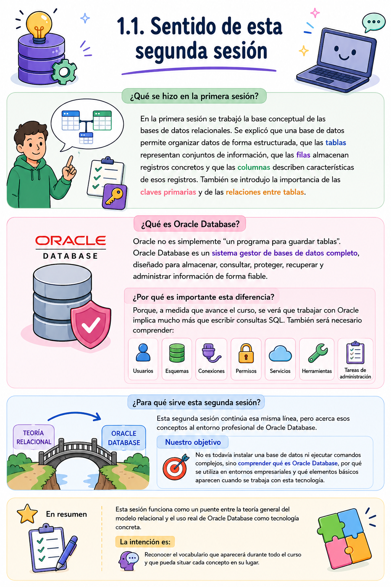
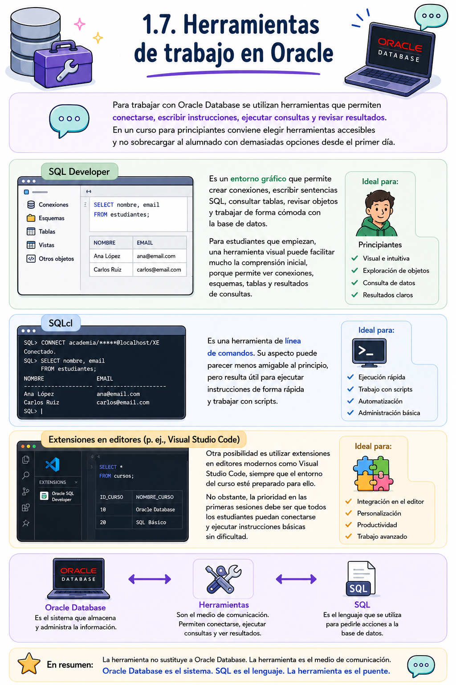

# Clase 02 - Primeros pasos en Oracle

# **Sesión 1  Introducción a Oracle Database**

---

## **1. Desarrollo teórico**



## **1.2. Qué es Oracle Database**


## **1.3. Dónde se utiliza Oracle Database**


## **1.4. Oracle Database como sistema gestor de bases de datos**


## **1.5. Diferencia entre base de datos e instancia**


<aside>

Para esta primera aproximación no es necesario memorizar nombres técnicos de procesos ni estructuras internas avanzadas. Basta con comprender la idea general:

</aside>

| **Concepto** | **Explicación**  | **Ejemplo conceptual** |
| --- | --- | --- |
| Base de datos | Conjunto de archivos y estructuras donde se almacena la información | Los datos guardados de una academia |
| Instancia | Memoria y procesos que permiten utilizar la base de datos | El sistema Oracle funcionando para aceptar consultas |

<aside>

Esta distinción será útil más adelante cuando se estudien tareas de administración, arranque, parada, conexiones y control del entorno.

</aside>

## **1.6. Usuario, esquema y tabla**


## **1.7. Herramientas de trabajo en Oracle**



## **1.8. Versiones de Oracle**

 ****


## **1.9. La conexión a una base de datos Oracle**


## **1.10. Relación entre el modelo de academia y Oracle Database**


# **2. Síntesis**


---

# **3. Práctica**

<aside>

Investiga todos los sistemas gestores de bases de datos relacionales (SGBD) que hay en el mercado. Luego clasifica de mayor a menor cuales SGBD son los mas utilizados en el mercado por las empresas. Clasifica también en cuanto a los precios de estos SGBD de mayor a menor. Además, argumenta porque DB2 de IBM todavía se utiliza.
Supongamos que trabajas para una consultora grande, elabora un informe detallado con la información anterior en el que recomiendas los 5 cinco mejores SGBD, aquí la seguridad es lo mas importante.

</aside>

# Sesión 2 - Primeros pasos en Oracle

## Instalación de Oracle AI Database 26ai Free

- Descargar Oracle AI-database-free
    
    [Conoce Oracle Database 26ai | Oracle América Latina](https://www.oracle.com/latam/database/free/get-started/)
    
- Busca el instalador para Windows (64 bits)
    
    
    
- Descomprimir ahí el ZIP.
- Evitar rutas con espacios raros, acentos o carpetas muy largas. Por ejemplo, mejor:
    
    ```jsx
    C:\oracle_instalador
    ```
    
- Luego ve al archivo descargado y lo descomprimes:
    
    
    
- Pulsa en examinar y descomprimes en `C:\oracle_instalador`
    
    
    
    
    
    
    


- Buscar el archivo de instalación, normalmente:
    
    ```jsx
    setup.exe
    ```
    
- Clic derecho, luego Ejecutar como administrador y seguir el asistente.
- Cuando llegues a carpeta de destino pulsa en cambiar en instala en la raiz C:
    
    ```jsx
    C:\Oracle
    ```
    
    
    
    
    
- Durante la instalación, el punto más importante será definir la **contraseña de administración**. Conviene usar una contraseña común para todos en el aula, fácil de recordar pero válida para Oracle. Utilizaremos:
    
    ```jsx
    Oracle_12345
    ```
    
    
    
- Pulsa en instalar y espera a que finalice la instalación.
    
    
    
    
    
- Datos importantes que debes recordar:
    
    
    
- Para trabajar en clase, no conviene usar siempre `SYSTEM`. Lo ideal es conectarse primero como `SYSTEM` y crear un usuario de prácticas.
- Instalar Oracle SQL Developer. Descarga SQL Developer desde Oracle:
    
    [Oracle SQL Developer Downloads](https://www.oracle.com/database/sqldeveloper/technologies/download/)
    
- Descargar la versión para windows (64 bits)(includes JDK 17)
    
    
    
- Descomprimir y luego ejecuta el archivo `sqldeveloper.exe` :
    
    
    
- Pulsa en No, si te aparece esto:
    
    
    
- Finalizada la instalación deberías ver esto:
    
    
    
- Vamos a instalar una interfaz de línea de comandos llamada `SQLcl` , lo puedes descargar desde aquí:
    
    [Oracle SQLcl](https://www.oracle.com/database/sqldeveloper/technologies/sqlcl/)
    
    
    
- Descomprime la carpeta y ejecuta el archivo `sql.exe` que se encuentra dentro de la carpeta `\bin` :
    
    
    
- Si no abre una terminal , te va a redirigir a un navegador web para que descargues e instales Java JDK 21 (`JDK 21 Windows x64 Installer`):
    
    
    
- Una vez descargado ejecutar y seguir la instalación.
- Ahora vuelve a ejecutar `sql.exe` :
    
    
    
- Cierra la ventana. Haremos las pruebas desde Oracle SQL Developer.
- Vuelve a Oracle SQL Developer:
    
    
    
- Pulsar en ➕ y seleccionar Nueva Conexion de Base de Datos.
    
    
    
- Conectarse con esta información:
    
    
    
- En contraseña, recuerda que es `Oracle_12345` . Luego que introduzcas todos los datos , pulsa en conectar. Deberías ver esto:
    
    
    
- Vamos a probar escribiendo:
    
    ```jsx
    SELECT * FROM dual;
    ```
    
    
    
    ```jsx
    SELECT sysdate FROM dual;
    ```
    
    
    
    Si esas consultas funcionan, Oracle está correctamente instalado.
    
- Crear un usuario para el curso. Una vez conectado como `SYSTEM`, crear un usuario de prácticas:
    
    ```jsx
    CREATE USER academia IDENTIFIED BY Academia123;
    ```
    
    ```jsx
    GRANT CREATE SESSION TO academia;
    ```
    
    ```jsx
    GRANT CREATE TABLE TO academia;
    ```
    
    ```jsx
    ALTER USER academia QUOTA UNLIMITED ON USERS;
    ```
    
    
    
- De ahora en adelante, utilizaremos el usuario creado para hacer todos nuestros ejercicios. Por lo tanto prueba la nueva conexión:
    
    
    
    ```sql
    Name: Practicas
    Usuario: academia
    Contraseña: Academia123
    Host: localhost
    Puerto: 1521
    Nombre del Servicio: FREEPDB1
    ```
    
    
    
- Pulsa en Conectar. Deberias ver:
    
    
    

# Oracle Live SQL

<aside>

Útil para practicar SQL y PL/SQL pero para crear usuarios, roles, permisos y esquemas nuevos necesitamos Oracle instalado localmente o una base de datos Oracle Cloud con permisos de administración.

</aside>

Para acceder a Oracle Live SQL visita:

[Oracle FreeSQL: Learn and practice SQL with the worksheet](https://freesql.com/)

# **Acceso a Oracle Live SQL y primeras consultas sobre el esquema Human Resources HR*HR***

---

# **1. Ajuste metodológico de la sesión**

Mientras se reciben las credenciales necesarias para instalar y trabajar con Oracle en local, estaremos trabjando con **Oracle Live SQL**, un entorno online que permite practicar SQL desde el navegador sin instalar todavía Oracle Database ni SQL Developer en el equipo del estudiante.

En esta sesión no se configurarán conexiones locales, host, puerto, servicio ni listener. Esos conceptos se retomarán cuando se instale Oracle en local. El objetivo ahora es que se pueda pueda empezar a escribir y ejecutar SQL desde el primer momento.

El entorno que se utilizará será el que aparece en Oracle Live SQL / FreeSQL, con el esquema de ejemplo **Human Resources HR**. En el panel izquierdo se pueden ver tablas como:

- `HR.COUNTRIES`
- `HR.DEPARTMENTS`
- `HR.EMPLOYEES`
- `HR.JOBS`
- `HR.JOB_HISTORY`
- `HR.LOCATIONS`
- `HR.REGIONS`

Estas tablas servirán para practicar consultas reales desde el inicio.

---

---

# **2. Material necesario**

## Se recomienda que cada estudiante tenga una carpeta similar a:

```
oracle_curso/
├── scripts/
├── capturas/
├── ejercicios/
└── notas/
```

Y que cree el archivo:

```
clase2_livesql_hr.sql
```

---

# **3. Desarrollo de la teoría**

---

## **3.1. Qué es Oracle Live SQL — 15 minutos**

<aside>

Oracle Live SQL es un entorno online para ejecutar sentencias SQL y practicar con Oracle desde el navegador.

</aside>

Para esta sesión se usará como entorno temporal porque:

- no requiere instalación local inmediata;
- permite empezar a practicar SQL desde el primer día;
- incluye esquemas de ejemplo;
- muestra resultados en formato tabular;
- permite repetir consultas de forma sencilla;
- reduce los problemas técnicos mientras se preparan los equipos locales.

## **3.2. Reconocimiento del entorno Live SQL**


## **Zonas de trabajo**

| **Zona** | **Función** |
| --- | --- |
| **Worksheet** | Lugar donde escribimos SQL |
| Botón de ejecución | Ejecuta la consulta seleccionada o el script |
| **Navigator** | Permite ver esquemas y tablas disponibles |
| **Tables** | Lista de tablas del esquema seleccionado |
| **Query result** | Muestra los resultados de una consulta |
| **Script output** | Muestra mensajes de ejecución de scripts |
| **SQL history** | Permite revisar consultas ejecutadas anteriormente |

## **Tablas principales del esquema HR**

| **Tabla** | **Qué representa** |
| --- | --- |
| `HR.EMPLOYEES` | Empleados de la organización |
| `HR.DEPARTMENTS` | Departamentos de la empresa |
| `HR.JOBS` | Puestos de trabajo |
| `HR.JOB_HISTORY` | Historial de puestos de los empleados |
| `HR.LOCATIONS` | Ubicaciones físicas |
| `HR.COUNTRIES` | Países |
| `HR.REGIONS` | Regiones |

---

## **3.3. Primeras cláusulas SQL**

## **`SELECT`**

Sirve para consultar datos.

```sql
SELECT first_name, last_name
FROM HR.EMPLOYEES;
```

## **Alias de columna**

Permiten dar un nombre más claro a una columna en el resultado.

```sql
SELECT first_name AS nombre,
       last_name AS apellido
FROM HR.EMPLOYEES;
```

## **`WHERE`**

Sirve para filtrar filas.

```sql
SELECT first_name, last_name, salary
FROM HR.EMPLOYEES
WHERE salary > 10000;
```

## **`ORDER BY`**

Sirve para ordenar resultados.

```sql
SELECT first_name, last_name, salary
FROM HR.EMPLOYEES
ORDER BY salary DESC;
```

## **`DISTINCT`**

Sirve para eliminar valores repetidos en el resultado.

```sql
SELECT DISTINCT job_id
FROM HR.EMPLOYEES
ORDER BY job_id;
```

---

# **4. Practicas**

## **Primera comprobación**

Ejecutar:

```sql
SELECT *
FROM dual;
```

Resultado esperado:

```
DUMMY
-----
X
```

Explicación :

`DUAL` es una tabla especial de Oracle que se usa para probar expresiones o funciones simples.

Significa:

- `DUMMY` = nombre de la columna.
- `X` = valor que contiene esa columna.
- `DUAL` = tabla especial de Oracle, usada para probar consultas, funciones o expresiones.

---

## **Primeras consultas sobre empleados, departamentos y trabajos**

### **Consulta 1: ver algunos empleados**

```sql
SELECT employee_id, first_name, last_name, email, hire_date
FROM HR.EMPLOYEES
FETCH FIRST 10 ROWS ONLY;
```


Explicación Consulta los **10 primeros empleados** de la tabla `HR.EMPLOYEES`, mostrando solo algunas columnas.

Preguntas:

- ¿Cuántas columnas se están mostrando?
- ¿Qué parece representar `employee_id`?
- ¿Qué diferencia hay entre `first_name` y `last_name`?

---

## **Consulta 2: usar alias en español**

```sql
SELECT employee_id AS id_empleado,
       first_name AS nombre,
       last_name AS apellido,
       email AS correo
FROM HR.EMPLOYEES
FETCH FIRST 10 ROWS ONLY;
```

Preguntas:

- ¿Cambia el nombre real de la columna en la tabla?
- ¿O solo cambia la forma en que se muestra el resultado?

---

## **Consulta 3: consultar departamentos**

```sql
SELECT department_id, department_name, manager_id, location_id
FROM HR.DEPARTMENTS
ORDER BY department_id;
```

Preguntas:

- ¿Qué columna identifica cada departamento?
- ¿Qué columna contiene el nombre del departamento?
- ¿Qué puede significar `manager_id`?

---

## **Consulta 4: consultar puestos de trabajo**

```sql
SELECT job_id, job_title, min_salary, max_salary
FROM HR.JOBS
ORDER BY job_title;
```

Preguntas:

- ¿Qué representa `job_id`?
- ¿Qué diferencia hay entre `min_salary` y `max_salary`?
- ¿Qué tipo de información guarda esta tabla?

---

## **Filtros, ordenación y valores únicos**

## **Consulta 5: empleados con salario mayor que 10000**

```sql
SELECT first_name, last_name, salary
FROM HR.EMPLOYEES
WHERE salary > 10000
ORDER BY salary DESC;
```

Preguntas:

- ¿Qué hace la condición `salary > 10000`?
- ¿Por qué el resultado aparece de mayor a menor salario?

---

## **Consulta 6: empleados de un departamento concreto**

```sql
SELECT employee_id, first_name, last_name, department_id
FROM HR.EMPLOYEES
WHERE department_id = 50
ORDER BY last_name;
```

Preguntas:

- ¿Qué significa filtrar por `department_id = 50`?
- ¿Qué columna se usa para ordenar?

---

## **Consulta 7: buscar empleados cuyo apellido empieza por S**

```sql
SELECT first_name, last_name
FROM HR.EMPLOYEES
WHERE last_name LIKE 'S%'
ORDER BY last_name;
```

Preguntas:

- ¿Qué significa el símbolo `%`?
- ¿Qué pasaría si usamos `LIKE '%s%'`?

---

## **Consulta 8: salarios entre dos valores**

```sql
SELECT first_name, last_name, salary
FROM HR.EMPLOYEES
WHERE salary BETWEEN 5000 AND 9000
ORDER BY salary;
```

Preguntas:

- ¿Incluye `BETWEEN` los valores 5000 y 9000?
- ¿Qué columna se muestra ordenada?

---

## **Consulta 9: puestos distintos en empleados**

```sql
SELECT DISTINCT job_id
FROM HR.EMPLOYEES
ORDER BY job_id;
```

Preguntas:

- ¿Por qué usamos `DISTINCT`?
- ¿La tabla de empleados puede tener muchos empleados con el mismo puesto?

---

## **Consulta 10: empleados de varios departamentos**

```sql
SELECT first_name, last_name, department_id
FROM HR.EMPLOYEES
WHERE department_id IN (30, 50, 80)
ORDER BY department_id, last_name;
```

Preguntas:

- ¿Qué hace `IN`?
- ¿Sería equivalente a usar varias condiciones con `OR`?

---

## Reto

Escribir una consulta que muestre:

- nombre;
- apellido;
- salario;
- identificador de departamento;
- solo empleados con salario superior a 7000;
- ordenados por salario de mayor a menor.

Solución orientativa:

```sql
SELECT first_name AS nombre,
       last_name AS apellido,
       salary AS salario,
       department_id AS departamento
FROM HR.EMPLOYEES
WHERE salary > 7000
ORDER BY salary DESC;
```

---

# **8. Script completo de la sesión**

Debes guardar este script como:

```
clase2_hr.sql
```

```sql
-- Clase 2 - Sesión 1
-- Oracle Live SQL / FreeSQL
-- Primeras consultas sobre Human Resources (HR)

-- 1. Comprobación básica de Oracle
SELECT *
FROM dual;

-- 2. Fecha del servidor
SELECT sysdate
FROM dual;

-- 3. Usuario de sesión
SELECT user
FROM dual;

-- 4. Primeros empleados
SELECT employee_id, first_name, last_name, email, hire_date
FROM HR.EMPLOYEES
FETCH FIRST 10 ROWS ONLY;

-- 5. Alias en español
SELECT employee_id AS id_empleado,
       first_name AS nombre,
       last_name AS apellido,
       email AS correo
FROM HR.EMPLOYEES
FETCH FIRST 10 ROWS ONLY;

-- 6. Departamentos
SELECT department_id, department_name, manager_id, location_id
FROM HR.DEPARTMENTS
ORDER BY department_id;

-- 7. Puestos de trabajo
SELECT job_id, job_title, min_salary, max_salary
FROM HR.JOBS
ORDER BY job_title;

-- 8. Empleados con salario mayor que 10000
SELECT first_name, last_name, salary
FROM HR.EMPLOYEES
WHERE salary > 10000
ORDER BY salary DESC;

-- 9. Empleados del departamento 50
SELECT employee_id, first_name, last_name, department_id
FROM HR.EMPLOYEES
WHERE department_id = 50
ORDER BY last_name;

-- 10. Apellidos que empiezan por S
SELECT first_name, last_name
FROM HR.EMPLOYEES
WHERE last_name LIKE 'S%'
ORDER BY last_name;

-- 11. Salarios entre 5000 y 9000
SELECT first_name, last_name, salary
FROM HR.EMPLOYEES
WHERE salary BETWEEN 5000 AND 9000
ORDER BY salary;

-- 12. Puestos distintos
SELECT DISTINCT job_id
FROM HR.EMPLOYEES
ORDER BY job_id;

-- 13. Empleados de varios departamentos
SELECT first_name, last_name, department_id
FROM HR.EMPLOYEES
WHERE department_id IN (30, 50, 80)
ORDER BY department_id, last_name;

-- 14. Mini reto final
SELECT first_name AS nombre,
       last_name AS apellido,
       salary AS salario,
       department_id AS departamento
FROM HR.EMPLOYEES
WHERE salary > 7000
ORDER BY salary DESC;
```

---

# **5. Actividades de refuerzo**

Estas actividades se pueden usar si algunos estudiantes terminan antes.

## **Actividad 1 — Texto en mayúsculas**

```sql
SELECT upper(first_name) AS nombre_mayusculas,
       upper(last_name) AS apellido_mayusculas
FROM HR.EMPLOYEES
FETCH FIRST 10 ROWS ONLY;
```

Preguntas:

- ¿Qué hace la función `UPPER`?
- ¿Cambia los datos de la tabla o solo el resultado mostrado?

---

## **Actividad 2 — Nombre completo**

```sql
SELECT first_name || ' ' || last_name AS nombre_completo
FROM HR.EMPLOYEES
FETCH FIRST 10 ROWS ONLY;
```

Preguntas:

- ¿Qué hace el operador `||`?
- ¿Qué utilidad puede tener crear una columna calculada?

---

## **Actividad 3 — Departamentos con nombre específico**

```sql
SELECT department_id, department_name
FROM HR.DEPARTMENTS
WHERE department_name LIKE '%Sales%';
```

Preguntas:

- ¿Por qué se usa `%Sales%`?
- ¿Qué diferencia habría con `LIKE 'Sales%'`?

---

## **Actividad 4 — Trabajos con salario máximo alto**

```sql
SELECT job_id, job_title, max_salary
FROM HR.JOBS
WHERE max_salary >= 15000
ORDER BY max_salary DESC;
```

Preguntas:

- ¿Qué puestos tienen mayor salario máximo?
- ¿Por qué se ordena de forma descendente?

---

# Practica 1.